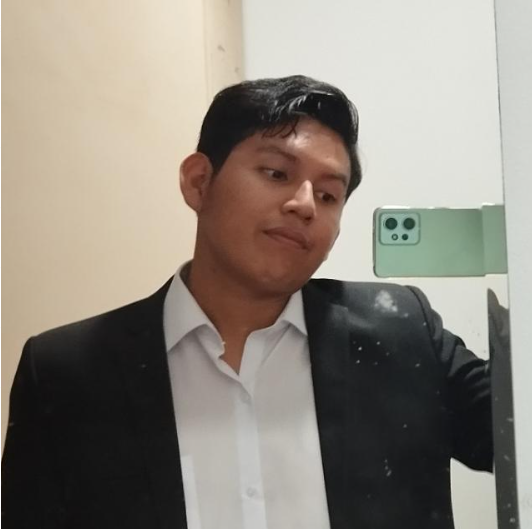

<<<<<<< HEAD

# 0.3. Integrante 3
## Apellidos y nombres:

- Chevez Collahuacho Matiaz Enrique
---
## ¿Por qué la UNI-FIIS?

- Elegí la UNI-FIIS por la recomendación y el apoyo de mi familia y amigos cercanos, quienes me motivaron a seguir este camino.
---

## ¿Cómo evalúo mi experiencia con los cursos de la carrera hasta el momento?

- Ha sido una experiencia variada. En algunos cursos he aprendido mucho sobre temas que sé que serán útiles en mi carrera profesional, mientras que en otros no tanto. Sin embargo, en términos académicos, he tenido buenos resultados en todos los cursos hasta ahora.
---

## ¿Cuál es mi experiencia en programación y bases de datos?

| Lenguaje de programación | Nivel de dominio |
| ------------------------ | ---------------- |
| **Python**               | Intermedio       |
| **C++**                  | Básico           |
| **Java**                 | Básico           |

**Motores de bases de datos que manejo**:

- [x] **SQL Server**
---

## ¿Qué espero del curso?

- Espero adquirir nuevos conocimientos que aumenten mi empleabilidad. Quiero aprovechar al máximo el proyecto que desarrollaremos a lo largo del curso para aprender habilidades valiosas y aplicarlas en mi futuro profesional.
---

## ¿Cómo me veo en 10 años?

- En 10 años me veo plenamente dedicado al desarrollo web, ya que es lo que más me apasiona en este momento. Mi objetivo es trabajar en proyectos relacionados con este campo, donde pueda combinar mis habilidades tanto en el frontend como en el backend para crear soluciones integrales y de alto impacto.
=======
# 0.3. Integrante 3
## Apellidos y nombres:
Nuñez Rivas Alvaro Fabricio
---
## �Por qu� la UNI-FIIS?

- Toda mi familia elogiaba la uni, ya que son de la generacion en donde la universidad tenia un gran renombre, por mi parte, me gustaba mucho los circuitos, utilizar mi soldador y tambien claro, algunos programas. Postule por unica vez, pense que no obtendria vacante en ing. electronica asi que puse ing de sistemas y asi es como estoy aca.

---

## �C�mo eval�o mi experiencia con los cursos de la carrera hasta el momento?

- Los cursos de programacion son mi talon de aquiles, llega un punto en donde comienzo a interesarme pero o me falta tiempo o me desanimo al no entender y lo dejo para estudiar otra cosa, siempre he buscado mi propia manera de realizar los problemas y eso se refleja en el tiempo que demoro aprendiendo.

---

## �Cu�l es mi experiencia en programaci�n y bases de datos?

| Lenguaje de programaci�n | Nivel de dominio |
| ------------------------ | ---------------- |
| **Python**               | Bajo       |
| **JavaScript**           | Bajo       |
| **Java**                 | Intermedio       |
| **C++**                  | Bajo       |

**Motores de bases de datos que manejo**:

- [x] **PosgreSQl**

---

## �Qu� espero del curso?

- Busco conocer un poco mas de la labor que tendria en una empresa.
- Poder agregar valor a mi conocimiento y inspirarme.

---

## �C�mo me veo en 10 a�os?

- Tabajando como un analista de datos reconocido, invirtiendo en negocios propios para poder jubilarme lo antes posible.

>>>>>>> 05ce6b173ada96d7813d45badbc78ff0bf3b9afb
