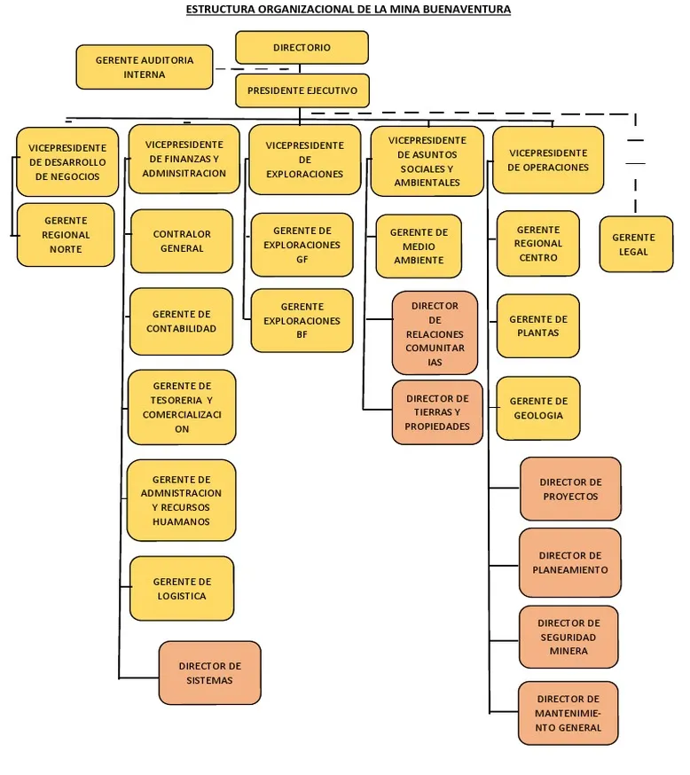

# 1. Descripción de la Empresa Elegida

## Descripción general
Compañía de Minas Buenaventura S.A.A. es una de las empresas mineras más importantes de Perú, con más de seis décadas de experiencia en la extracción y producción de metales preciosos y básicos. Su enfoque en la minería sostenible y su compromiso con la responsabilidad social la posicionan como un líder en la industria minera tanto a nivel nacional como internacional.

## Misión
La misión de Buenaventura es crear valor sostenible en la minería, generando un impacto positivo en las comunidades, empleados y accionistas, mediante la explotación responsable de los recursos minerales, respetando el medio ambiente y promoviendo el desarrollo social y económico.

## Visión
La visión de Buenaventura es ser una empresa minera líder en Latinoamérica, reconocida por su eficiencia operativa, compromiso con la sostenibilidad y responsabilidad social, y por su capacidad de crear valor a largo plazo para sus grupos de interés.

## Servicios y productos
Buenaventura se dedica principalmente a la extracción y comercialización de:

- Metales preciosos: Oro y plata, los cuales son sus principales productos.
- Metales base: Cobre, plomo y zinc, que complementan su portafolio de producción.
- Servicios asociados: Buenaventura participa en el desarrollo de infraestructuras y proyectos relacionados con la minería, así como en la gestión ambiental y social de las comunidades donde opera

## Información adicional
Buenaventura tiene participaciones en importantes proyectos mineros como Yanacocha y Cerro Verde. Se caracteriza por su enfoque en la sostenibilidad, gestión ambiental y desarrollo de comunidades locales. 

## Organigrama

## Contacto

- Nombre: Borja Atencio, Eddy Gustavo
- Cargo: Jefe del área de mantenimiento
- Correo: eddy.borja@buenaventura.pe

--- 

2. Información para el trabajo

- [Datos de la empresa](1.1/1.1.md)
- [Modelo de negocio](1.1/1.1.md)
- [Procesos de negocio identificados](1.1/1.1.md)

**[Regresar al README](../README.md)**