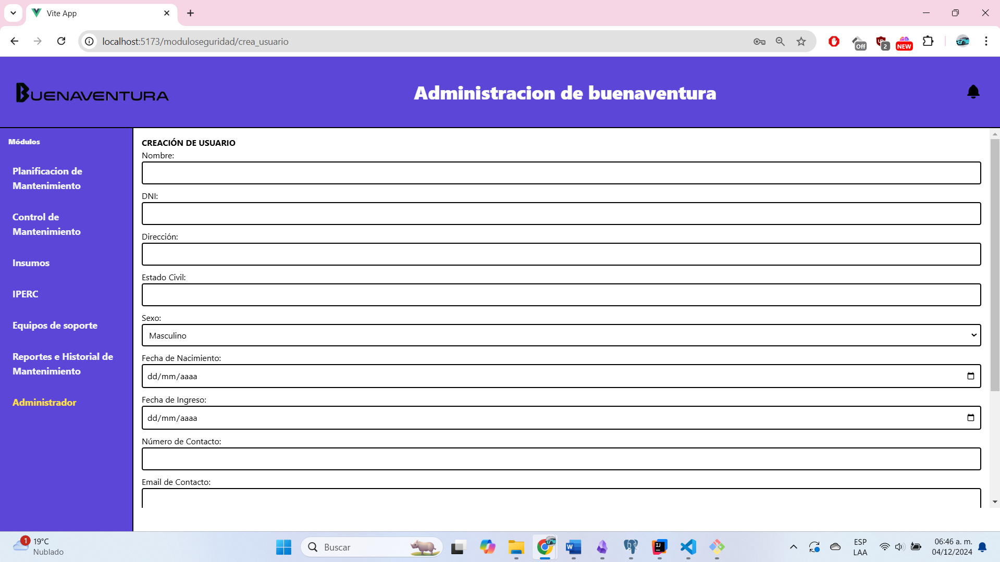
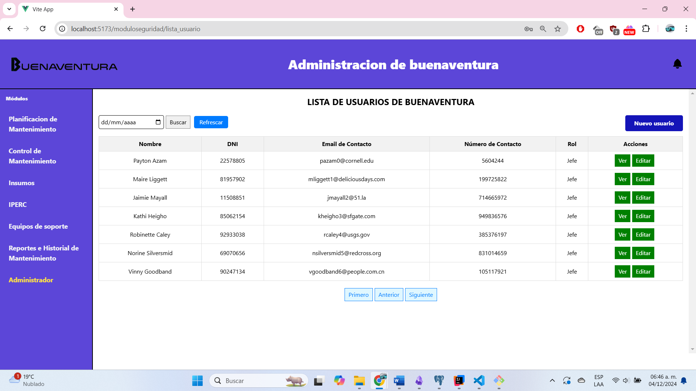

# 11.3. Flujo de Pantallas por Módulo

## Principal

### Dashboard

---

## Módulo 1: Planificación del mantenimiento:

### Dashboard

### Lista de planes

### Creación del plan de mantenimiento

### Detalle del plan de mantenimiento y envío de la notificación

### Edición del plan de mantenimiento

### Lista de órdenes de trabajo

### Creación de la orden de trabajo

### Detalle de la orden de trabajo

### Edición de la orden de trabajo

### Lista de actividades de empleado (primera vista)

### Lista de actividades de empleado (seleccionada una orden de trabajo)

### Detalle de la actividad de empleado

### Edición de la actividad de empleado

---

## Módulo 2: Control del mantenimiento:

### Lista de trabajos de mantenimiento asignados

### Detalles específicos de los trabajos de mantenimiento asignados

### Estado y disponibilidad de los trabajos de mantenimiento

---

## Módulo 3: Gestión de insumos:

### Pantalla que lista todos los insumos disponibles

### Pantalla de reserva de determinado material

### Filtrado por nombre

### Pantalla de pedidos solicitados hasta el momento

### Pantalla de confirmación de reserva

---

## Módulo 4: Gestión del IPERC:
### Seleccion de iperc a editar

### Llenado de datos de inicio

### Llenado de riesgos y reconocimiento de riesgo inicial

### Visualizacion de los registros

## Módulo 5: Gestion de Equipos de Soporte

### Dashboard

### Inventario de equipos de soporte 

### Visualizacion de los detalles de un equipo de soporte en especifico

### Lista de todos los pedidos de compra

### Detalle del pedido de compra

---

## Módulo 6: Seguridad y Gestión de Usuarios:

### Verificacion de usuario registrado

### Dashboard de control de administrador 

### Creacion de cuenta para un Nuevo Empleado

### Control de Empleados de buenaventura

### Control de Notificaciones de Administrador

### Incidencia cibernetica

## Módulo 7: Reportes e Historial de Mantenimiento:

### Dashboard Inicial

### Generar Registros

### Seleccionar Actividad de Mantenimiento

### Verificar Datos

### Historial de Mantenimiento

### Exportacion de Datos

