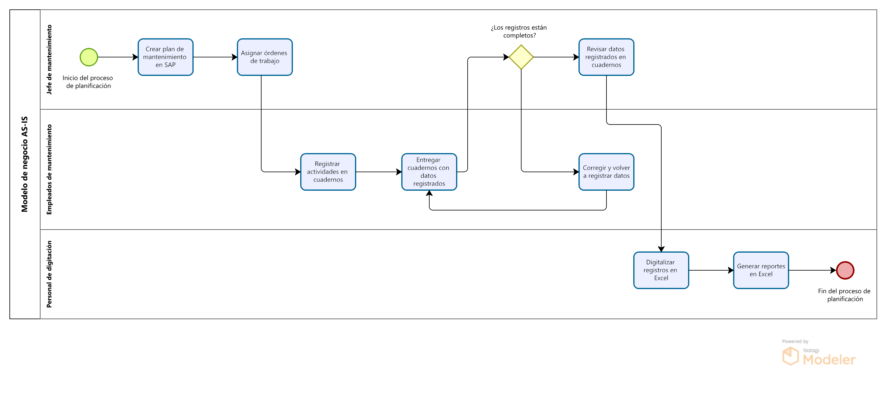
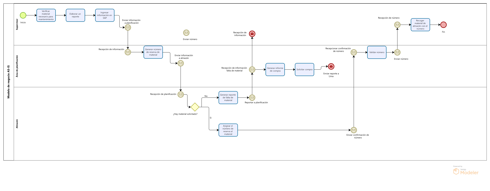
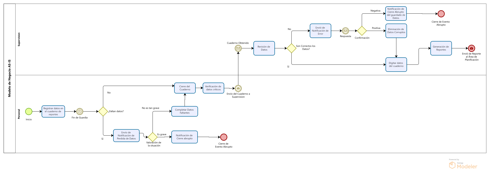

# 2.1. Procesos AS-IS

---

## Módulo 1: Sistema de Planificación del mantenimiento

<table>
  <thead>
    <tr>
      <th>Secuencia</th>
      <th>Actividad</th>
      <th>Descripción</th>
      <th>Responsable</th>
    </tr>
  </thead>
  <tbody>
    <tr>
      <td>1</td>
      <td>Crear plan de mantenimiento en SAP</td>
      <td>Se genera el plan semanal de trabajo en SAP.</td>
      <td>Jefe de mantenimiento</td>
    </tr>
    <tr>
      <td>2</td>
      <td>Asignar órdenes de trabajo</td>
      <td>Se distribuyen las órdenes a los empleados.</td>
      <td>Jefe de mantenimiento</td>
    </tr>
    <tr>
      <td>3</td>
      <td>Registrar actividades en cuadernos</td>
      <td>Los empleados registran sus intervenciones manualmente.</td>
      <td>Empleados de mantenimiento</td>
    </tr>
    <tr>
      <td>4</td>
      <td>Entregar cuadernos con datos registrados</td>
      <td>Los empleados entregan los cuadernos al jefe de mantenimiento.</td>
      <td>Empleados de mantenimiento</td>
    </tr>
    <tr>
      <td>5</td>
      <td>¿Los registros están completos?</td>
      <td>Se revisan los cuadernos. Si los registros están completos, sigue el flujo; si no, se devuelven a los empleados para corregir.</td>
      <td>Jefe de mantenimiento</td>
    </tr>
    <tr>
      <td>6a</td>
      <td>Revisar datos registrados en cuadernos</td>
      <td>Si los datos están completos, el jefe entrega los cuadernos al personal de digitalización.</td>
      <td>Jefe de mantenimiento</td>
    </tr>
    <tr>
      <td>6b</td>
      <td>Corregir y volver a registrar datos</td>
      <td>Si los datos están incompletos o incorrectos, los empleados deben corregir los registros en los cuadernos.</td>
      <td>Empleados de mantenimiento</td>
    </tr>
    <tr>
      <td>7</td>
      <td>Digitalizar registros en Excel</td>
      <td>Se transcriben los registros desde los cuadernos a Excel.</td>
      <td>Personal de digitalización</td>
    </tr>
    <tr>
      <td>8</td>
      <td>Generar reportes en Excel</td>
      <td>Se generan los reportes para la gerencia.</td>
      <td>Personal de digitalización</td>
    </tr>
  </tbody>
</table>

---
## Módulo 5: Gestión de repuestos y materiales

## Módulo 7: Gestión de Reportes

<table>
  <thead>
    <tr>
      <th>Secuencia</th>
      <th>Título</th>
      <th>Tipo</th>
      <th>Descripción</th>
      <th>Responsable</th>
    </tr>
  </thead>
  <tbody>
    <tr>
      <td>1</td>
      <td>Registrar datos en el cuaderno de reportes</td>
      <td>Actividad</td>
      <td>Se registran físicamente los datos de interés en un cuaderno.</td>
      <td>Personal</td>
    </tr>
    <tr>
      <td>2</td>
      <td>Fin de guardia</td>
      <td>Evento</td>
      <td>Se espera hasta el fin de la guardia para preparar el envío del cuaderno a Supervisión.</td>
      <td>---</td>
    </tr>
    <tr>
      <td>3</td>
      <td>¿Faltan datos?</td>
      <td>Condicional</td>
      <td>Se verifica si en el cuaderno faltan datos.</td>
      <td>Jefe de Personal</td>
    </tr>
    <tr>
      <td>4a</td>
      <td>Cierre del cuaderno</td>
      <td>Actividad</td>
      <td>Se procede a cerrar el cuaderno y prepararlo para su envío.</td>
      <td>Jefe de Personal</td>
    </tr>
    <tr>
      <td>4b</td>
      <td>Envío de notificación de pérdida de datos</td>
      <td>Actividad</td>
      <td>Se realiza una notificación de pérdida de datos.</td>
      <td>Jefe de Personal</td>
    </tr>
    <tr>
      <td>5</td>
      <td>Verificación de datos críticos</td>
      <td>Actividad</td>
      <td>Última verificación de datos para su envío.</td>
      <td>Jefe de Personal</td>
    </tr>
    <tr>
      <td>6</td>
      <td>Valoración de la situación</td>
      <td>Condicional</td>
      <td>Se estima la gravedad de la pérdida.</td>
      <td>Jefe de Personal</td>
    </tr>
    <tr>
      <td>6a</td>
      <td>Completar datos faltantes</td>
      <td>Actividad</td>
      <td>Si la pérdida no es grave, se realiza una reconstrucción de datos.</td>
      <td>Jefe de Personal / Personal</td>
    </tr>
    <tr>
      <td>6b</td>
      <td>Notificación de cierre abrupto</td>
      <td>Actividad</td>
      <td>Si la pérdida es considerable, se notifica a Supervisión para cerrar el proceso.</td>
      <td>Jefe de Personal</td>
    </tr>
    <tr>
      <td>7</td>
      <td>Envío del cuaderno a Supervisión</td>
      <td>Evento</td>
      <td>Se envía el cuaderno a Supervisión.</td>
      <td>Jefe de Personal</td>
    </tr>
    <tr>
      <td>8</td>
      <td>Cuaderno obtenido</td>
      <td>Evento</td>
      <td>Supervisión recibe el cuaderno.</td>
      <td>Supervisión</td>
    </tr>
    <tr>
      <td>9</td>
      <td>Revisión de datos</td>
      <td>Actividad</td>
      <td>Se revisan los datos obtenidos.</td>
      <td>Supervisión</td>
    </tr>
    <tr>
      <td>10</td>
      <td>¿Son correctos los datos?</td>
      <td>Condicional</td>
      <td>Se verifica la exactitud de los datos revisados.</td>
      <td>Supervisión</td>
    </tr>
    <tr>
      <td>11a</td>
      <td>Digitar datos del cuaderno</td>
      <td>Actividad</td>
      <td>Se digitalizan los datos del cuaderno en el sistema.</td>
      <td>Supervisión</td>
    </tr>
    <tr>
      <td>11b</td>
      <td>Envío de notificación de error</td>
      <td>Actividad</td>
      <td>Se notifica a la directiva y al personal sobre un error en el envío.</td>
      <td>Supervisión</td>
    </tr>
    <tr>
      <td>12</td>
      <td>Generación de reportes</td>
      <td>Actividad</td>
      <td>Se generan los reportes para ser enviados al Área de Planificación.</td>
      <td>Supervisión</td>
    </tr>
    <tr>
      <td>13</td>
      <td>Respuesta</td>
      <td>Evento</td>
      <td>Se espera la confirmación de la directiva para proceder.</td>
      <td>Directiva</td>
    </tr>
    <tr>
      <td>14</td>
      <td>Confirmación</td>
      <td>Condicional</td>
      <td>Se procede dependiendo de la respuesta de la directiva.</td>
      <td>Supervisión</td>
    </tr>
    <tr>
      <td>15a</td>
      <td>Eliminación de datos corruptos</td>
      <td>Actividad</td>
      <td>Se procede a eliminar los datos anómalos.</td>
      <td>Supervisión</td>
    </tr>
    <tr>
      <td>15b</td>
      <td>Notificación de cierre abrupto del guardado de datos</td>
      <td>Actividad</td>
      <td>Se notifica sobre el cierre del proceso de digitalización de datos.</td>
      <td>Supervisión</td>
    </tr>
    <tr>
      <td>16</td>
      <td>Envío de reporte al Área de Planificación</td>
      <td>Evento de cierre</td>
      <td>Se envían los reportes generados al Área de Planificación.</td>
      <td>Supervisión</td>
    </tr>
  </tbody>
</table>

