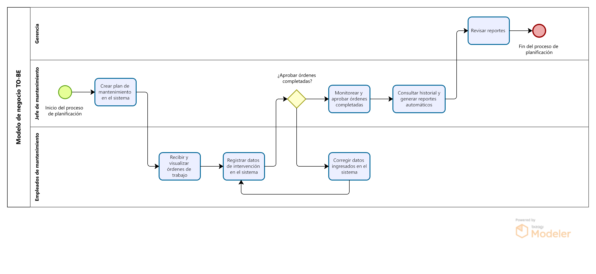
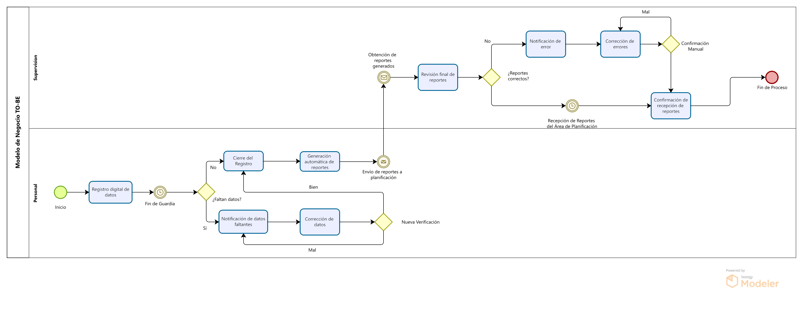

# 2.2. Procesos TO-BE

---

## Módulo 1: Sistema de Planificación del mantenimiento

<table>
  <thead>
    <tr>
      <th>Secuencia</th>
      <th>Actividad</th>
      <th>Descripción</th>
      <th>Responsable</th>
    </tr>
  </thead>
  <tbody>
    <tr>
      <td>1</td>
      <td>Crear plan de mantenimiento en el sistema</td>
      <td>Se genera el plan en el nuevo sistema digital.</td>
      <td>Jefe de mantenimiento</td>
    </tr>
    <tr>
      <td>2</td>
      <td>Recibir y visualizar órdenes de trabajo</td>
      <td>Los empleados acceden a las órdenes de trabajo en el sistema.</td>
      <td>Empleados de mantenimiento</td>
    </tr>
    <tr>
      <td>3</td>
      <td>Registrar datos de intervención en el sistema</td>
      <td>Los empleados ingresan los datos de las tareas realizadas en el sistema digital.</td>
      <td>Empleados de mantenimiento</td>
    </tr>
    <tr>
      <td>4</td>
      <td>¿Aprobar órdenes completadas?</td>
      <td>El jefe revisa los datos registrados y, si son correctos, aprueba las órdenes; si no, solicita correcciones.</td>
      <td>Jefe de mantenimiento</td>
    </tr>
    <tr>
      <td>5a</td>
      <td>Monitorear y aprobar órdenes completadas</td>
      <td>Si las órdenes son aprobadas, el proceso sigue con la validación final.</td>
      <td>Jefe de mantenimiento</td>
    </tr>
    <tr>
      <td>5b</td>
      <td>Corregir datos ingresados en el sistema</td>
      <td>Si los datos son incorrectos, los empleados deben hacer las correcciones correspondientes.</td>
      <td>Empleados de mantenimiento</td>
    </tr>
    <tr>
      <td>6</td>
      <td>Consultar historial y generar reportes automáticos</td>
      <td>El sistema genera reportes automáticamente con los datos ingresados y aprobados.</td>
      <td>Sistema, Jefe de mantenimiento</td>
    </tr>
    <tr>
      <td>7</td>
      <td>Revisar reportes</td>
      <td>La gerencia u otros departamentos consultan los reportes generados.</td>
      <td>Gerencia, Personal autorizado</td>
    </tr>
  </tbody>
</table>

## Módulo 7: Gestion de Reportes

<table>
  <thead>
    <tr>
      <th>Secuencia</th>
      <th>Título</th>
      <th>Tipo</th>
      <th>Descripción</th>
      <th>Responsable</th>
    </tr>
  </thead>
  <tbody>
    <tr>
      <td>1</td>
      <td>Registro digital de datos</td>
      <td>Actividad</td>
      <td>El personal registra los datos directamente en una página web conectada a una base de datos.</td>
      <td>Personal</td>
    </tr>
    <tr>
      <td>2</td>
      <td>Fin de guardia</td>
      <td>Evento</td>
      <td>Se cierra automáticamente el registro de la guardia al finalizar el turno.</td>
      <td>--- (Automatización)</td>
    </tr>
    <tr>
      <td>3</td>
      <td>¿Faltan datos?</td>
      <td>Condicional</td>
      <td>La página web verifica si faltan datos automáticamente al cierre de la guardia.</td>
      <td>Sistema</td>
    </tr>
    <tr>
      <td>4a</td>
      <td>Cierre del registro</td>
      <td>Actividad</td>
      <td>Si no faltan datos, se cierra el registro digitalmente y se notifica a supervisión.</td>
      <td>Sistema</td>
    </tr>
    <tr>
      <td>4b</td>
      <td>Notificación de datos faltantes</td>
      <td>Actividad</td>
      <td>Si faltan datos, el sistema envía automáticamente una notificación al jefe para su corrección.</td>
      <td>Sistema</td>
    </tr>
    <tr>
      <td>5</td>
      <td>Corrección de datos</td>
      <td>Actividad</td>
      <td>El jefe de personal revisa y corrige los datos directamente en la página web.</td>
      <td>Jefe de Personal</td>
    </tr>
    <tr>
      <td>6</td>
      <td>Generación automática de reportes</td>
      <td>Actividad</td>
      <td>El sistema genera los reportes automáticamente a partir de los datos registrados y corregidos.</td>
      <td>Sistema</td>
    </tr>
    <tr>
      <td>7</td>
      <td>Envío de reportes a planificación</td>
      <td>Evento</td>
      <td>Los reportes generados se envían automáticamente al Área de Planificación.</td>
      <td>Sistema</td>
    </tr>
    <tr>
      <td>8</td>
      <td>Revisión final de reportes</td>
      <td>Actividad</td>
      <td>La supervisión revisa los reportes recibidos para asegurar que toda la información es correcta.</td>
      <td>Supervisión</td>
    </tr>
    <tr>
      <td>9</td>
      <td>Recepción de Reportes del Área de Planificación</td>
      <td>Evento</td>
      <td>Se espera a que el Área de Planificación obtenga el Reporte.</td>
      <td>Supervisión</td>
    </tr>
    <tr>
      <td>10</td>
      <td>¿Reportes correctos?</td>
      <td>Condicional</td>
      <td>Se verifica la exactitud de los reportes revisados.</td>
      <td>Supervisión</td>
    </tr>
    <tr>
      <td>11a</td>
      <td>Confirmación de recepción de reportes</td>
      <td>Actividad</td>
      <td>Se confirma la recepción de los reportes por el Área de Planificación.</td>
      <td>Supervisión</td>
    </tr>
    <tr>
      <td>11b</td>
      <td>Notificación de error</td>
      <td>Actividad</td>
      <td>Se notifica a la directiva sobre cualquier error encontrado en los reportes.</td>
      <td>Supervisión</td>
    </tr>
    <tr>
      <td>12</td>
      <td>Corrección de errores</td>
      <td>Actividad</td>
      <td>Se corrigen los errores identificados en los reportes y se envían nuevamente si es necesario.</td>
      <td>Supervisión</td>
    </tr>
    <tr>
      <td>13</td>
      <td>Confirmación Manual</td>
      <td>Condicional</td>
      <td>La supervision revisa y confirma la corrección de errores y la validez de los reportes finales.</td>
      <td>Supervision</td>
    </tr>
    <tr>
      <td>14</td>
      <td>Envío final de reportes</td>
      <td>Evento de cierre</td>
      <td>Los reportes finales corregidos se envían al Área de Planificación.</td>
      <td>Supervisión</td>
    </tr>
  </tbody>
</table>
