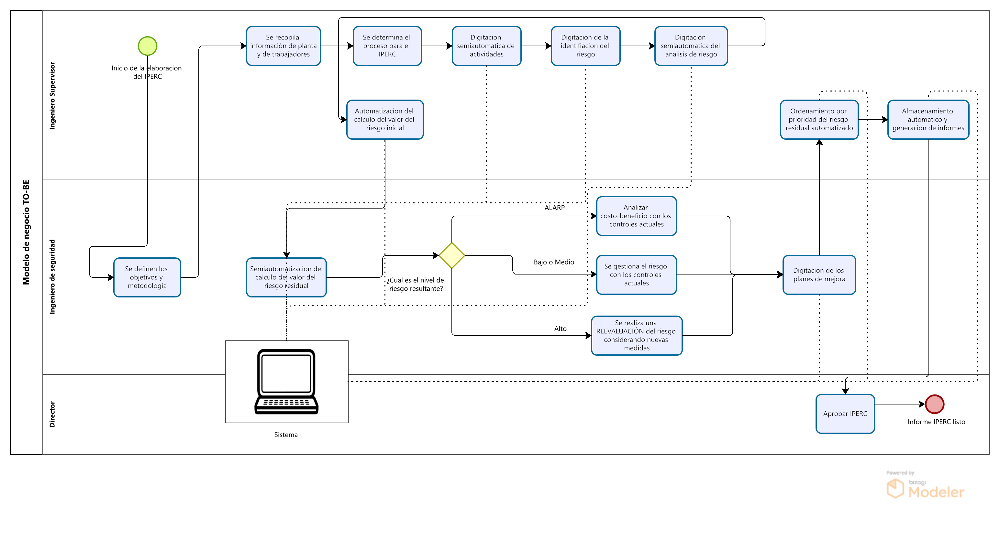
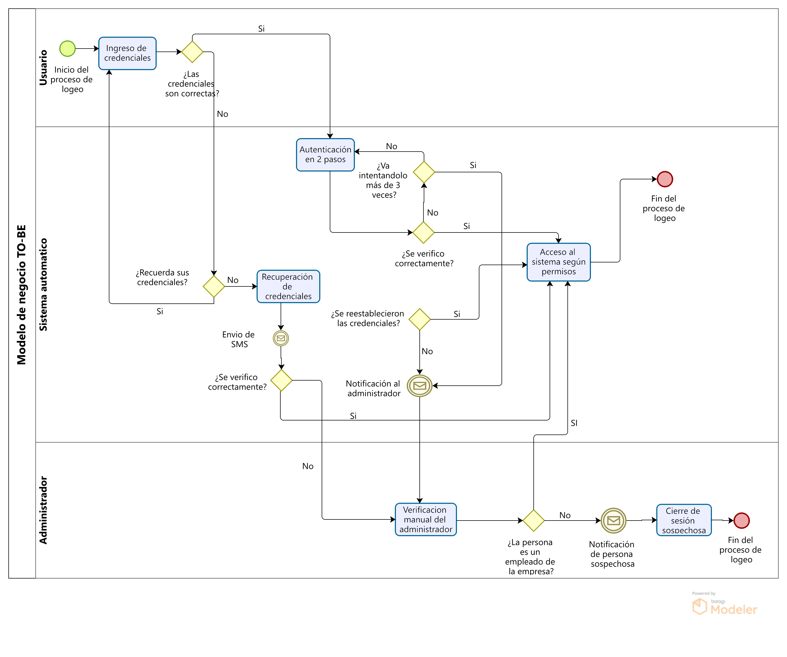

# 2.2. Procesos TO-BE

---

## Módulo 1: Sistema de Planificación del mantenimiento

<table>
  <thead>
    <tr>
      <th>Secuencia</th>
      <th>Actividad</th>
      <th>Descripción</th>
      <th>Responsable</th>
    </tr>
  </thead>
  <tbody>
    <tr>
      <td>1</td>
      <td>Crear plan de mantenimiento en el sistema</td>
      <td>Se genera el plan en el nuevo sistema digital.</td>
      <td>Jefe de mantenimiento</td>
    </tr>
    <tr>
      <td>2</td>
      <td>Recibir y visualizar órdenes de trabajo</td>
      <td>Los empleados acceden a las órdenes de trabajo en el sistema.</td>
      <td>Empleados de mantenimiento</td>
    </tr>
    <tr>
      <td>3</td>
      <td>Registrar datos de intervención en el sistema</td>
      <td>Los empleados ingresan los datos de las tareas realizadas en el sistema digital.</td>
      <td>Empleados de mantenimiento</td>
    </tr>
    <tr>
      <td>4</td>
      <td>¿Aprobar órdenes completadas?</td>
      <td>El jefe revisa los datos registrados y, si son correctos, aprueba las órdenes; si no, solicita correcciones.</td>
      <td>Jefe de mantenimiento</td>
    </tr>
    <tr>
      <td>5a</td>
      <td>Monitorear y aprobar órdenes completadas</td>
      <td>Si las órdenes son aprobadas, el proceso sigue con la validación final.</td>
      <td>Jefe de mantenimiento</td>
    </tr>
    <tr>
      <td>5b</td>
      <td>Corregir datos ingresados en el sistema</td>
      <td>Si los datos son incorrectos, los empleados deben hacer las correcciones correspondientes.</td>
      <td>Empleados de mantenimiento</td>
    </tr>
    <tr>
      <td>6</td>
      <td>Consultar historial y generar reportes automáticos</td>
      <td>El sistema genera reportes automáticamente con los datos ingresados y aprobados.</td>
      <td>Sistema, Jefe de mantenimiento</td>
    </tr>
    <tr>
      <td>7</td>
      <td>Revisar reportes</td>
      <td>La gerencia u otros departamentos consultan los reportes generados.</td>
      <td>Gerencia, Personal autorizado</td>
    </tr>
  </tbody>
</table>

---
## Módulo 2: Control del proceso de mantenimiento

<table>
  <thead>
    <tr>
      <th>Secuencia</th>
      <th>Actividad</th>
      <th>Descripción</th>
      <th>Responsable</th>
    </tr>
  </thead>
  <tbody>
    <tr>
      <td>1</td>
      <td>Detección Automatizada de Falla</td>
      <td>Sensores o sistemas detectan la falla automáticamente.</td>
      <td>Sistema</td>
    </tr>
    <tr>
      <td>2</td>
      <td>Notificación Automatizada</td>
      <td>El sistema envía una alerta automática al equipo de mantenimiento.</td>
      <td>Sistema</td>
    </tr>
    <tr>
      <td>3</td>
      <td>Asignación Automática</td>
      <td>El sistema asigna automáticamente el caso al técnico disponible.</td>
      <td>Sistema</td>
    </tr>
    <tr>
      <td>4</td>
      <td>Despliegue Inmediato</td>
      <td>El técnico se dirige al sitio tras recibir la notificación.</td>
      <td>Técnico</td>
    </tr>
    <tr>
      <td>5</td>
      <td>Evaluación y Diagnóstico Asistido</td>
      <td>El técnico usa herramientas digitales para diagnóstico rápido.</td>
      <td>Técnico</td>
    </tr>
    <tr>
      <td>6</td>
      <td>Ejecución del Mantenimiento con SOPs</td>
      <td>El técnico sigue procedimientos estándar asistidos por el sistema.</td>
      <td>Técnico</td>
    </tr>
    <tr>
      <td>7</td>
      <td>Prueba de Operación Automatizada</td>
      <td>El sistema realiza una prueba automática para verificar la reparación.</td>
      <td>Sistema</td>
    </tr>
    <tr>
      <td>8</td>
      <td>¿Prueba exitosa?</td>
      <td>Si la respuesta es si, entonces sigue el flujo del proceso; si es no, entonces se vuelve a realizar la ejecución del mantenimiento con SOPs</td>
      <td>Sistema</td>
    </tr>
    <tr>
      <td>9</td>
      <td>Registro Automático de Actividades</td>
      <td>Los detalles se registran automáticamente mediante la app móvil.</td>
      <td>Sistema</td>
    </tr>
    <tr>
      <td>10</td>
      <td>Análisis Post-Mantenimiento</td>
      <td>El sistema analiza la intervención para prevenir futuras fallas.</td>
      <td>Sistema</td>
    </tr>
    <tr>
      <td>11</td>
      <td>Generación Automática de Informes y Cierre</td>
      <td>Se genera un informe automatizado y se cierra el caso.</td>
      <td>Sistema</td>
    </tr>
  </tbody>
</table>

---
## Módulo 3: Gestion de repuestos y materiales

<table>
  <thead>
    <tr>
      <th>Secuencia</th>
      <th>Título</th>
      <th>Tipo</th>
      <th>Descripción</th>
      <th>Responsable</th>
    </tr>
  </thead>
  <tbody>
    <tr>
      <td>1</td>
      <td>Verificar material necesario para mantenimiento</td>
      <td>Actividad</td>
      <td>El supervisor verifica todo el material necesario para el mantenimiento programado.</td>
      <td>Supervisor</td>
    </tr>
    <tr>
      <td>2</td>
      <td>Elaborar un reporte</td>
      <td>Actividad</td>
      <td>Se elabora un reporte con todo lo necesario para el mantenimiento</td>
      <td> Supervisor</td>
    </tr>
    <tr>
      <td>3</td>
      <td>Ingresar información al sistema de mantenimiento</td>
      <td>Actividad</td>
      <td>Se digitaliza en el sistema el reporte</td>
      <td>Supervisor</td>
    </tr>
    <tr>
      <td>4</td>
      <td>Generar número de reserva de material</td>
      <td>Actividad</td>
      <td>Se genera un número para posteriormente asociarlo a una reserva de material</td>
      <td>Sistema</td>
    </tr>
    <tr>
      <td>5</td>
      <td>Consultar inventario</td>
      <td>Actividad</td>
      <td>Se hace una consulta interna del sistema sobre la disponibilidad del material solicitado</td>
      <td>Sistema</td>
    </tr>
    <tr>
      <td>6</td>
      <td>¿Hay material solicitado?</td>
      <td>Condicional</td>
      <td>Se bifurca en caso haya o no haya material</td>
      <td>Sistema</td>
    </tr>
    <tr>
      <td>7</td>
      <td>Generar alerta de falta de material</td>
      <td>Actividad</td>
      <td>El sistema genera de manera automática una alerta de falta en inventario a los diversos usuarios involucrados(supervisor, planeamiento).</td>
      <td>Sistema</td>
    </tr>
    <tr>
      <td>8</td>
      <td>Enviar reporte a Lima</td>
      <td>Evento</td>
      <td>Se envía un reporte automático a la sede Lima para que ellos se encarguen de la compra.</td>
      <td>Sistema</td>
    </tr>
    <tr>
      <td>9</td>
      <td>Asignar el número de reserva al material</td>
      <td>Actividad</td>
      <td>Se asigna el número generado a un material de almacen</td>
      <td>Sistema</td>
    </tr>
    <tr>
      <td>10</td>
      <td>Validar número</td>
      <td>Actividad</td>
      <td>El sistema cambio el estado del número generado a "válido"</td>
      <td>Sistema</td>
    </tr>
    <tr>
      <td>11</td>
      <td>Actualizar inventario</td>
      <td>Actividad</td>
      <td>Se actualiza el inventario descontando los materiales asignados</td>
      <td>Sistema</td>
    </tr>
    <tr>
      <td>12</td>
      <td>Enviar número</td>
      <td>Evento</td>
      <td>Se envía el número validado al supervisor</td>
      <td>Sistema</td>
    </tr>
    <tr>
      <td>13</td>
      <td>Recepción de número</td>
      <td>Evento</td>
      <td>El supervisor recibe el número validado asignado a sus materiales de mantenimiento</td>
      <td>Supervisor</td>
    </tr>
    <tr>
      <td>14</td>
      <td>Recoger material de almacen con el número</td>
      <td>Actividad</td>
      <td>El supervisor solicita a almacen los materiales asignados a su mantenimiento haciendo uso del número</td>
      <td>Supervisor</td>
    </tr>
    
  </tbody>
</table>

---
## Módulo 4: Gestion del IPERC

<table>
  <thead>
    <tr>
      <th>Secuencia</th>
      <th>Actividad</th>
      <th>Descripción</th>
      <th>Responsable</th>
    </tr>
  </thead>
  <tbody>
    <tr>
      <td>1</td>
      <td>Se definen los objetivos y metodologia</td>
      <td>Se determina la profundidad, alcance y limites del trabajo.</td>
      <td>Ingeniero de seguridad</td>
    </tr>
    <tr>
      <td>2</td>
      <td>Se recopila información de planta y de trabajadores</td>
      <td>Se hacen auditorias en planta y reuniones con trabajadores</td>
      <td>Ingeniero supervisor</td>
    </tr>
    <tr>
      <td>3</td>
      <td>Se determina el proceso para el IPERC</td>
      <td>Se escoge el conjunto de actividades que se buscan analizar.</td>
      <td>Ingeniero supervisor</td>
    </tr>
    <tr>
      <td>4</td>
      <td>Digitacion semiautomatica de actividades.</td>
      <td>La empresa tiene la mayoria de actividades definidas y el ingeniero digitaliza con la ayuda de los datos de los informes anteriores .</td>
      <td>Ingeniero supervisor</td>
    </tr>
    <tr>
      <td>5</td>
      <td>Digitacion de la identifiacion del riesgo.</td>
      <td>Se ditaliza en el sistema el peligro y el evento no deseado generado por el riesgo.</td>
      <td>Ingeniero supervisor</td>
    </tr>
    <tr>
      <td>6</td>
      <td>Digitacion semiautomatica del analisis de riesgo.</td>
      <td>Se digitaliza el afetado, el tipo de daño o contacto causado y la consecuencia. Datos como tipo de daño y afectado corresponden a tablas anexadas.</td>
      <td>Ingeniero supervisor</td>
    </tr>
    <tr>
      <td>7</td>
      <td>Automatizacion del calculo del valor del riesgo inicial.</td>
      <td>El valor de riesgo inicial se basa en una matriz para calcularla, los datos de probabilidad y severidad corresponden a tablas anexadas.</td>
      <td>Sistema</td>
    </tr>
    <tr>
      <td>8</td>
      <td>Semiautomatizacion del calculo del valor del riesgo residual</td>
      <td>Aun es necesario digitar las medidas de control pero el valor del riesgo residual es automatizable.</td>
      <td>Ingeniero de seguridad</td>
    </tr>
    <tr>
      <td>9</td>
      <td>¿Cual es el nivel de riesgo resultante?</td>
      <td>Cada nivel de riesgo residual, tiene diferentes acciones a tomar.</td>
      <td>Ingeniero de seguridad</td>
    </tr>
    <tr>
      <td>9a</td>
      <td>Analizar costo-beneficio con los controles actuales.</td>
      <td>Si el nivel de riesgo residual es ALARP, se busca hacer una evaluacion cualitativa.</td>
      <td>Ingeniero de seguridad</td>
    </tr>
    <tr>
      <td>9b</td>
      <td>Se gestiona el riesgo con los controles actuales.</td>
      <td>Si el nivel de riesgo residual es bajo o medio, se gestionara el riesgo con los controles actuales.</td>
      <td>Ingeniero de seguridad</td>
    </tr>
    <tr>
      <td>9c</td>
      <td>Se realiza una REEVALUACIÓN del riesgo considerando nuevas medidas</td>
      <td>Si el nivel de riesgo residual es alto, se realiara una revaaluacion del riesgo considerando nuevas jerarquias de control.</td>
      <td>Ingeniero de seguridad</td>
    </tr>
    <tr>
      <td>10</td>
      <td>Digitacion de los planes de mejora.</td>
      <td>Se digita los planes de mejora a realizar con un quien, que y cuando.</td>
      <td>Ingeniero de seguridad</td>
    </tr>
    <tr>
      <td>11</td>
      <td>Ordenamiento por prioridad del riesgo residual automatizado</td>
      <td>EL sistema ordena de mayor a menor valor de riesgo residual.</td>
      <td>Sistema</td>
    </tr>
    <tr>
      <td>12</td>
      <td>Almacenamiento automatico y generacion de informes</td>
      <td>EL sistema almacena y genera informes en pdf y demas.</td>
      <td>Sistema</td>
    </tr>
    <tr>
      <td>13</td>
      <td>Aprobar IPERC.</td>
      <td>Aprobacion de los informes y del IPERC generado.</td>
      <td>Director</td>
    </tr>
  </tbody>
</table>

---
## Módulo 5: Gestion de equipos de soporte

<table>
  <thead>
    <tr>
      <th>Secuencia</th>
      <th>Título</th>
      <th>Tipo</th>
      <th>Descripción</th>
      <th>Responsable</th>
    </tr>
  </thead>
  <tbody>
    <tr>
      <td>1</td>
      <td>Verificar disponibilidad de equipos</td>
      <td>Actividad</td>
      <td>El supervisor verifica la disponibilidad de equipos.</td>
      <td>Supervisor</td>
    </tr>
    <tr>
      <td>2</td>
      <td>¿Equipos disponibles en inventario?</td>
      <td>Condicional</td>
      <td>Se verifica si los equipos estan disponibles con ayuda del sistema.</td>
      <td>Sistema de almacén</td>
    </tr>
    <tr>
      <td>3</td>
      <td>Reprogramación automática</td>
      <td>Actividad</td>
      <td>Si existe algun equipo no disponible, el sistema sugiere una reprogramación optima</td>
      <td>Sistema de almacén</td>
    </tr>
    <tr>
      <td>4</td>
      <td>Ingresar información al sistema</td>
      <td>Actividad</td>
      <td>El supervisor usa el sistema para ingresar la información de los equipos.</td>
      <td>Supervisor</td>
    </tr>
    <tr>
      <td>5</td>
      <td>Inicio de mantenimiento</td>
      <td>Evento</td>
      <td>El sistema notifica automáticamente el inicio del mantenimiento.</td>
      <td>Sistema de almacén</td>
    </tr>
    <tr>
      <td>6</td>
      <td>Uso de equipo</td>
      <td>Actividad</td>
      <td>El técnico utiliza el equipo para las tareas asignadas.</td>
      <td>Técnico</td>
    </tr>
    <tr>
      <td>7</td>
      <td>Verificación del estado del equipo</td>
      <td>Evento</td>
      <td>El sistema monitorea constantemente el estado del equipo.</td>
      <td>Sistema de almacén</td>
    </tr>
    <tr>
      <td>8</td>
      <td>¿Se detectan fallos?</td>
      <td>Condicional</td>
      <td>El sistema verifica si hay fallos significativos en el equipo, de ser el caso se le notifica al supervisor.</td>
      <td>Sistema de almacén</td>
    </tr>
    <tr>
      <td>9</td>
      <td>Notifica retiro del equipo</td>
      <td>Actividad</td>
      <td>El supervisor notifica al técnico el retiro del equipo.</td>
      <td>Supervisor</td>
    </tr>
    <tr>
      <td>10</td>
      <td>¿Se finalizo uso del equipo?</td>
      <td>Condicional</td>
      <td>Se evalua si el tecnivo finalizo o no con el equipo</td>
      <td>Técnico</td>
    </tr>
    <tr>
      <td>11</td>
      <td>Finalizar uso y registrar devolución</td>
      <td>Actividad</td>
      <td>El técnico finaliza el uso del equipo y registra su devolución al inventario.</td>
      <td>Técnico</td>
    </tr>
    <tr>
      <td>12</td>
      <td>Cierre de gestión de equipos</td>
      <td>Evento final</td>
      <td>El sistema cierra automáticamente el proceso de gestión de equipos.</td>
      <td>Sistema de almacén</td>
    </tr>
  </tbody>
</table>

---
## Módulo 6: Módulo de seguridad

<table>
  <thead>
    <tr>
      <th>Secuencia</th>
      <th>Título</th>
      <th>Tipo</th>
      <th>Descripción</th>
      <th>Responsable</th>
    </tr>
  </thead>
  <tbody>
    <tr>
      <td>1</td>
      <td>Ingreso de credenciales </td>
      <td>Actividad</td>
      <td>El usuario ingresa sus credenciales (usuario y contraseña).</td>
      <td>Usuario</td>
    </tr>
    <tr>
      <td>2</td>
      <td>¿Las credenciales son correctas?</td>
      <td>Condicional</td>
      <td>El sistema verifica si las credenciales ingresadas son correctas. </td>
      <td>Usuario</td>
    </tr>
    <tr>
      <td>3</td>
      <td>Autenticacion en dos pasos</td>
      <td>Actividad</td>
      <td>Proceso de verificación de identidad del usuario a través de 2FA (SMS).</td>
      <td>Sistema automatico</td>
    </tr>
      <td>4</td>
      <td>¿Se verifico correctamente?</td>
      <td>Condicional</td>
      <td>El sistema verifica si el código 2FA ingresado es correcto.</td>
      <td>Sistema automatico</td>
    </tr>
    <tr>
      <td>5</td>
      <td>¿Recuerda sus credenciales?</td>
      <td>Condicional</td>
      <td>El sistema le pregunta al usuario si las credenciales proporcionadas son correctas.</td>
      <td>Sistema automatico</td>
    </tr>
    <tr>
      <td>6</td>
      <td>Recuperacion de credenciales</td>
      <td>Actividad</td>
      <td>Si las credenciales no son correctas, se ofrece la opción de recuperarlas.</td>
      <td>Sistema automatico</td>
    </tr>
      <tr>
      <td>7</td>
      <td>Envio de SMS</td>
      <td>Evento</td>
      <td>Si se requiere 2FA, el sistema envía un código de verificación vía SMS</td>
      <td>Sistema automatico</td>
    </tr>
    <tr>
      <td>8</td>
      <td>¿Se reestablecieron las credenciales?</td>
      <td>Evento</td>
      <td>Se verifica si se reestablecieron las credenciales del usuario.</td>
      <td>Sistema automatico</td>
    </tr>
    <tr>
      <td>9</td>
      <td>Notificacion al administrador</td>
      <td>Evento</td>
      <td>Si las credenciales no se recuperan, se notifica al administrador.</td>
      <td>Sistema automatico</td>
    </tr>
    <tr>
      <td>10</td>
      <td>Verificación manual del administrador</td>
      <td>Actividad</td>
      <td>El administrador revisa manualmente la situación del usuario.</td>
      <td>Administrador</td>
    </tr>
    <tr>
      <td>11</td>
      <td>¿La persona es un empleado de la empresa?</td>
      <td>Condicional</td>
      <td>El administrador verifica si la persona pertenece o no a la empresa</td>
      <td>Administrador</td>
    </tr>
    <tr>
      <td>12a</td>
      <td>Notificación de persona sospechosa</td>
      <td>Evento</td>
      <td>Si la persona no es un empleado, se notifica como sospechosa.</td>
      <td>Administrador</td>
    </tr>
    <tr>
      <td>12b</td>
      <td>Acceso al sistema según permisos</td>
      <td>Actividad</td>
      <td>Si las credenciales son correctas o recuperadas, se concede el acceso</td>
      <td>Sistema automatico</td>
    </tr>
        <tr>
      <td>13</td>
      <td>Cierre de sesión sospechosa</td>
      <td>Actividad</td>
      <td>Si se detecta actividad inusual, se cierra la sesión.</td>
      <td>Sistema automatico</td>
    </tr>
  </tbody>
</table>

---
## Módulo 7: Gestion de Reportes

<table>
  <thead>
    <tr>
      <th>Secuencia</th>
      <th>Título</th>
      <th>Tipo</th>
      <th>Descripción</th>
      <th>Responsable</th>
    </tr>
  </thead>
  <tbody>
    <tr>
      <td>1</td>
      <td>Registro digital de datos</td>
      <td>Actividad</td>
      <td>El personal registra los datos directamente en una página web conectada a una base de datos.</td>
      <td>Personal</td>
    </tr>
    <tr>
      <td>2</td>
      <td>Fin de guardia</td>
      <td>Evento</td>
      <td>Se cierra automáticamente el registro de la guardia al finalizar el turno.</td>
      <td>--- (Automatización)</td>
    </tr>
    <tr>
      <td>3</td>
      <td>¿Faltan datos?</td>
      <td>Condicional</td>
      <td>La página web verifica si faltan datos automáticamente al cierre de la guardia.</td>
      <td>Sistema</td>
    </tr>
    <tr>
      <td>4a</td>
      <td>Cierre del registro</td>
      <td>Actividad</td>
      <td>Si no faltan datos, se cierra el registro digitalmente y se notifica a supervisión.</td>
      <td>Sistema</td>
    </tr>
    <tr>
      <td>4b</td>
      <td>Notificación de datos faltantes</td>
      <td>Actividad</td>
      <td>Si faltan datos, el sistema envía automáticamente una notificación al jefe para su corrección.</td>
      <td>Sistema</td>
    </tr>
    <tr>
      <td>5</td>
      <td>Corrección de datos</td>
      <td>Actividad</td>
      <td>El jefe de personal revisa y corrige los datos directamente en la página web.</td>
      <td>Jefe de Personal</td>
    </tr>
    <tr>
      <td>6</td>
      <td>Generación automática de reportes</td>
      <td>Actividad</td>
      <td>El sistema genera los reportes automáticamente a partir de los datos registrados y corregidos.</td>
      <td>Sistema</td>
    </tr>
    <tr>
      <td>7</td>
      <td>Envío de reportes a planificación</td>
      <td>Evento</td>
      <td>Los reportes generados se envían automáticamente al Área de Planificación.</td>
      <td>Sistema</td>
    </tr>
    <tr>
      <td>8</td>
      <td>Revisión final de reportes</td>
      <td>Actividad</td>
      <td>La supervisión revisa los reportes recibidos para asegurar que toda la información es correcta.</td>
      <td>Supervisión</td>
    </tr>
    <tr>
      <td>9</td>
      <td>Recepción de Reportes del Área de Planificación</td>
      <td>Evento</td>
      <td>Se espera a que el Área de Planificación obtenga el Reporte.</td>
      <td>Supervisión</td>
    </tr>
    <tr>
      <td>10</td>
      <td>¿Reportes correctos?</td>
      <td>Condicional</td>
      <td>Se verifica la exactitud de los reportes revisados.</td>
      <td>Supervisión</td>
    </tr>
    <tr>
      <td>11a</td>
      <td>Confirmación de recepción de reportes</td>
      <td>Actividad</td>
      <td>Se confirma la recepción de los reportes por el Área de Planificación.</td>
      <td>Supervisión</td>
    </tr>
    <tr>
      <td>11b</td>
      <td>Notificación de error</td>
      <td>Actividad</td>
      <td>Se notifica a la directiva sobre cualquier error encontrado en los reportes.</td>
      <td>Supervisión</td>
    </tr>
    <tr>
      <td>12</td>
      <td>Corrección de errores</td>
      <td>Actividad</td>
      <td>Se corrigen los errores identificados en los reportes y se envían nuevamente si es necesario.</td>
      <td>Supervisión</td>
    </tr>
    <tr>
      <td>13</td>
      <td>Confirmación Manual</td>
      <td>Condicional</td>
      <td>La supervision revisa y confirma la corrección de errores y la validez de los reportes finales.</td>
      <td>Supervision</td>
    </tr>
    <tr>
      <td>14</td>
      <td>Envío final de reportes</td>
      <td>Evento de cierre</td>
      <td>Los reportes finales corregidos se envían al Área de Planificación.</td>
      <td>Supervisión</td>
    </tr>
  </tbody>
</table>
