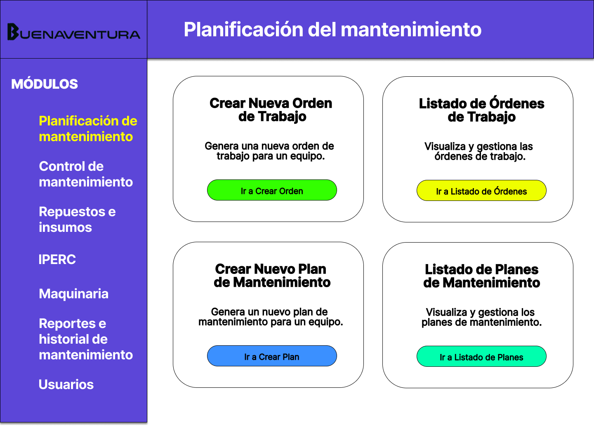
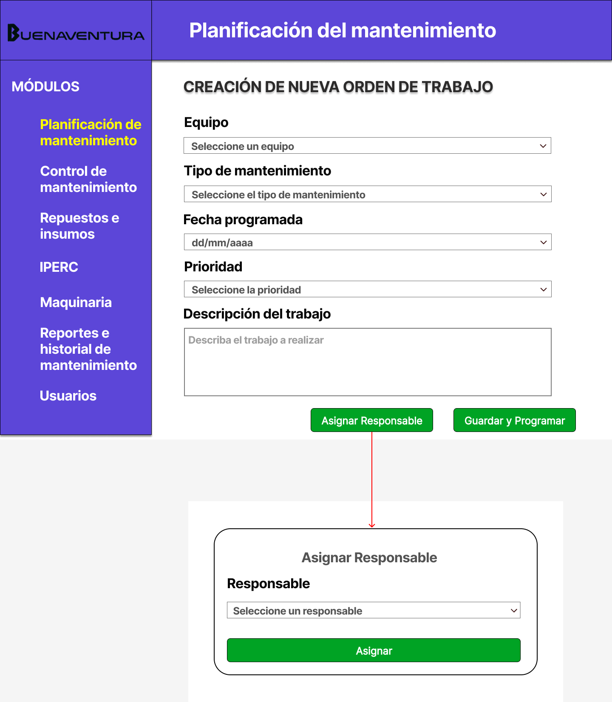
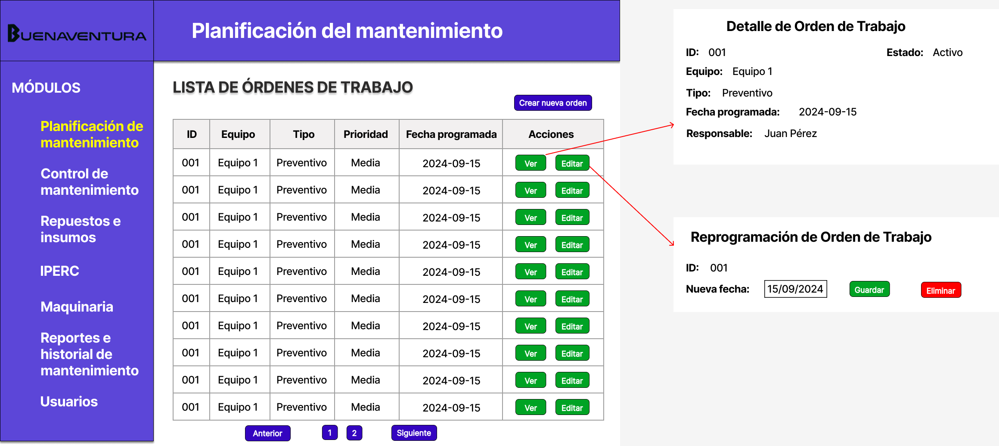
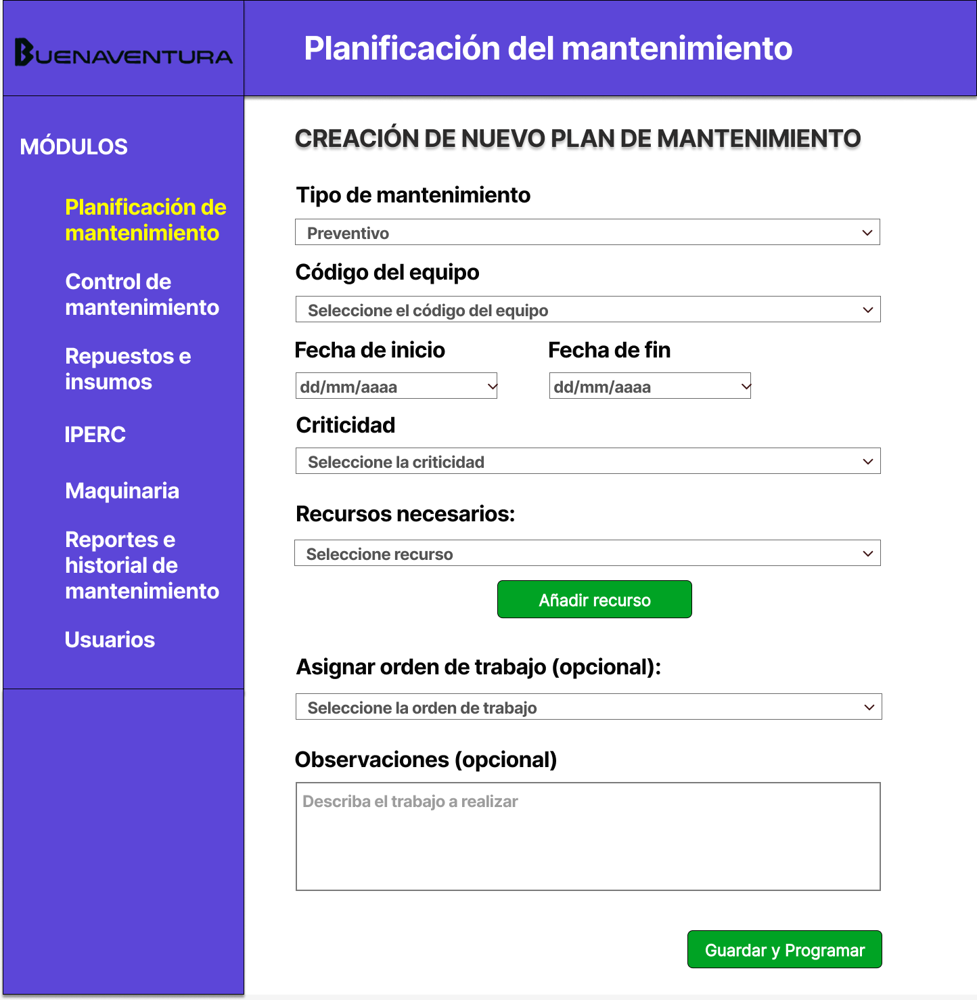
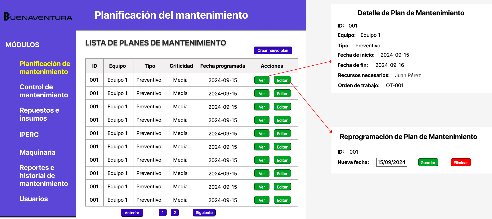

# 4.1. Módulo 1

# Módulo 1: Planificación del mantenimiento

# Requerimientos por casos de uso

## 1) Creación del plan de mantenimiento preventivo

<table border="1">
	<tbody>
		<tr>
			<td>Nombre</td>
			<td colspan="2">Creación del plan de mantenimiento preventivo</td>
		</tr>
		<tr>
			<td>Tarea realizada por el usuario</td>
			<td colspan="2">Planificar las tareas de mantenimiento preventivo para los equipos de la mina</td>
		</tr>
		<tr>
			<td>Actor inicializador</td>
			<td colspan="2">Jefe de Mantenimiento</td>
		</tr>
		<tr>
			<td>Actores participantes</td>
			<td colspan="2">Técnico de Mantenimiento, Administrador del Sistema</td>
		</tr>
		<tr>
            <th>Flow of Events</th>
            <td>
            <ol>
                <li>El jefe de mantenimiento ingresa al sistema digital.</li>
                <li>Selecciona el equipo a ser mantenido.</li>
                <li>Configura las tareas de mantenimiento preventivo.</li>
                <li>Asigna responsable y recursos (herramientas, tiempo).</li>
                <li>Confirma el plan de mantenimiento.</li>
				<li>Configura una nueva orden de trabajo y especifica fechas.</li>
                <li>El sistema genera las órdenes de trabajo digitalmente.</li>
				<li>De solicitarse, el sistema envía las órdenes de trabajo a los empleados correspondientes.</li>
            </ol>
            </td>
        </tr>
        <tr>
			<th>Excepciones</th>
			<td>
            <ol>
                <li>El equipo no está disponible para mantenimiento.</li>
                <li>Recursos (técnicos, herramientas) no disponibles.</li>
            </ol>
            </td>
		</tr>
		<tr>
			<td>Precondición</td>
			<td colspan="2">El equipo y su historial de mantenimiento deben estar registrados en el sistema</td>
		</tr>
		<tr>
			<td>Postcondición</td>
			<td colspan="2">El plan de mantenimiento queda almacenado y las órdenes de trabajo son asignadas digitalmente</td>
		</tr>
		<tr>
			<td>Casos de uso incluidos</td>
			<td colspan="2">-</td>
		</tr>
		<tr>
			<td>Servicios utilizados</td>
			<td colspan="2">Gestión de equipos, Gestión de órdenes de trabajo, Notificaciones</td>
		</tr>
		<tr>
			<th>Requisitos no funcionales</th>
			<td>
            <ol>
                <li>Interfaz intuitiva y accesible desde dispositivos móviles</li>
                <li>Seguridad en el acceso a los datos</li>
            </ol>
            </td>
		</tr>
	</tbody>
</table>

 

## 2) Asignar tareas de mantenimiento correctivo

<table border="1">
	<tbody>
		<tr>
			<td>Nombre</td>
			<td colspan="2">Asignar tareas de mantenimiento correctivo</td>
		</tr>
		<tr>
			<td>Tarea realizada por el usuario</td>
			<td colspan="2">Asignar tareas para corregir fallos en los equipos de la mina</td>
		</tr>
		<tr>
			<td>Actor inicializador</td>
			<td colspan="2">Supervisor de Mantenimiento</td>
		</tr>
		<tr>
			<td>Actores participantes</td>
			<td colspan="2">Técnicos de Mantenimiento, Administrador del Sistema</td>
		</tr>
		<tr>
            <th>Flow of Events</th>
            <td>
            <ol>
                <li>El supervisor recibe notificación de un fallo en el sistema.</li>
				<li>Prepara un plan de mantenimiento correctivo.</li>
                <li>Verifica el fallo y selecciona al técnico disponible para la reparación.</li>
                <li>Asigna las tareas correctivas correspondientes.</li>
				<li>Genera una orden de trabajo correspondiente y esta se envía al técnico.</li>
                <li>El técnico recibe la notificación de las tareas asignadas.</li>
                <li>El técnico registra el progreso y finalización del mantenimiento en el sistema.</li>
            </ol>
            </td>
        </tr>
        <tr>
			<th>Excepciones</th>
			<td>
            <ol>
                <li>El técnico no está disponible.</li>
                <li>Las piezas o herramientas necesarias no están en stock.</li>
            </ol>
            </td>
		</tr>
		<tr>
			<td>Precondición</td>
			<td colspan="2">El equipo debe estar registrado y el fallo identificado.</td>
		</tr>
		<tr>
			<td>Postcondición</td>
			<td colspan="2">El equipo vuelve a estar operativo y los registros de mantenimiento son actualizados.</td>
		</tr>
		<tr>
			<td>Casos de uso incluidos</td>
			<td colspan="2">Consulta de disponibilidad de técnicos, Gestión de inventario de piezas.</td>
		</tr>
		<tr>
			<td>Servicios utilizados</td>
			<td colspan="2">Notificaciones, Gestión de fallos, Gestión de técnicos, Actualización de historial de mantenimiento</td>
		</tr>
		<tr>
			<th>Requisitos no funcionales</th>
			<td>
            <ol>
                <li>Notificaciones en tiempo real.</li>
                <li>Escalabilidad para soportar múltiples usuarios simultáneamente. </li>
            </ol>
            </td>
		</tr>
	</tbody>
</table>

---

# Prototipo
## Dashboard del módulo de planificación
### Requrimientos asociados
- Ingreso del jefe y supervisor al sistema de planificación.
### Imagen de la interfaz
- Se ingresa primero al dashboard de planificación.
- Para crear un nuevo plan de mantenimiento y su orden de trabajo correspondiente se ingresa a las secciones respectivas en cualquier orden.
- Para consultar tanto los planes como las órdenes se ingresan a las secciones respectivas por separado.
### Principales entidades involucradas
- Empleado (con rol de jefe o supervisor)
### Rendimiento
- Proceso online
- Rendimiento necesario: Medio
- Volumen de información: Pequeño
### Pantalla

## Creación de orden de trabajo
### Requrimientos asociados
- El jefe o supervisor debe poder crear una nueva orden de trabajo a partir de un plan de mantenimiento o de manera independiente.
- Los empleados deben recibir la notificación de las órdenes enviadas.
### Imagen de la interfaz
- En esta pantalla, el jefe o supervisor selecciona el plan de mantenimiento relacionado o crea una orden de trabajo de forma independiente.
- Los campos a completar incluyen detalles como equipo a reparar, recursos e insumos necesarios, responsable y fecha límite.
- El sistema debe validar la disponibilidad de los recursos y del equipo.
### Principales entidades involucradas
- Empleado (con rol de jefe o supervisor)
- Orden de trabajo
- Equipo
### Rendimiento
- Proceso online
- Rendimiento necesario: Medio
- Volumen de información: Moderado
### Pantalla

## Lista de órdenes de trabajo
### Requrimientos asociados
- Visualización de todas las órdenes de trabajo creadas, incluyendo opciones para ver detalles y editar la información.
- Los empleados deben poder consultar y actualizar el estado de las órdenes asignadas.
### Imagen de la interfaz
- Se presenta una tabla que muestra todas las órdenes de trabajo, con columnas que incluyen el ID, equipo, tipo de mantenimiento, fecha de creación y acciones (Ver, Editar).
- Al seleccionar “Ver”, se despliega una ventana con los detalles completos de la orden.
- Al seleccionar “Editar”, se permite modificar la orden (a excepción del ID de la orden).
### Principales entidades involucradas
- Empleado (con rol de jefe o supervisor)
- Orden de trabajo
- Equipo
### Rendimiento
- Proceso online
- Rendimiento necesario: Medio
- Volumen de información: Moderado
### Pantalla

## Creación de plan de mantenimiento
### Requrimientos asociados
- Los jefes o supervisores deben poder crear nuevos planes de mantenimiento para equipos, ya sea preventivo, correctivo o predictivo.
- El sistema debe permitir seleccionar recursos e insumos necesarios, asignar responsables y establecer fechas.
### Imagen de la interfaz
- En esta pantalla, se llena un formulario para crear un plan de mantenimiento.
- Los campos incluyen el tipo de mantenimiento (preventivo o correctivo), el equipo involucrado, los recursos e insumos necesarios, fechas de inicio y fin, y el nivel de criticidad.
- Opción para asignar una orden de trabajo relacionada.
### Principales entidades involucradas
- Empleado (con rol de jefe o supervisor): 
- Plan de mantenimiento
- Equipo
- Recurso de mantenimiento
- Insumo de mantenimiento
### Rendimiento
- Proceso online
- Rendimiento necesario: Medio
- Volumen de información: Moderado
### Pantalla

## Lista de planes de mantenimiento
### Requrimientos asociados
- Visualización de todos los planes de mantenimiento actuales.
- El jefe o supervisor debe poder ver los detalles y editar planes de mantenimiento, a excepción del ID.
### Imagen de la interfaz
- Se muestra una tabla con todos los planes de mantenimiento.
- Las columnas incluyen ID, código del equipo, tipo de mantenimiento, nivel de criticidad, fechas de inicio y acciones.
- Los botones de acción permiten ver los detalles o editar los datos del plan.
### Principales entidades involucradas
- Empleado (con rol de jefe o supervisor): 
- Plan de mantenimiento
- Equipo
- Recurso de mantenimiento
- Insumo de mantenimiento
### Rendimiento
- Proceso online
- Rendimiento necesario: Medio
- Volumen de información: Moderado
### Pantalla

