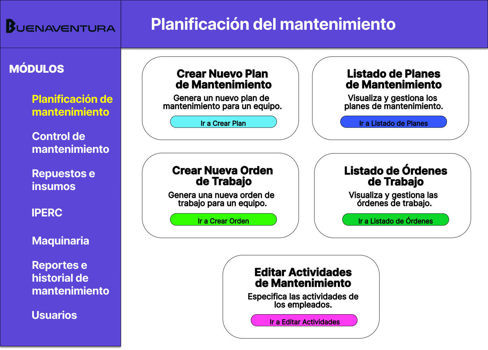
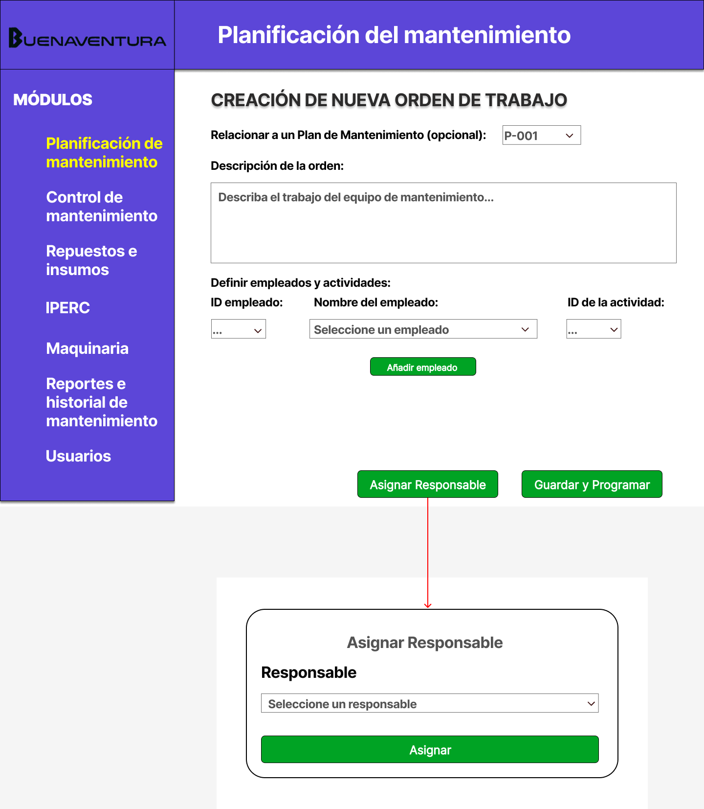

# 4.1. Módulo 1

# Módulo 1: Planificación del mantenimiento

# Requerimientos por casos de uso

## 1) Acceso al Dashboard de Planificación de Mantenimiento

**Código Requerimiento:** R-101

<table border="1">
	<tbody>
		<tr>
			<td>Nombre</td>
			<td colspan="2">Acceso al Dashboard</td>
		</tr>
		<tr>
			<td>Tarea realizada por el usuario</td>
			<td colspan="2">Acceder a la pantalla principal del módulo para ver accesos rápidos a todas las funciones de planificación de mantenimiento.</td>
		</tr>
		<tr>
			<td>Actor inicializador</td>
			<td colspan="2">Jefe de Mantenimiento</td>
		</tr>
		<tr>
			<td>Actores participantes</td>
			<td colspan="2">Jefe de Mantenimiento</td>
		</tr>
		<tr>
            <th>Flow of Events</th>
            <td>
            <ol>
                <li> El usuario ingresa al sistema y selecciona el módulo de "Planificación de Mantenimiento". </li>
				<li> El sistema muestra la pantalla del dashboard con accesos rápidos a las opciones de crear planes, ver listas de planes y órdenes de trabajo, y gestionar actividades de mantenimiento. </li>
            </ol>
            </td>
        </tr>
        <tr>
			<th>Excepciones</th>
			<td>
            <ol>
                <li>Si el usuario no tiene acceso al módulo, se muestra un mensaje de error.</li>
            </ol>
            </td>
		</tr>
		<tr>
			<td>Precondición</td>
			<td colspan="2">El usuario tiene permisos para acceder al módulo.</td>
		</tr>
		<tr>
			<td>Postcondición</td>
			<td colspan="2">Se muestra el dashboard con accesos rápidos a todas las funcionalidades del módulo.</td>
		</tr>
		<tr>
			<td>Casos de uso incluidos</td>
			<td colspan="2">-</td>
		</tr>
		<tr>
			<td>Servicios utilizados</td>
			<td colspan="2">Sistema de control de acceso</td>
		</tr>
		<tr>
			<th>Requisitos no funcionales</th>
			<td>
            <ol>
                <li>La pantalla debe cargar en menos de 2 segundos.</li>
            </ol>
            </td>
		</tr>
	</tbody>
</table>

 

## 2) Creación de un Plan de Mantenimiento

**Código Requerimiento:** R-102

<table border="1">
	<tbody>
		<tr>
			<td>Nombre</td>
			<td colspan="2">Creación del Plan de Mantenimiento</td>
		</tr>
		<tr>
			<td>Tarea realizada por el usuario</td>
			<td colspan="2">Completar los detalles de un nuevo plan de mantenimiento, como tipo, máquina, fechas, insumos y herramientas necesarias, y descripción.</td>
		</tr>
		<tr>
			<td>Actor inicializador</td>
			<td colspan="2">Jefe de Mantenimiento</td>
		</tr>
		<tr>
			<td>Actores participantes</td>
			<td colspan="2">Jefe de Mantenimiento</td>
		</tr>
		<tr>
            <th>Flow of Events</th>
            <td>
            <ol>
                <li>El usuario accede a la pantalla de creación de un plan de mantenimiento.</li>
				<li>Completa los campos del formulario, incluyendo tipo de mantenimiento, máquina, fechas, insumos, herramientas y descripción.</li>
                <li>Guarda el plan en el sistema.</li>
            </ol>
            </td>
        </tr>
        <tr>
			<th>Excepciones</th>
			<td>
            <ol>
                <li>Si faltan campos obligatorios, el sistema muestra un mensaje de error.</li>
            </ol>
            </td>
		</tr>
		<tr>
			<td>Precondición</td>
			<td colspan="2">El usuario tiene permisos de creación en el módulo. </td>
</td>
		</tr>
		<tr>
			<td>Postcondición</td>
			<td colspan="2">El plan de mantenimiento se almacena en estado "borrador."</td>
		</tr>
		<tr>
			<td>Casos de uso incluidos</td>
			<td colspan="2">Consulta de disponibilidad de técnicos, Gestión de inventario de piezas.</td>
		</tr>
		<tr>
			<td>Servicios utilizados</td>
			<td colspan="2">Sistema de almacenamiento de planes de mantenimiento</td>
		</tr>
		<tr>
			<th>Requisitos no funcionales</th>
			<td>
            <ol>
                <li>La interfaz debe ser clara e intuitiva.</li>
            </ol>
            </td>
		</tr>
	</tbody>
</table>

 

## 3) Visualización de Lista de Planes de Mantenimiento

**Código Requerimiento:** R-103

<table border="1">
	<tbody>
		<tr>
			<td>Nombre</td>
			<td colspan="2">Visualización de Lista de Planes de Mantenimiento
</td>
		</tr>
		<tr>
			<td>Tarea realizada por el usuario</td>
			<td colspan="2">Visualizar la lista de planes de mantenimiento en una tabla.</td>
		</tr>
		<tr>
			<td>Actor inicializador</td>
			<td colspan="2">Jefe de Mantenimiento</td>
		</tr>
		<tr>
			<td>Actores participantes</td>
			<td colspan="2">Jefe de Mantenimiento</td>
		</tr>
		<tr>
            <th>Flow of Events</th>
            <td>
            <ol>
                <li>El usuario accede a la lista de planes de mantenimiento.</li>
				<li>El sistema muestra la lista con detalles básicos de cada plan.</li>
            </ol>
            </td>
        </tr>
        <tr>
			<th>Excepciones</th>
			<td>
            <ol>
                <li>Si no hay planes disponibles, el sistema muestra un mensaje de “No se encontraron planes.”</li>
            </ol>
            </td>
		</tr>
		<tr>
			<td>Precondición</td>
			<td colspan="2"> El usuario tiene permisos de acceso a la lista. </td>
</td>
		</tr>
		<tr>
			<td>Postcondición</td>
			<td colspan="2"> La lista de planes queda visible.</td>
		</tr>
		<tr>
			<td>Casos de uso incluidos</td>
			<td colspan="2">-</td>
		</tr>
		<tr>
			<td>Servicios utilizados</td>
			<td colspan="2">Sistema de gestión de planes</td>
		</tr>
		<tr>
			<th>Requisitos no funcionales</th>
			<td>
            <ol>
                <li>La tabla debe cargar rápidamente.</li>
            </ol>
            </td>
		</tr>
	</tbody>
</table>

 

## 4) Creación de una Orden de Trabajo

**Código Requerimiento:** R-104

<table border="1">
	<tbody>
		<tr>
			<td>Nombre</td>
			<td colspan="2">Creación de la Orden de Trabajo</td>
		</tr>
		<tr>
			<td>Tarea realizada por el usuario</td>
			<td colspan="2">Completar los detalles de una nueva orden de trabajo, incluyendo empleados, responsable y descripción general.</td>
		</tr>
		<tr>
			<td>Actor inicializador</td>
			<td colspan="2">Jefe de Mantenimiento</td>
		</tr>
		<tr>
			<td>Actores participantes</td>
			<td colspan="2">Jefe de Mantenimiento</td>
		</tr>
		<tr>
            <th>Flow of Events</th>
            <td>
            <ol>
                <li> El usuario accede a la pantalla de creación de una orden de trabajo. </li>
				<li> Completa los campos, incluyendo empleados asignados, responsable y descripción. </li>
				<li> Guarda la orden en el sistema. </li>
            </ol>
            </td>
        </tr>
        <tr>
			<th>Excepciones</th>
			<td>
            <ol>
                <li>Si faltan campos obligatorios, el sistema muestra un mensaje de error.</li>
            </ol>
            </td>
		</tr>
		<tr>
			<td>Precondición</td>
			<td colspan="2">El usuario tiene permisos para crear órdenes.</td>
		</tr>
		<tr>
			<td>Postcondición</td>
			<td colspan="2">La orden de trabajo se almacena en el sistema.</td>
		</tr>
		<tr>
			<td>Casos de uso incluidos</td>
			<td colspan="2">-</td>
		</tr>
		<tr>
			<td>Servicios utilizados</td>
			<td colspan="2">Sistema de almacenamiento de órdenes de trabajo</td>
		</tr>
		<tr>
			<th>Requisitos no funcionales</th>
			<td>
            <ol>
                <li>La interfaz debe ser intuitiva.</li>
            </ol>
            </td>
		</tr>
	</tbody>
</table>

 

## 5) Visualización de Lista de Órdenes de Trabajo

**Código Requerimiento:** R-105

<table border="1">
	<tbody>
		<tr>
			<td>Nombre</td>
			<td colspan="2">Visualización de Lista de Órdenes de Trabajo</td>
		</tr>
		<tr>
			<td>Tarea realizada por el usuario</td>
			<td colspan="2">Visualizar la lista de órdenes de trabajo en una tabla.</td>
		</tr>
		<tr>
			<td>Actor inicializador</td>
			<td colspan="2">Jefe de Mantenimiento</td>
		</tr>
		<tr>
			<td>Actores participantes</td>
			<td colspan="2">Jefe de Mantenimiento</td>
		</tr>
		<tr>
            <th>Flow of Events</th>
            <td>
            <ol>
                <li> El usuario accede a la lista de órdenes de trabajo. </li>
				<li> El sistema muestra la lista con detalles básicos de cada orden. </li>
            </ol>
            </td>
        </tr>
        <tr>
			<th>Excepciones</th>
			<td>
            <ol>
                <li>Si no hay órdenes, se muestra un mensaje de “No se encontraron órdenes.”</li>
            </ol>
            </td>
		</tr>
		<tr>
			<td>Precondición</td>
			<td colspan="2">El usuario tiene permisos para acceder al módulo.</td>
		</tr>
		<tr>
			<td>Postcondición</td>
			<td colspan="2"> La lista de órdenes queda visible.</td>
		</tr>
		<tr>
			<td>Casos de uso incluidos</td>
			<td colspan="2">-</td>
		</tr>
		<tr>
			<td>Servicios utilizados</td>
			<td colspan="2">Sistema de gestión de órdenes</td>
		</tr>
		<tr>
			<th>Requisitos no funcionales</th>
			<td>
            <ol>
                <li>La carga debe ser rápida.</li>
            </ol>
            </td>
		</tr>
	</tbody>
</table>

 

## 6) Visualización de Actividades de Mantenimiento por Orden

**Código Requerimiento:** R-106

<table border="1">
	<tbody>
		<tr>
			<td>Nombre</td>
			<td colspan="2">Visualización de Actividades de Mantenimiento</td>
		</tr>
		<tr>
			<td>Tarea realizada por el usuario</td>
			<td colspan="2">Ver las actividades de mantenimiento para una orden específica.</td>
		</tr>
		<tr>
			<td>Actor inicializador</td>
			<td colspan="2">Jefe de Mantenimiento</td>
		</tr>
		<tr>
			<td>Actores participantes</td>
			<td colspan="2">Jefe de Mantenimiento</td>
		</tr>
		<tr>
            <th>Flow of Events</th>
            <td>
            <ol>
                <li> El usuario accede a la lista de actividades para una orden seleccionada. </li>
				<li> El sistema muestra las actividades relacionadas. </li>
            </ol>
            </td>
        </tr>
        <tr>
			<th>Excepciones</th>
			<td>
            <ol>
                <li>Si no hay actividades, se muestra un mensaje de “No se encontraron actividades.”</li>
            </ol>
            </td>
		</tr>
		<tr>
			<td>Precondición</td>
			<td colspan="2">El usuario tiene permisos para acceder.</td>
		</tr>
		<tr>
			<td>Postcondición</td>
			<td colspan="2">La lista de actividades queda visible.</td>
		</tr>
		<tr>
			<td>Casos de uso incluidos</td>
			<td colspan="2">-</td>
		</tr>
		<tr>
			<td>Servicios utilizados</td>
			<td colspan="2">Sistema de gestión de actividades</td>
		</tr>
		<tr>
			<th>Requisitos no funcionales</th>
			<td>
            <ol>
                <li>La interfaz debe ser responsiva.</li>
            </ol>
            </td>
		</tr>
	</tbody>
</table>

 

## 7) Detalle de Plan de Mantenimiento y Notificación al Responsable

**Código Requerimiento:** R-107

<table border="1">
	<tbody>
		<tr>
			<td>Nombre</td>
			<td colspan="2">Detalle de Plan y Notificación</td>
		</tr>
		<tr>
			<td>Tarea realizada por el usuario</td>
			<td colspan="2">Ver el detalle de un plan de mantenimiento y notificar al responsable.</td>
		</tr>
		<tr>
			<td>Actor inicializador</td>
			<td colspan="2">Jefe de Mantenimiento</td>
		</tr>
		<tr>
			<td>Actores participantes</td>
			<td colspan="2">
				<ol>
					<li>Jefe de mantenimiento</li>
					<li>Responsable del mantenimiento</li>
    			</ol>
			</td>
		</tr>
		<tr>
            <th>Flow of Events</th>
            <td>
            <ol>
                <li> El usuario accede al detalle de un plan en estado "borrador." </li>
				<li> Revisa el contenido detallado del plan. </li>
				<li> Hace clic en "Notificar". </li>
				<li> El sistema cambia el estado del plan a "notificado" y envía la notificación al responsable. </li>
            </ol>
            </td>
        </tr>
        <tr>
			<th>Excepciones</th>
			<td>
            <ol>
                <li>Si el sistema de notificación falla, se muestra un error.</li>
            </ol>
            </td>
		</tr>
		<tr>
			<td>Precondición</td>
			<td colspan="2">El plan está en estado "borrador."</td>
		</tr>
		<tr>
			<td>Postcondición</td>
			<td colspan="2">El plan se marca como "notificado."</td>
		</tr>
		<tr>
			<td>Casos de uso incluidos</td>
			<td colspan="2">-</td>
		</tr>
		<tr>
			<td>Servicios utilizados</td>
			<td colspan="2">Notificación, sistema de gestión de estados</td>
		</tr>
		<tr>
			<th>Requisitos no funcionales</th>
			<td>
            <ol>
                <li>Notificación en tiempo real.</li>
            </ol>
            </td>
		</tr>
	</tbody>
</table>

 

## 8) Edición de Plan de Mantenimiento

**Código Requerimiento:** R-108

<table border="1">
	<tbody>
		<tr>
			<td>Nombre</td>
			<td colspan="2">Edición de Plan de Mantenimiento</td>
		</tr>
		<tr>
			<td>Tarea realizada por el usuario</td>
			<td colspan="2">Editar los detalles de un plan de mantenimiento.</td>
		</tr>
		<tr>
			<td>Actor inicializador</td>
			<td colspan="2">Jefe de Mantenimiento</td>
		</tr>
		<tr>
			<td>Actores participantes</td>
			<td colspan="2">Jefe de Mantenimiento</td>
		</tr>
		<tr>
            <th>Flow of Events</th>
            <td>
            <ol>
                <li> El usuario selecciona el plan a editar. </li>
				<li> Modifica los campos requeridos. </li>
				<li> Guarda los cambios. </li>
            </ol>
            </td>
        </tr>
        <tr>
			<th>Excepciones</th>
			<td>
            <ol>
                <li>Si faltan datos, se muestra un mensaje de error.</li>
            </ol>
            </td>
		</tr>
		<tr>
			<td>Precondición</td>
			<td colspan="2">El usuario tiene permisos de edición.</td>
		</tr>
		<tr>
			<td>Postcondición</td>
			<td colspan="2">Los cambios quedan registrados.</td>
		</tr>
		<tr>
			<td>Casos de uso incluidos</td>
			<td colspan="2">-</td>
		</tr>
		<tr>
			<td>Servicios utilizados</td>
			<td colspan="2">Sistema de actualización de planes</td>
		</tr>
		<tr>
			<th>Requisitos no funcionales</th>
			<td>
            <ol>
                <li>Validación de campos en tiempo real.</li>
            </ol>
            </td>
		</tr>
	</tbody>
</table>

 

## 9) Detalle de Orden de Trabajo

**Código Requerimiento:** R-101

<table border="1">
	<tbody>
		<tr>
			<td>Nombre</td>
			<td colspan="2">Detalle de Orden de Trabajo</td>
		</tr>
		<tr>
			<td>Tarea realizada por el usuario</td>
			<td colspan="2">Ver el detalle de una orden de trabajo.</td>
		</tr>
		<tr>
			<td>Actor inicializador</td>
			<td colspan="2">Jefe de Mantenimiento</td>
		</tr>
		<tr>
			<td>Actores participantes</td>
			<td colspan="2">Jefe de Mantenimiento</td>
		</tr>
		<tr>
            <th>Flow of Events</th>
            <td>
            <ol>
                <li> El usuario selecciona una orden para ver los detalles. </li>
				<li> El sistema muestra información detallada de la orden. </li>
            </ol>
            </td>
        </tr>
        <tr>
			<th>Excepciones</th>
			<td>
            <ol>
                <li>Ninguna</li>
            </ol>
            </td>
		</tr>
		<tr>
			<td>Precondición</td>
			<td colspan="2">El usuario tiene acceso.</td>
		</tr>
		<tr>
			<td>Postcondición</td>
			<td colspan="2">El detalle queda visible.</td>
		</tr>
		<tr>
			<td>Casos de uso incluidos</td>
			<td colspan="2">-</td>
		</tr>
		<tr>
			<td>Servicios utilizados</td>
			<td colspan="2">Sistema de gestión de órdenes</td>
		</tr>
		<tr>
			<th>Requisitos no funcionales</th>
			<td>
            <ol>
                <li>La pantalla debe ser clara y fácil de leer.</li>
            </ol>
            </td>
		</tr>
	</tbody>
</table>

 

## 10) Edición de Orden de Trabajo

**Código Requerimiento:** R-110

<table border="1">
	<tbody>
		<tr>
			<td>Nombre</td>
			<td colspan="2">Edición de Orden de Trabajo</td>
		</tr>
		<tr>
			<td>Tarea realizada por el usuario</td>
			<td colspan="2">Editar una orden de trabajo.</td>
		</tr>
		<tr>
			<td>Actor inicializador</td>
			<td colspan="2">Jefe de Mantenimiento</td>
		</tr>
		<tr>
			<td>Actores participantes</td>
			<td colspan="2">Jefe de Mantenimiento</td>
		</tr>
		<tr>
            <th>Flow of Events</th>
            <td>
            <ol>
                <li> El usuario selecciona la orden a editar. </li>
				<li> Realiza las modificaciones necesarias. </li>
				<li> Guarda los cambios. </li>
            </ol>
            </td>
        </tr>
        <tr>
			<th>Excepciones</th>
			<td>
            <ol>
                <li>Ninguna.</li>
            </ol>
            </td>
		</tr>
		<tr>
			<td>Precondición</td>
			<td colspan="2">El usuario tiene permisos de edición.</td>
		</tr>
		<tr>
			<td>Postcondición</td>
			<td colspan="2">La orden se actualiza.</td>
		</tr>
		<tr>
			<td>Casos de uso incluidos</td>
			<td colspan="2">-</td>
		</tr>
		<tr>
			<td>Servicios utilizados</td>
			<td colspan="2">Sistema de gestión de órdenes</td>
		</tr>
		<tr>
			<th>Requisitos no funcionales</th>
			<td>
            <ol>
                <li>Confirmación de cambios antes de guardar.</li>
            </ol>
            </td>
		</tr>
	</tbody>
</table>

 

## 11) Creación de Actividad de Mantenimiento

**Código Requerimiento:** R-111

<table border="1">
	<tbody>
		<tr>
			<td>Nombre</td>
			<td colspan="2">Creación de Actividad de Mantenimiento</td>
		</tr>
		<tr>
			<td>Tarea realizada por el usuario</td>
			<td colspan="2">Crear una actividad específica para un plan.</td>
		</tr>
		<tr>
			<td>Actor inicializador</td>
			<td colspan="2">Jefe de Mantenimiento</td>
		</tr>
		<tr>
			<td>Actores participantes</td>
			<td colspan="2">Jefe de Mantenimiento</td>
		</tr>
		<tr>
            <th>Flow of Events</th>
            <td>
            <ol>
                <li> El usuario accede al formulario de nueva actividad. </li>
				<li> Completa los campos. </li>
				<li> Guarda la actividad. </li>
            </ol>
            </td>
        </tr>
        <tr>
			<th>Excepciones</th>
			<td>
            <ol>
                <li>Si el usuario no tiene acceso al módulo, se muestra un mensaje de error.</li>
            </ol>
            </td>
		</tr>
		<tr>
			<td>Precondición</td>
			<td colspan="2">El plan debe estar creado.</td>
		</tr>
		<tr>
			<td>Postcondición</td>
			<td colspan="2">La actividad queda registrada.</td>
		</tr>
		<tr>
			<td>Casos de uso incluidos</td>
			<td colspan="2">-</td>
		</tr>
		<tr>
			<td>Servicios utilizados</td>
			<td colspan="2">Sistema de actividades</td>
		</tr>
		<tr>
			<th>Requisitos no funcionales</th>
			<td>
            <ol>
                <li>Validación de datos en tiempo real.</li>
            </ol>
            </td>
		</tr>
	</tbody>
</table>

 

## 12) Edición de Actividad de Mantenimiento

**Código Requerimiento:** R-101

<table border="1">
	<tbody>
		<tr>
			<td>Nombre</td>
			<td colspan="2">Edición de Actividad de Mantenimiento</td>
		</tr>
		<tr>
			<td>Tarea realizada por el usuario</td>
			<td colspan="2">Modificar una actividad de mantenimiento.</td>
		</tr>
		<tr>
			<td>Actor inicializador</td>
			<td colspan="2">Jefe de Mantenimiento</td>
		</tr>
		<tr>
			<td>Actores participantes</td>
			<td colspan="2">Jefe de Mantenimiento</td>
		</tr>
		<tr>
            <th>Flow of Events</th>
            <td>
            <ol>
                <li> El usuario selecciona la actividad. </li>
				<li> Realiza cambios y guarda. </li>
            </ol>
            </td>
        </tr>
        <tr>
			<th>Excepciones</th>
			<td>
            <ol>
                <li>Ninguna.</li>
            </ol>
            </td>
		</tr>
		<tr>
			<td>Precondición</td>
			<td colspan="2">La actividad debe existir.</td>
		</tr>
		<tr>
			<td>Postcondición</td>
			<td colspan="2">La actividad queda actualizada.</td>
		</tr>
		<tr>
			<td>Casos de uso incluidos</td>
			<td colspan="2">-</td>
		</tr>
		<tr>
			<td>Servicios utilizados</td>
			<td colspan="2">Sistema de actividades</td>
		</tr>
		<tr>
			<th>Requisitos no funcionales</th>
			<td>
            <ol>
                <li>Confirmación de cambios antes de guardar.</li>
            </ol>
            </td>
		</tr>
	</tbody>
</table>

---

# Prototipo

**Código de Interfaz:** I-101
## Dashboard del módulo de planificación
### Requerimientos asociados
- R-101: Acceso del encargado de planificación al sistema de planificación de mantenimiento.
### Imagen de la interfaz
- El encargado de planificación accede al dashboard principal del módulo.
- Desde el dashboard, el usuario puede navegar para crear nuevos planes de mantenimiento y órdenes de trabajo.
- También puede acceder a las secciones de consulta para revisar planes y órdenes de trabajo de manera independiente.
### Principales entidades involucradas
- Jefe de mantenimiento (actor principal que accede y gestiona los planes y órdenes de mantenimiento).
### Rendimiento
- Proceso: En línea
- Rendimiento necesario: Medio
- Volumen de información: Bajo a medio, considerando que el usuario solo accede a opciones y no a datos masivos.
### Pantalla

**Código de Interfaz:** I-102
## Creación de Plan de Mantenimiento
### Requerimientos asociados
- R-102: Creación de un nuevo plan de mantenimiento, con datos sobre tipo, máquina, fechas, insumos, herramientas y descripción.
### Imagen de la interfaz
- El encargado de planificación accede a esta interfaz para completar un formulario con los detalles del plan de mantenimiento.
- Puede ingresar la información requerida, incluyendo tipo de mantenimiento, equipo a trabajar, fechas, recursos y descripción detallada.
### Principales entidades involucradas
- Jefe de mantenimiento (actor principal que accede y gestiona los planes y órdenes de mantenimiento).
- Plan de Mantenimiento (creado por el usuario con los datos necesarios).
### Rendimiento
- Proceso: En línea
- Rendimiento necesario: Medio
- Volumen de información: Bajo a medio.
### Pantalla

**Código de Interfaz:** I-103
## Visualización de Lista de Planes de Mantenimiento
### Requerimientos asociados
- R-103: Acceso a la lista de planes de mantenimiento, con detalles básicos de cada plan.
### Imagen de la interfaz
- Muestra una tabla con todos los planes de mantenimiento creados, listando información clave como tipo de plan, equipo y estado.
- La interfaz permite al encargado de planificación revisar, editar o acceder al detalle de cada plan desde la lista.
### Principales entidades involucradas
- Jefe de mantenimiento (actor principal que accede y gestiona los planes y órdenes de mantenimiento).
- Plan de Mantenimiento (entidad principal mostrada en la lista).
### Rendimiento
- Proceso: En línea
- Rendimiento necesario: Medio a alto, considerando consultas frecuentes.
- Volumen de información: Medio
### Pantalla

**Código de Interfaz:** I-104
## Creación de Orden de Trabajo
### Requerimientos asociados
- R-104: Creación de una nueva orden de trabajo, que incluye empleados, responsable, descripción y detalles de la tarea.
### Imagen de la interfaz
- El encargado de planificación accede a un formulario donde puede definir los empleados asignados, el responsable de la orden, y detalles relevantes del trabajo a realizar.
### Principales entidades involucradas
- Jefe de mantenimiento (actor principal que accede y gestiona los planes y órdenes de mantenimiento).
- Orden de Trabajo (creada para tareas específicas relacionadas con los planes de mantenimiento).
### Rendimiento
- Proceso: En línea
- Rendimiento necesario: Medio
- Volumen de información: Bajo a medio.
### Pantalla

**Código de Interfaz:** I-105
## Visualización de Lista de Órdenes de Trabajo
### Requerimientos asociados
- R-105: Visualización de la lista de órdenes de trabajo existentes.
### Imagen de la interfaz
- Muestra una tabla con las órdenes de trabajo registradas, listando información clave como empleados asignados, estado y descripción breve.
### Principales entidades involucradas
- Jefe de mantenimiento (actor principal que accede y gestiona los planes y órdenes de mantenimiento).
- Orden de Trabajo (entidad principal mostrada en la lista).
### Rendimiento
- Proceso: En línea
- Rendimiento necesario: Medio
- Volumen de información: Medio
### Pantalla

**Código de Interfaz:** I-106
## Visualización de Actividades de Mantenimiento por Orden
### Requerimientos asociados
- R-106: Acceso a las actividades de mantenimiento relacionadas con una orden específica.
### Imagen de la interfaz
- Despliega una lista de actividades asociadas a una orden de trabajo, con detalles de cada actividad como duración, empleados asignados y recursos necesarios.
### Principales entidades involucradas
- Jefe de mantenimiento (actor principal que accede y gestiona los planes y órdenes de mantenimiento).
- Actividad de Mantenimiento (actividades específicas dentro de una orden).
### Rendimiento
- Proceso: En línea
- Rendimiento necesario: Medio
- Volumen de información: Medio
### Pantalla

**Código de Interfaz:** I-107
## Detalle de Plan de Mantenimiento y Notificación al Responsable
### Requerimientos asociados
- R-107: Visualización del detalle de un plan y notificación al responsable.
### Imagen de la interfaz
- Muestra el detalle completo de un plan de mantenimiento, con la opción de notificar al responsable.
- Al activar la notificación, se cambia el estado del plan a "notificado".
### Principales entidades involucradas
- Jefe de mantenimiento (actor principal que accede y gestiona los planes y órdenes de mantenimiento).
- Plan de Mantenimiento (en estado detallado para revisión y notificación).
- Notificación ()
### Rendimiento
- Proceso: En línea
- Rendimiento necesario: Medio a alto
- Volumen de información: Bajo a medio
### Pantalla

**Código de Interfaz:** I-108
## Edición de Plan de Mantenimiento
### Requerimientos asociados
- R-108: Modificación de los detalles de un plan de mantenimiento.
### Imagen de la interfaz
- Permite al encargado de planificación editar la información registrada en un plan de mantenimiento, como fechas, recursos y equipos.
### Principales entidades involucradas
- Jefe de mantenimiento (actor principal que accede y gestiona los planes y órdenes de mantenimiento).
- Plan de Mantenimiento (modificado con datos adicionales o corregidos).
### Rendimiento
- Proceso: En línea
- Rendimiento necesario: Medio
- Volumen de información: Bajo
### Pantalla

**Código de Interfaz:** I-109
## Detalle de Orden de Trabajo
### Requerimientos asociados
- R-109: Visualización de detalles específicos de una orden de trabajo.
### Imagen de la interfaz
- Despliega información detallada sobre una orden de trabajo, como el responsable, empleados asignados y recursos necesarios.
### Principales entidades involucradas
- Jefe de mantenimiento (actor principal que accede y gestiona los planes y órdenes de mantenimiento).
- Orden de Trabajo (detallada para ver la información completa).
### Rendimiento
- Proceso: En línea
- Rendimiento necesario: Medio
- Volumen de información: Bajo
### Pantalla

**Código de Interfaz:** I-110
## Edición de Orden de Trabajo
### Requerimientos asociados
- R-110: Modificación de una orden de trabajo existente.
### Imagen de la interfaz
- Permite editar información registrada en una orden de trabajo, como empleados asignados y recursos requeridos.
### Principales entidades involucradas
- Jefe de mantenimiento (actor principal que accede y gestiona los planes y órdenes de mantenimiento).
- Orden de Trabajo (modificada para ajustes en datos asignados).
### Rendimiento
- Proceso: En línea
- Rendimiento necesario: Medio
- Volumen de información: Bajo
### Pantalla

**Código de Interfaz:** I-111
## Creación de Actividad de Mantenimiento
### Requerimientos asociados
- R-111: Creación de una actividad específica dentro de un plan de mantenimiento.
### Imagen de la interfaz
- Formulario para registrar una nueva actividad dentro de un plan, con detalles como tipo, duración, empleados y recursos.
### Principales entidades involucradas
- Jefe de mantenimiento (actor principal que accede y gestiona los planes y órdenes de mantenimiento).
- Actividad de Mantenimiento (creada para un plan específico).
### Rendimiento
- Proceso: En línea
- Rendimiento necesario: Medio
- Volumen de información: Bajo
### Pantalla

**Código de Interfaz:** I-112
## Edición de Actividad de Mantenimiento
### Requerimientos asociados
- R-112: Modificación de detalles de una actividad de mantenimiento existente.
### Imagen de la interfaz
- Permite al usuario ajustar los detalles de una actividad, como duración, empleados o recursos.
### Principales entidades involucradas
- Jefe de mantenimiento (actor principal que accede y gestiona los planes y órdenes de mantenimiento).
- Actividad de Mantenimiento (ajustada según los cambios necesarios).
### Rendimiento
- Proceso: En línea
- Rendimiento necesario: Medio
- Volumen de información: Bajo
### Pantalla
