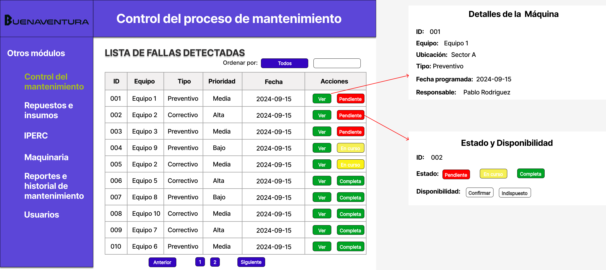

# 4.2. Módulo 2

# Módulo 2: Control del proceso de mantenimiento

# Requerimientos por casos de uso

## 1) Visualización de la Lista de Trabajos Asignados

**Código Requerimiento:** R-201

<table border="1">
	<tbody>
		<tr>
			<td>Nombre</td>
			<td colspan="2">Visualización de la Lista de Trabajos Asignados</td>
		</tr>
		<tr>
			<td>Tarea realizada por el usuario</td>
			<td colspan="2">Visualizar la lista de las tareas de mantenimiento asignadas en una tabla.</td>
		</tr>
		<tr>
			<td>Actor inicializador</td>
			<td colspan="2">Empleado (observar las tareas de mantenimiento) </td>
		</tr>
		<tr>
			<td>Actores participantes</td>
			<td colspan="2">Técnico de Mantenimiento, Supervisor de Mantenimiento</td>
		</tr>
		<tr>
            <th>Flow of Events</th>
            <td>
            <ol>
                <li>El usuario accede a la lista de las tareas de mantenimiento.</li>
                <li>El sistema muestra la lista con detalles básicos de cada tarea de mantenimiento.</li>
                <li>El usuario puede acceder a los detalles especificos de la tarea al hacer click en el boton "ver".</li>
                <li>El usuario puede editar la disponibilidad o el estado de la tarea de mantenimiento</li>
                <li>El usuario puede visualizar el estado de la tarea de mantenimiento con un color distinto.</li>
            </ol>
            </td>
        </tr>
        <tr>
			<th>Excepciones</th>
			<td>
            <ol>
                <li>Si no hay tareas asignadas, el sistema muestra un mensaje de “No hay tareas asignadas.”</li>
            </ol>
            </td>
		</tr>
		<tr>
			<td>Precondición</td>
			<td colspan="2">El usuario debe tener permiso de acceso a la lista.</td>
		</tr>
		<tr>
			<td>Postcondición</td>
			<td colspan="2">La lista de actividades queda visible.</td>
		</tr>
		<tr>
			<td>Casos de uso incluidos</td>
			<td colspan="2"></td>
		</tr>
		<tr>
			<td>Servicios utilizados</td>
			<td colspan="2">Gestión de órdenes de trabajo, Reportes de mantenimiento</td>
		</tr>
		<tr>
			<th>Requisitos no funcionales</th>
			<td>
            <ol>
                <li>La tabla de tareas de mantenimiento debe cargar rapidamente</li>
            </ol>
            </td>
		</tr>
	</tbody>
</table>

 

## 2) Detalles del Trabajo de Mantenimiento

**Código Requerimiento:** R-202

<table border="1">
	<tbody>
		<tr>
			<td>Nombre</td>
			<td colspan="2">Detalles del Trabajo de Mantenimiento</td>
		</tr>
		<tr>
			<td>Tarea realizada por el usuario</td>
			<td colspan="2">Ver los detalles especificos de una tarea de mantenimiento.</td>
		</tr>
		<tr>
			<td>Actor inicializador</td>
			<td colspan="2">Empleado (no necesariamente el responsable del mantenimiento) </td>
		</tr>
		<tr>
			<td>Actores participantes</td>
			<td colspan="2">Técnico de Mantenimiento, Supervisor de Mantenimiento</td>
		</tr>
		<tr>
            <th>Flow of Events</th>
            <td>
            <ol>
                <li>El usuario accede al detalle de una tarea de mantenimiento</li>
                <li>Revisa el contenido detallado de la tarea.</li>
                <li>Lee la descripcion detallada de la tarea que tiene que realizar</li>
            </ol>
            </td>
        </tr>
        <tr>
			<th>Excepciones</th>
			<td>
            <ol>
                <li>Si el no se pusieron los detalles de mantenimiento, se muestra un error.</li>
            </ol>
            </td>
		</tr>
		<tr>
			<td>Precondición</td>
			<td colspan="2">La tarea de mantenimiento tiene que haber sido creada</td>
		</tr>
		<tr>
			<td>Postcondición</td>
			<td colspan="2">El detalle de la tarea queda visible</td>
		</tr>
		<tr>
			<td>Casos de uso incluidos</td>
			<td colspan="2">Visualización de la Lista de Trabajos Asignados</td>
		</tr>
		<tr>
			<td>Servicios utilizados</td>
			<td colspan="2">Gestión de órdenes de trabajo, Reportes de mantenimiento</td>
		</tr>
		<tr>
			<th>Requisitos no funcionales</th>
			<td>
            <ol>
                <li>Confirmación visual de los detalles de la tarea.</li>
            </ol>
            </td>
		</tr>
	</tbody>
</table>

 

## 3) Estado y Disponibilidad

**Código Requerimiento:** R-203

<table border="1">
	<tbody>
		<tr>
			<td>Nombre</td>
			<td colspan="2">Estado y Disponibilidad</td>
		</tr>
		<tr>
			<td>Tarea realizada por el usuario</td>
			<td colspan="2">Modificar el estado y la disponibilidad de la tarea de mantenimiento.</td>
		</tr>
		<tr>
			<td>Actor inicializador</td>
			<td colspan="2">Empleado (responsable del mantenimiento) </td>
		</tr>
		<tr>
			<td>Actores participantes</td>
			<td colspan="2">Técnico de Mantenimiento, Supervisor de Mantenimiento</td>
		</tr>
		<tr>
            <th>Flow of Events</th>
            <td>
            <ol>
                <li>El usuario accede al estado y disponibilidad de una tarea de mantenimiento</li>
                <li>El usuario puede cambiar el estado de la tarea para que todos puedan observar si se esta realizando o no.</li>
                <li>El usuario puede marcar como indisupuesto si no pudiese encargarse del trabajo asignado.</li>
		<li>El usuario puede hacer un comentario acerca del trabajo de mantenimeinto.</li>
		<li>El usuario puede notificar al jefe para que pueda hacer los cambios necesarios</li>
            </ol>
            </td>
        </tr>
        <tr>
			<th>Excepciones</th>
			<td>
            <ol>
                <li>Si no se puede visualizar la pantalla de estado y disponibilidad, se muestra un error.</li>
            </ol>
            </td>
		</tr>
		<tr>
			<td>Precondición</td>
			<td colspan="2">Solo el empleado responsable puede acceder al boton editar</td>
		</tr>
		<tr>
			<td>Postcondición</td>
			<td colspan="2">El empleado responsable puede editar el estado y la disponibilidad</td>
		</tr>
		<tr>
			<td>Casos de uso incluidos</td>
			<td colspan="2">Visualización de la Lista de Trabajos Asignados</td>
		</tr>
		<tr>
			<td>Servicios utilizados</td>
			<td colspan="2">Gestión de órdenes de trabajo, Reportes de mantenimiento</td>
		</tr>
		<tr>
			<th>Requisitos no funcionales</th>
			<td>
            <ol>
                <li>Notificación en tiempo real al jefe.</li>
            </ol>
            </td>
		</tr>
	</tbody>
</table>

 

# Prototipo

**Código de Interfaz:** I-201
## Visualización de la Lista de Trabajos Asignados
### Requerimientos asociados
- R-201: Visualización de la Lista de Trabajos Asignados.
### Imagen de la interfaz
- El trabajador de mantenimiento accede a la pantalla principal del módulo de Control de Mantenimiento.
- Desde esta interfaz, el trabajador puede: Ver con detalles la tarea y Editar.
- Los trabajos están ordenados y pueden ser filtrados por el nivel de criticidad, fecha programada, etc.
### Principales entidades involucradas
- Trabajador de mantenimiento (actor principal que accede a la lista de trabajos asignados).
### Rendimiento
- Proceso: En línea
- Rendimiento necesario: Medio
- Volumen de información: Medio a alto, considerando que se muestran múltiples tareas asignadas con información de criticidad, estado, y detalles relevantes.
### Pantalla

**Código de Interfaz:** I-202
## Detalles del Trabajo de Mantenimiento
### Requerimientos asociados
- R-202: Detalles del Trabajo de Mantenimiento.
### Imagen de la interfaz
- El trabajador de mantenimiento accede a la pantalla de Detalles del Trabajo de Mantenimiento, donde puede ver toda la información mas detallada sobre una tarea específica.
- Desde esta interfaz, el trabajador puede: Revisar la información general de la tarea.
- Consultar los insumos necesarios y equipos de soporte asignados a la tarea, con la cantidad requerida de cada uno.
- Leer una descripción detallada del trabajo a realizar..
### Principales entidades involucradas
- Trabajador de mantenimiento (actor principal que accede a la lista de trabajos asignados).
### Rendimiento
- Proceso: En línea
- Rendimiento necesario: Medio
- Volumen de información: Bajo a medio, ya que solo se accede a la información específica de una tarea de mantenimiento, con datos de insumos y equipos.
### Pantalla

**Código de Interfaz:** I-203
## Estado y Disponibilidad
### Requerimientos asociados
- R-203: Estado y Disponibilidad.
### Imagen de la interfaz
- El trabajador de mantenimiento accede a la pantalla de Estado y Disponibilidad.
- Desde esta interfaz, el trabajador puede: puede editar el estado y la disponibilidad del mismo.
- Hacer un comentario hacer de la tarea de mantenimiento.
- Notificar al jefe acerca del comentario para que haga los cambios necesarios.
### Principales entidades involucradas
- Trabajador de mantenimiento (actor principal que accede a la lista de trabajos asignados).
### Rendimiento
- Proceso: En línea
- Rendimiento necesario: Medio
- Volumen de información: Bajo a medio.
### Pantalla

