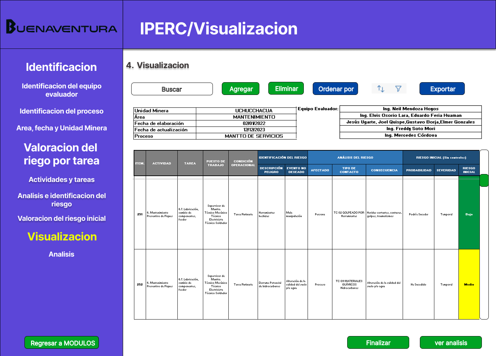

# 4.4. Módulo 4


# Módulo 4: Gestion de los IPERC

# Requerimientos por casos de uso


## 1) LLenado de actividades y reisgos del IPERC

<table border="1">
	<tbody>
		<tr>
			<td>Nombre</td>
			<td colspan="2">Elaboracion del IPERC</td>
		</tr>
		<tr>
			<td>Tarea realizada por el usuario</td>
			<td colspan="2">Recolectar información de los peligros, llenar las actividades, tareas y reconocer e identificar los riesgos y analizar y generar un valor de riesgo inicial.</td>
		</tr>
		<tr>
			<td>Actor inicializador</td>
			<td colspan="2">Ingeniero supervisor</td>
		</tr>
		<tr>
			<td>Actores participantes</td>
			<td colspan="2">
    <ol>
       <li>Ingeniero supervisor</li>
      <li>Un trabajador expuesto</li>
    </ol>
    </td>
    </tr>
		<tr>
            <th>Flow of Events</th>
            <td>
            <ol>
                <li>El ingeniero supervisor identifica al equipo evaluador.</li>
                <li>Ingresa los procesos, actividades y tareas.</li>
                <li>Identifica los peligros asociados a las tareas.</li>
                <li>Evalúa los riesgos relacionados.</li>
		<li>Reconoce al afectado, el tipo de daño causado y la consecuencia dañina del riesgo</li>
                <li>El sistema genera una evaluación de riesgo.</li>
            </ol>
            </td>
        </tr>
        <tr>
			<th>Excepciones</th>
			<td>
            <ol>
                <li>Si faltan datos, el sistema notifica.</li>
            </ol>
            </td>
		</tr>
		<tr>
			<td>Precondición</td>
			<td colspan="2">Acceso autorizado al sistema IPERC y que el ingeniero supervisor tenga los datos recogidos de los trabajadores.</td>
		</tr>
		<tr>
			<td>Postcondición</td>
			<td colspan="2">El IPERC queda almacenado en el sistema.</td>
		</tr>
		<tr>
			<td>Casos de uso incluidos</td>
			<td colspan="2">-</td>
		</tr>
		<tr>
			<td>Servicios utilizados</td>
			<td colspan="2">Sistema de gestión de riesgos, Notificaciones y tareas IPERC</td>
		</tr>
		<tr>
			<th>Requisitos no funcionales</th>
			<td>
            <ol>
                <li>Interfaz intuitiva y accesible desde dispositivos móviles</li>
                <li>Seguridad en el acceso a los datos</li>
            </ol>
            </td>
		</tr>
	</tbody>
</table>
<br>


   
## 2) Clasificacion de riesgos y revision del IPERC
<table border="1">
	<tbody>
		<tr>
			<td>Nombre</td>
			<td colspan="2">Elaboración y revisión del IPERC</td>
		</tr>
		<tr>
			<td>Tarea realizada por el usuario</td>
			<td colspan="2"> Clasificar el nivel de riesgo que representa y acciones y medidas a tomar.</td>
		</tr>
		<tr>
			<td>Actor inicializador</td>
			<td colspan="2">Ingeniero supervisor</td>
		</tr>
		<tr>
			<td>Actores participantes</td>
			<td colspan="2">
    <ol>
      <li>Ingeniero de seguridad</li>
    </ol>
    </td>
    </tr>
		<tr>
            <th>Flow of Events</th>
            <td>
            <ol>
                <li>Un ingeniero de seguridad ingresa al sistema digital.</li>
                <li>Realiza la valoracion del riesgo planteando medidas de control y calculando el riesgo residual.</li>
		<li>Plantea acciones de mejora.</li>
            </ol>
            </td>
        </tr>
        <tr>
			<th>Excepciones</th>
			<td>
            <ol>
                <li>Falta de participación del personal.</li>
                <li>Ausencia de instrumentos de medición o equipos que analisis costo-beneficio.</li> 
            </ol>
            </td>
		</tr>
		<tr>
			<td>Precondición</td>
			<td colspan="2">El equipo evaluador, el historial de IPERC y la informacion recopilada que deberia estar ya cargada del ingeniero supervisor, deberian estar cargados ya en el sistema.</td>
		</tr>
		<tr>
			<td>Postcondición</td>
			<td colspan="2">El IPERC queda almacenado.</td>
		</tr>
		<tr>
			<td>Casos de uso incluidos</td>
			<td colspan="2">-</td>
		</tr>
		<tr>
			<td>Servicios utilizados</td>
			<td colspan="2">Gestión de equipos, Gestion de riesgos, Reportes y análisis de incidentes, Documentacion y registro.</td>
		</tr>
		<tr>
			<th>Requisitos no funcionales</th>
			<td>
            <ol>
                <li>Interfaz intuitiva y accesible.</li>
                <li>Protección de datos sensibles y control de accesos.</li>
            </ol>
            </td>
		</tr>
	</tbody>
</table>
<br>

# Prototipo





3. Botón Seleccionar registro: 

	Con este boton nos mandara un apartado para ver el registro y saber que hacer con el.

4. Boton buscar:

   	El boton busca el registro segun actividad, tarea y riesgo.
	
	```sql
	SELECT 
	    a.descripcion_actividad AS "Actividad",              
	    t.descripcion_tarea AS "Tarea",                       
	    t.puesto_trabajo AS "Puesto de Trabajo",                  
	    t.cond_operacional AS "Condición Operacional",            
	    ir.descripcion_peligro AS "Descripción del Peligro",      
	    ir.evento_no_deseado AS "Evento No Deseado",              
	    ar.afectado AS "Afectado",                                
	    CONCAT(tc.nombre_tipo_contacto, ' ', tp.nombre_tipo_peligro) AS "Contacto y Peligro", 
	    ar.consecuencia AS "Consecuencia",                        
	    tp_prob.nombre_tipo_probabilidad AS "Probabilidad",       
	    ts.nombre_tipo_severidad AS "Severidad",                  
	    tr.nombre_tipo_riesgo AS "Riesgo Inicial"                
	FROM 
	    actividades a
	JOIN 
	    tareas t ON a.id_actividad = t.id_actividad
	JOIN 
	    identificacion_del_riesgo ir ON t.id_tarea = ir.id_tarea
	JOIN 
	    analisis_riesgo ar ON ar.id_riesgo = ir.id_riesgo
	JOIN 
	    tipos_contacto tc ON ar.id_tipo_contacto = tc.id_tipo_contacto
	JOIN 
	    tipos_peligro tp ON ar.id_tipo_peligro = tp.id_tipo_peligro
	JOIN 
	    valoracion_del_riesgo_inicial vi ON vi.id_analisis = ar.id_analisis
	JOIN 
	    tipo_probabilidad tp_prob ON vi.id_tipo_probabilidad = tp_prob.id_tipo_probabilidad
	JOIN 
	    tipo_severidad ts ON vi.id_tipo_severidad = ts.id_tipo_severidad
	JOIN 
	    tipo_riesgo tr ON vi.id_tipo_riesgo = tr.id_tipo_riesgo
	WHERE 
	    a.descripcion_actividad = <1>      
	    AND t.descripcion_tarea = <2>    
	    AND ir.descripcion_peligro = <3>; 
	```
	
5. Boton eliminar:

   	Elimina el registro seleccionado.

	```sql
	DO $$
	DECLARE
	    v_id_tarea INT;
	    v_id_riesgo INT;
	    v_id_actividad INT;
	BEGIN
	    -- Paso 1: Buscar el id_riesgo, id_tarea y id_actividad en identificacion_del_riesgo usando descripcion_peligro, descripcion_tarea y descripcion_actividad
	    SELECT ir.id_riesgo, ir.id_tarea, t.id_actividad
	    INTO v_id_riesgo, v_id_tarea, v_id_actividad
	    FROM identificacion_del_riesgo ir
	    JOIN tareas t ON ir.id_tarea = t.id_tarea
	    JOIN actividades a ON t.id_actividad = a.id_actividad
	    WHERE ir.descripcion_peligro = <3>  -- Descripción del riesgo (peligro)
	      AND t.descripcion_tarea = <2>     -- Descripción de la tarea
	      AND a.descripcion_actividad = <1>;-- Descripción de la actividad
	
	    -- Validar que los IDs fueron encontrados antes de proceder con la eliminación
	    IF v_id_tarea IS NOT NULL AND v_id_riesgo IS NOT NULL THEN
	        
	        -- Paso 2: Proceder con la eliminación en cascada
	
	        -- Eliminar en valoracion_del_riesgo_inicial usando id_riesgo
	        DELETE FROM valoracion_del_riesgo_inicial
	        USING analisis_riesgo ar
	        WHERE ar.id_analisis = valoracion_del_riesgo_inicial.id_analisis
	          AND ar.id_riesgo = v_id_riesgo;
	
	        -- Eliminar en analisis_riesgo usando id_riesgo
	        DELETE FROM analisis_riesgo
	        WHERE id_riesgo = v_id_riesgo;
	
	        -- Eliminar en identificacion_del_riesgo usando id_riesgo y id_tarea
	        DELETE FROM identificacion_del_riesgo
	        WHERE id_riesgo = v_id_riesgo 
	          AND id_tarea = v_id_tarea;
	
	        -- Finalmente, eliminar la tarea específica si es necesario (opcional)
	        DELETE FROM tareas
	        WHERE id_tarea = v_id_tarea;
	
	        RAISE NOTICE 'El registro ha sido eliminado exitosamente.';
	
	    ELSE
	        RAISE NOTICE 'No se encontraron registros con las descripciones especificadas.';
	    END IF;
	END $$;
	```
 	Donde:

 	| Placeholder | Descripción |
	|-------------|-------------|
	| `<1>`       | Descripción de la actividad ingresada (nombre de la actividad específica). |
	| `<2>`       | Descripción de la tarea ingresada (nombre de la tarea específica). |
	| `<3>`       | Descripción del peligro ingresada (nombre del riesgo o peligro específico). |

7. Boton editar:

	Actualizar la actividad, si se ha cambiado
	
	```sql
	UPDATE actividades
	SET descripcion_actividad = <1>
	WHERE id_actividad = ?;
	```
	
	Actualizar la tarea, si se han modificado sus datos
	
	```sql
	UPDATE tareas
	SET descripcion_tarea = <2>,
	    puesto_trabajo = <3>,
	    cond_operacional = <4>
	WHERE id_tarea = ?;
	```
	
	Actualizar la identificación del riesgo, si se ha cambiado el peligro o el evento no deseado
	
	```sql
	UPDATE identificacion_del_riesgo
	SET descripcion_peligro = <5>,
	    evento_no_deseado = <6>
	WHERE id_riesgo = ?;
	```
	
	Actualizar el análisis del riesgo, si se ha cambiado el afectado, tipo de contacto, o consecuencia
	
	```sql
	UPDATE analisis_riesgo
	SET afectado = <7>,
	    id_tipo_contacto = <8>,
	    id_tipo_peligro = <9>,
	    consecuencia = <10>
	WHERE id_riesgo = ?;
	```
	
	Actualizar la valoración inicial del riesgo, si se han cambiado la severidad, probabilidad o tipo de riesgo
	
	```sql
	UPDATE valoracion_del_riesgo_inicial
	SET id_tipo_severidad = <11>,
	    id_tipo_probabilidad = <12>,
	    id_tipo_riesgo = ?
	WHERE id_analisis = ?;
	```
 

    	| Placeholder | Descripción                                           |
	|-------------|-------------------------------------------------------|
	| `<1>`       | Nueva descripción de la actividad.                    |
	| `<2>`       | Nueva descripción de la tarea.                        |
	| `<3>`       | Nuevo puesto de trabajo para la tarea.                |
	| `<4>`       | Nueva condición operacional para la tarea.            |
	| `<5>`       | Nueva descripción del peligro en la identificación.   |
	| `<6>`       | Nuevo evento no deseado en la identificación.         |
	| `<7>`       | Nuevo afectado en el análisis del riesgo.             |
	| `<8>`       | Nuevo ID de tipo de contacto en el análisis del riesgo. |
	| `<9>`       | Nuevo ID de tipo de peligro en el análisis del riesgo. |
	| `<10>`      | Nueva consecuencia en el análisis del riesgo.         |
	| `<11>`      | Nuevo ID de severidad en la valoración inicial.       |
	| `<12>`      | Nuevo ID de probabilidad en la valoración inicial.    |


	

	


