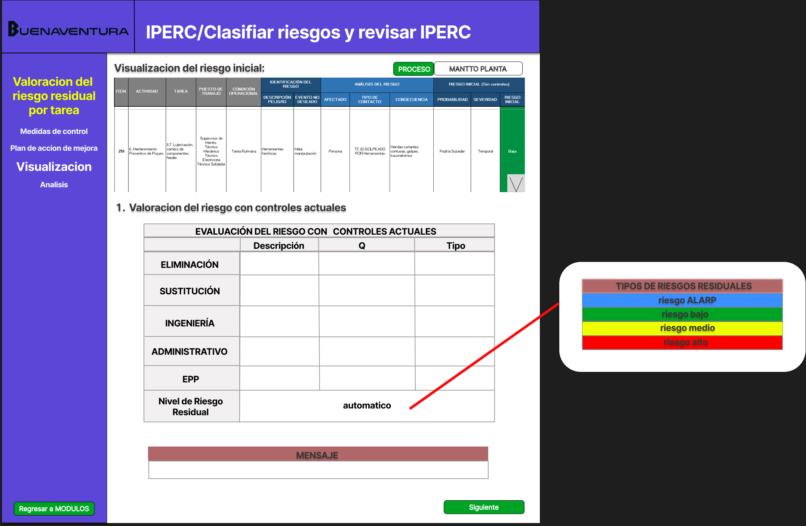

# 4.4. Módulo 4

# Módulo 4: Gestion de los IPERC

# Requerimientos por casos de uso

## 1) LLenado de actividades y reisgos del IPERC

<table border="1">
	<tbody>
		<tr>
			<td>Nombre</td>
			<td colspan="2">Elaboracion del IPERC</td>
		</tr>
		<tr>
			<td>Tarea realizada por el usuario</td>
			<td colspan="2">Recolectar información de los peligros, llenar las actividades, tareas y reconocer e identificar los riesgos y analizar y generar un valor de riesgo inicial.</td>
		</tr>
		<tr>
			<td>Actor inicializador</td>
			<td colspan="2">Ingeniero supervisor</td>
		</tr>
		<tr>
			<td>Actores participantes</td>
			<td colspan="2">
    <ol>
       <li>Ingeniero supervisor</li>
      <li>Un trabajador expuesto</li>
    </ol>
    </td>
    </tr>
		<tr>
            <th>Flow of Events</th>
            <td>
            <ol>
                <li>El ingeniero supervisor identifica al equipo evaluador.</li>
                <li>Ingresa los procesos, actividades y tareas.</li>
                <li>Identifica los peligros asociados a las tareas.</li>
                <li>Evalúa los riesgos relacionados.</li>
		<li>Reconoce al afectado, el tipo de daño causado y la consecuencia dañina del riesgo</li>
                <li>El sistema genera una evaluación de riesgo.</li>
            </ol>
            </td>
        </tr>
        <tr>
			<th>Excepciones</th>
			<td>
            <ol>
                <li>Si faltan datos, el sistema notifica.</li>
            </ol>
            </td>
		</tr>
		<tr>
			<td>Precondición</td>
			<td colspan="2">Acceso autorizado al sistema IPERC y que el ingeniero supervisor tenga los datos recogidos de los trabajadores.</td>
		</tr>
		<tr>
			<td>Postcondición</td>
			<td colspan="2">El IPERC queda almacenado en el sistema.</td>
		</tr>
		<tr>
			<td>Casos de uso incluidos</td>
			<td colspan="2">-</td>
		</tr>
		<tr>
			<td>Servicios utilizados</td>
			<td colspan="2">Sistema de gestión de riesgos, Notificaciones y tareas IPERC</td>
		</tr>
		<tr>
			<th>Requisitos no funcionales</th>
			<td>
            <ol>
                <li>Interfaz intuitiva y accesible desde dispositivos móviles</li>
                <li>Seguridad en el acceso a los datos</li>
            </ol>
            </td>
		</tr>
	</tbody>
</table>
 

   
## 2) Clasificacion de riesgos y revision del IPERC
<table border="1">
	<tbody>
		<tr>
			<td>Nombre</td>
			<td colspan="2">Elaboración y revisión del IPERC</td>
		</tr>
		<tr>
			<td>Tarea realizada por el usuario</td>
			<td colspan="2"> Clasificar el nivel de riesgo que representa y acciones y medidas a tomar.</td>
		</tr>
		<tr>
			<td>Actor inicializador</td>
			<td colspan="2">Ingeniero supervisor</td>
		</tr>
		<tr>
			<td>Actores participantes</td>
			<td colspan="2">
    <ol>
      <li>Ingeniero de seguridad</li>
    </ol>
    </td>
    </tr>
		<tr>
            <th>Flow of Events</th>
            <td>
            <ol>
                <li>Un ingeniero de seguridad ingresa al sistema digital.</li>
                <li>Realiza la valoracion del riesgo planteando medidas de control y calculando el riesgo residual.</li>
		<li>Plantea acciones de mejora.</li>
            </ol>
            </td>
        </tr>
        <tr>
			<th>Excepciones</th>
			<td>
            <ol>
                <li>Falta de participación del personal.</li>
                <li>Ausencia de instrumentos de medición o equipos que analisis costo-beneficio.</li> 
            </ol>
            </td>
		</tr>
		<tr>
			<td>Precondición</td>
			<td colspan="2">El equipo evaluador, el historial de IPERC y la informacion recopilada que deberia estar ya cargada del ingeniero supervisor, deberian estar cargados ya en el sistema.</td>
		</tr>
		<tr>
			<td>Postcondición</td>
			<td colspan="2">El IPERC queda almacenado.</td>
		</tr>
		<tr>
			<td>Casos de uso incluidos</td>
			<td colspan="2">-</td>
		</tr>
		<tr>
			<td>Servicios utilizados</td>
			<td colspan="2">Gestión de equipos, Gestion de riesgos, Reportes y análisis de incidentes, Documentacion y registro.</td>
		</tr>
		<tr>
			<th>Requisitos no funcionales</th>
			<td>
            <ol>
                <li>Interfaz intuitiva y accesible.</li>
                <li>Protección de datos sensibles y control de accesos.</li>
            </ol>
            </td>
		</tr>
	</tbody>
</table>
 

# Prototipo

Boton seleccionar:

	Se selecciona un registro y se busca 

 Boton evaluar:

	 Se insertan todos los controles que se quieren aplicar segun el analisis del riesgo inicial que ya se hizo y la app devuelve el nuevo nivel de riesgo.

  	-- Insertar un registro en Valoracion_del_riesgo_residual con valores iniciales
	INSERT INTO Valoracion_del_riesgo_residual (id_valoracion_residual, id_valoracion_inicial, cantidad_controles, id_tipo_riesgo)
	VALUES (?, ?, 0, ?);

	-- Insertar Control Administrativo si tiene datos
	IF <1> IS NOT NULL AND <2> IS NOT NULL THEN
	    INSERT INTO Control (id_control, id_valoracion_residual, descripcion_control, id_tipo_estgia_control, id_tipo_med_control, id_tipo_qcontrol)
	    VALUES ( ? , ? , <1> , <3> , 'ADM' , <2> );
	END IF;
	
	-- Insertar Control de Eliminación si tiene datos
	IF <4> IS NOT NULL AND <5> IS NOT NULL THEN
	    INSERT INTO Control (id_control, id_valoracion_residual, descripcion_control, id_tipo_estgia_control, id_tipo_med_control, id_tipo_qcontrol)
	    VALUES ( ? , ? , <4> , <6> , 'ELI' , <5> );
	END IF;
	
	-- Insertar Control de Sustitución si tiene datos
	IF <7> IS NOT NULL AND <8> IS NOT NULL THEN
	    INSERT INTO Control (id_control, id_valoracion_residual, descripcion_control, id_tipo_estgia_control, id_tipo_med_control, id_tipo_qcontrol)
	    VALUES ( ? , ? , <7> , <9> , 'SUS' , <8> );
	END IF;
	
	-- Insertar Control de Ingeniería si tiene datos
	IF <10> IS NOT NULL AND <11> IS NOT NULL THEN
	    INSERT INTO Control (id_control, id_valoracion_residual, descripcion_control, id_tipo_estgia_control, id_tipo_med_control, id_tipo_qcontrol)
	    VALUES ( ? , ? , <10> , <12> , 'INH' , <11> );
	END IF;
	
	-- Insertar Control de EPP si tiene datos
	IF <13> IS NOT NULL AND <14> IS NOT NULL THEN
	    INSERT INTO Control (id_control, id_valoracion_residual, descripcion_control, id_tipo_estgia_control, id_tipo_med_control, id_tipo_qcontrol)
	    VALUES ( ? , ? , <13> , <15> , 'EPP' , <14> );
	END IF;
	
	-- Actualizar la cantidad de controles después de insertar solo los controles válidos
	UPDATE Valoracion_del_riesgo_residual
	SET cantidad_controles = (SELECT COUNT(*) FROM Control WHERE id_valoracion_residual = ?)
	WHERE id_valoracion_residual = ?;

	
	Donde:
 
	| Placeholder | Descripción                                           |
	|-------------|-------------------------------------------------------|
	| `<1>`       | Descripción del Control Administrativo                |
	| `<2>`       | Calidad del Control (`Q`) para el Control Administrativo |
	| `<3>`       | Tipo de Estrategia del Control Administrativo         |
	| `<4>`       | Descripción del Control de Eliminación                |
	| `<5>`       | Calidad del Control (`Q`) para el Control de Eliminación |
	| `<6>`       | Tipo de Estrategia del Control de Eliminación         |
	| `<7>`       | Descripción del Control de Sustitución                |
	| `<8>`       | Calidad del Control (`Q`) para el Control de Sustitución |
	| `<9>`       | Tipo de Estrategia del Control de Sustitución         |
	| `<10>`      | Descripción del Control de Ingeniería                 |
	| `<11>`      | Calidad del Control (`Q`) para el Control de Ingeniería |
	| `<12>`      | Tipo de Estrategia del Control de Ingeniería          |
	| `<13>`      | Descripción del Control de EPP                        |
	| `<14>`      | Calidad del Control (`Q`) para el Control de EPP      |
	| `<15>`      | Tipo de Estrategia del Control de EPP                 |
	| `?`         | ID dinámico (para `id_control` y `id_valoracion_residual`) |
	
	

	

	

