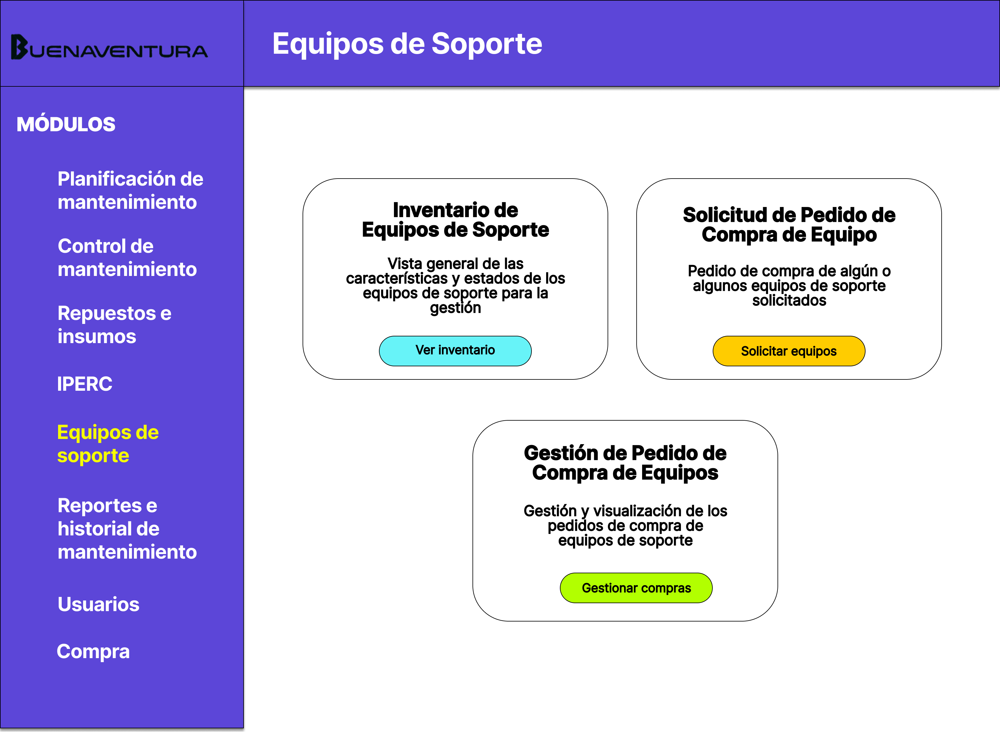
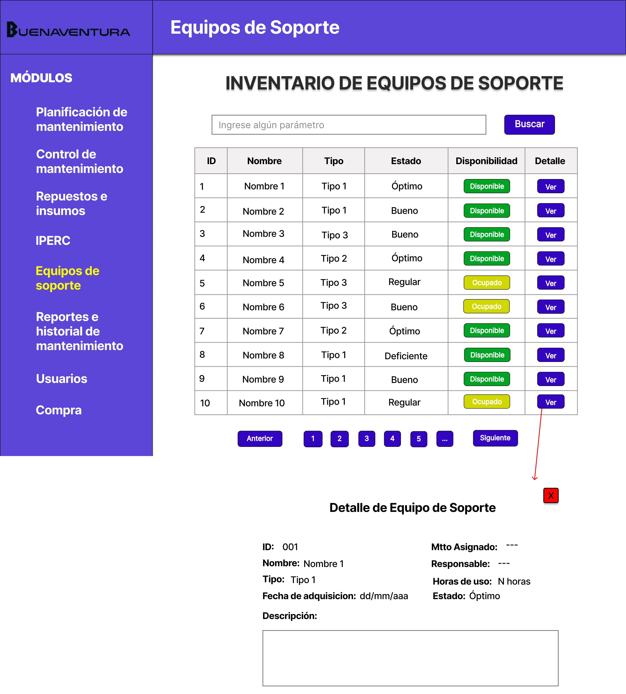
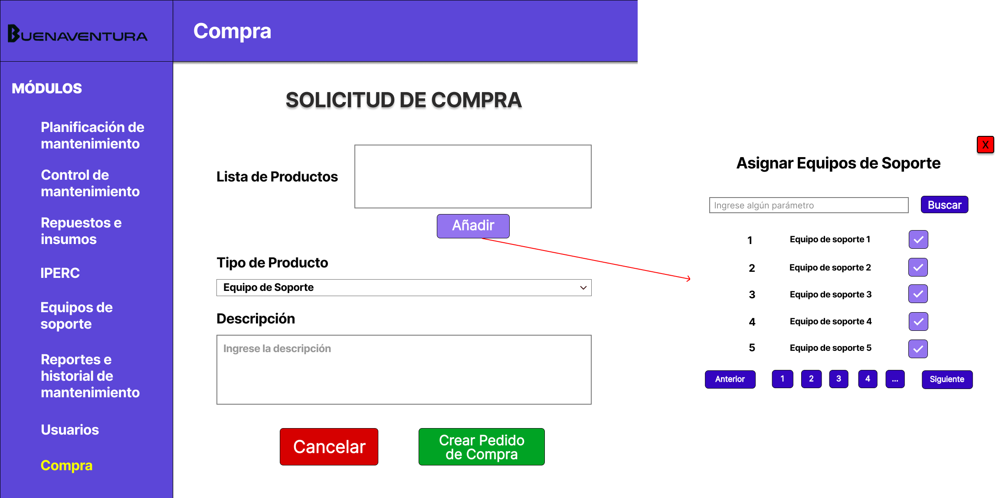
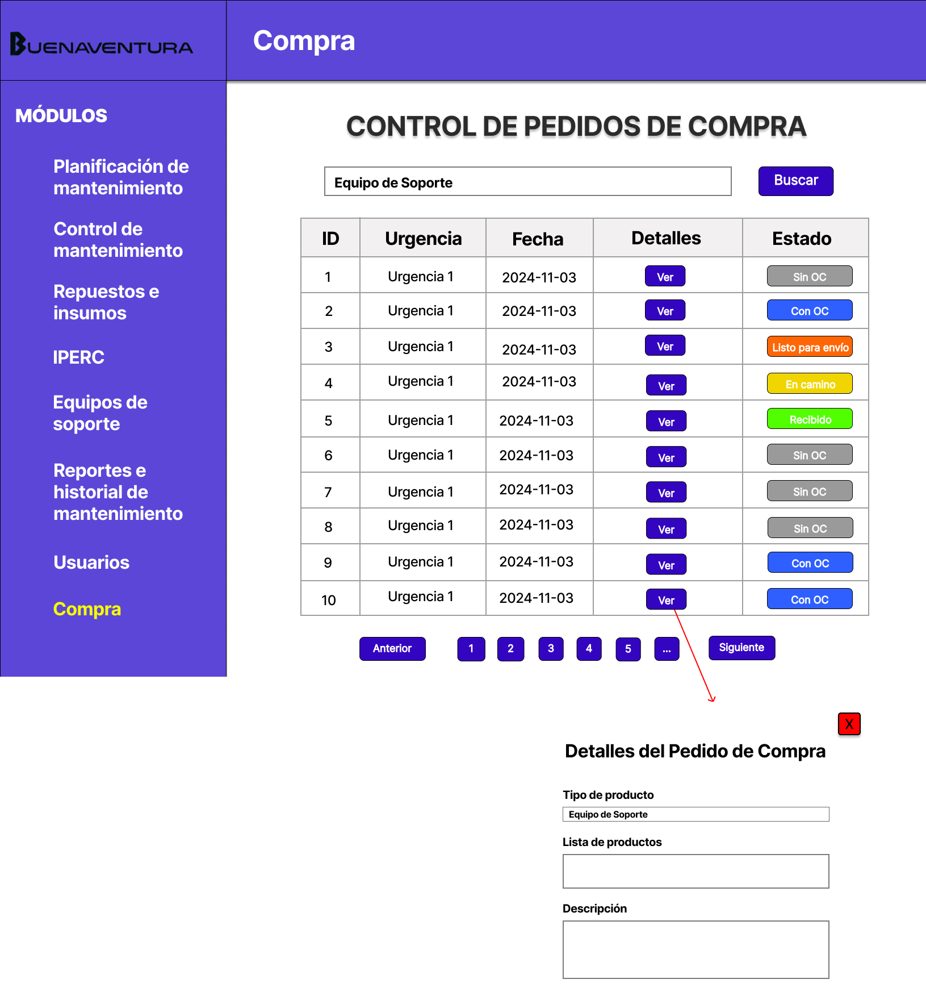

# 4.5. Módulo 5

# Módulo 5: Gestión de equipos de soporte

# Requerimientos por casos de uso

## 1) Acceso al Dashboard de Equipos de Soporte

**Código Requerimiento:** R-501

<table border="1">
	<tbody>
		<tr>
			<td>Nombre</td>
			<td colspan="2">Acceso al Dashboard de Equipos de Soporte</td>
		</tr>
		<tr>
			<td>Tarea realizada por el usuario</td>
			<td colspan="2">Acceder a la pantalla principal del módulo para ver accesos rápidos a todas las funciones de gestión de equipos de soporte.</td>
		</tr>
		<tr>
			<td>Actor inicializador</td>
			<td colspan="2">Jefe de Mantenimiento</td>
		</tr>
		<tr>
			<td>Actores participantes</td>
			<td colspan="2">Jefe de Mantenimiento, Técnicos</td>
		</tr>
		<tr>
			<td>Flujo de Eventos</td>
			<td colspan="2">
				1. El usuario ingresa al sistema y selecciona el módulo de "Equipos de Soporte". 
				2. El sistema muestra el dashboard con accesos rápidos a las funciones de soporte.
			</td>
		</tr>
		<tr>
			<td>Excepciones</td>
			<td colspan="2">Si el usuario no tiene acceso al módulo, se muestra un mensaje de error.</td>
		</tr>
		<tr>
			<td>Precondición</td>
			<td colspan="2">El usuario tiene permisos para acceder al módulo.</td>
		</tr>
		<tr>
			<td>Postcondición</td>
			<td colspan="2">Se muestra el dashboard con accesos rápidos a las funcionalidades del módulo.</td>
		</tr>
		<tr>
			<td>Casos de uso incluidos</td>
			<td colspan="2">-</td>
		</tr>
		<tr>
			<td>Servicios utilizados</td>
			<td colspan="2">Sistema de control de acceso</td>
		</tr>
		<tr>
			<td>Requisitos no funcionales</td>
			<td colspan="2">1. La pantalla debe cargar en menos de 2 segundos.</td>
		</tr>
	</tbody>
</table>

 

## 2) Visualización de Inventario de Equipos de Soporte

**Código Requerimiento:** R-502

<table border="1">
	<tbody>
		<tr>
			<td>Nombre</td>
			<td colspan="2">Visualización de Inventario de Equipos de Soporte</td>
		</tr>
		<tr>
			<td>Tarea realizada por el usuario</td>
			<td colspan="2">Ver el inventario de equipos de soporte en una tabla, con detalles como tipo, estado y disponibilidad de cada equipo.</td>
		</tr>
		<tr>
			<td>Actor inicializador</td>
			<td colspan="2">Jefe de Mantenimiento</td>
		</tr>
		<tr>
			<td>Actores participantes</td>
			<td colspan="2">Jefe de Mantenimiento, Técnicos</td>
		</tr>
		<tr>
			<td>Flujo de Eventos</td>
			<td colspan="2">
				1. El usuario accede al inventario de equipos de soporte. 
				2. El sistema muestra la lista con los detalles de cada equipo.
			</td>
		</tr>
		<tr>
			<td>Excepciones</td>
			<td colspan="2">Si el usuario no tiene acceso al módulo, se muestra un mensaje de error.</td>
		</tr>
		<tr>
			<td>Precondición</td>
			<td colspan="2">El usuario tiene permisos para acceder al inventario.</td>
		</tr>
		<tr>
			<td>Postcondición</td>
			<td colspan="2">El inventario de equipos de soporte se muestra en pantalla.</td>
		</tr>
		<tr>
			<td>Casos de uso incluidos</td>
			<td colspan="2">-</td>
		</tr>
		<tr>
			<td>Servicios utilizados</td>
			<td colspan="2">Sistema de gestión de equipos</td>
		</tr>
		<tr>
			<td>Requisitos no funcionales</td>
			<td colspan="2">1. La tabla debe cargar rápidamente.</td>
		</tr>
	</tbody>
</table>

 

## 3) Solicitud de Pedido de Compra de Equipo de Soporte

**Código Requerimiento:** R-503

<table border="1">
	<tbody>
		<tr>
			<td>Nombre</td>
			<td colspan="2">Solicitud de Pedido de Compra de Equipo de Soporte</td>
		</tr>
		<tr>
			<td>Tarea realizada por el usuario</td>
			<td colspan="2">Solicitar la compra de equipo(s) de soporte, indicando en la descripción el motivo de la solicitud de compra.</td>
		</tr>
		<tr>
			<td>Actor inicializador</td>
			<td colspan="2">Jefe de Mantenimiento</td>
		</tr>
		<tr>
			<td>Actores participantes</td>
			<td colspan="2">Jefe de Mantenimiento, Administrador de Compras</td>
		</tr>
		<tr>
			<td>Flujo de Eventos</td>
			<td colspan="2">
				1. El usuario accede a la pantalla de solicitud de compra. 
				2. Selecciona el(los) equipo(s) para la compra y completa los campos requeridos, excepto el campo tipo de producto. 
				3. Crea el pedido de compra.
			</td>
		</tr>
		<tr>
			<td>Excepciones</td>
			<td colspan="2">Si falta información obligatoria, el sistema muestra un mensaje de error.</td>
		</tr>
		<tr>
			<td>Precondición</td>
			<td colspan="2">El usuario tiene permisos para crear pedidos de compra.</td>
		</tr>
		<tr>
			<td>Postcondición</td>
			<td colspan="2">El pedido de compra se guarda en el sistema.</td>
		</tr>
		<tr>
			<td>Casos de uso incluidos</td>
			<td colspan="2">Inventario de equipos, Verificación de disponibilidad</td>
		</tr>
		<tr>
			<td>Servicios utilizados</td>
			<td colspan="2">Sistema de pedidos de compra</td>
		</tr>
		<tr>
			<td>Requisitos no funcionales</td>
			<td colspan="2">1. La interfaz debe ser intuitiva para facilitar la creación de pedidos.</td>
		</tr>
	</tbody>
</table>

 

## 4) Gestión de Pedido de Compra de Equipos de Soporte

**Código Requerimiento:** R-504

<table border="1">
	<tbody>
		<tr>
			<td>Nombre</td>
			<td colspan="2">Gestión de Pedido de Compra de Equipos de Soporte</td>
		</tr>
		<tr>
			<td>Tarea realizada por el usuario</td>
			<td colspan="2">Visualizar el estado de los pedidos de compra en una lista, incluyendo información de urgencia, fecha, lista de productos solicitados y motivo del pedido en la descripción de cada pedido.</td>
		</tr>
		<tr>
			<td>Actor inicializador</td>
			<td colspan="2">Jefe de Mantenmiento</td>
		</tr>
		<tr>
			<td>Actores participantes</td>
			<td colspan="2">Jefe de Mantenimiento, Administrador de Compras</td>
		</tr>
		<tr>
			<td>Flujo de Eventos</td>
			<td colspan="2">
				1. El usuario accede a la lista de pedidos de compra. 
				2. El sistema muestra el estado y detalles de cada pedido.
			</td>
		</tr>
		<tr>
			<td>Excepciones</td>
			<td colspan="2">Si no hay pedidos en el sistema, se muestra un mensaje de "No se encontraron pedidos".</td>
		</tr>
		<tr>
			<td>Precondición</td>
			<td colspan="2">El usuario tiene permisos para acceder a la lista de pedidos.</td>
		</tr>
		<tr>
			<td>Postcondición</td>
			<td colspan="2">Los pedidos de compra son visibles en pantalla.</td>
		</tr>
		<tr>
			<td>Casos de uso incluidos</td>
			<td colspan="2">-</td>
		</tr>
		<tr>
			<td>Servicios utilizados</td>
			<td colspan="2">Sistema de gestión de pedidos de compra</td>
		</tr>
		<tr>
			<td>Requisitos no funcionales</td>
			<td colspan="2">1. La carga de la lista debe ser rápida para mejorar la experiencia del usuario.</td>
		</tr>
	</tbody>
</table>

---

# Prototipo

## Dashboard del módulo de planificación
**Código de Interfaz:** I-501

## Inventario de equipos de soporte
**Código de Interfaz:** I-502

## Solicitud de compra de equipos de soporte
**Código de Interfaz:** I-503

## Gestion de compra de equipos de soporte
**Código de Interfaz:** I-504

