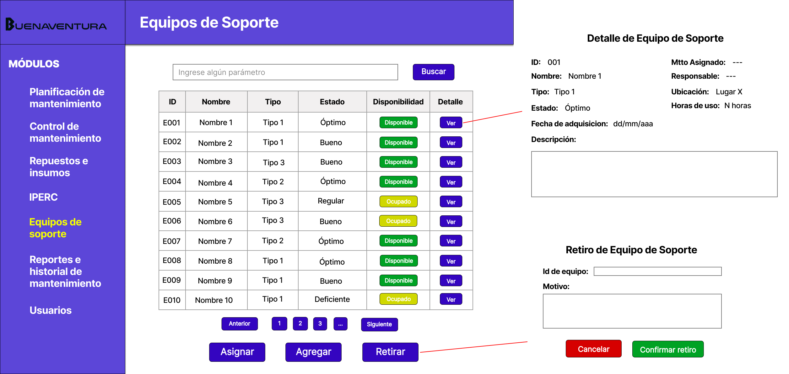
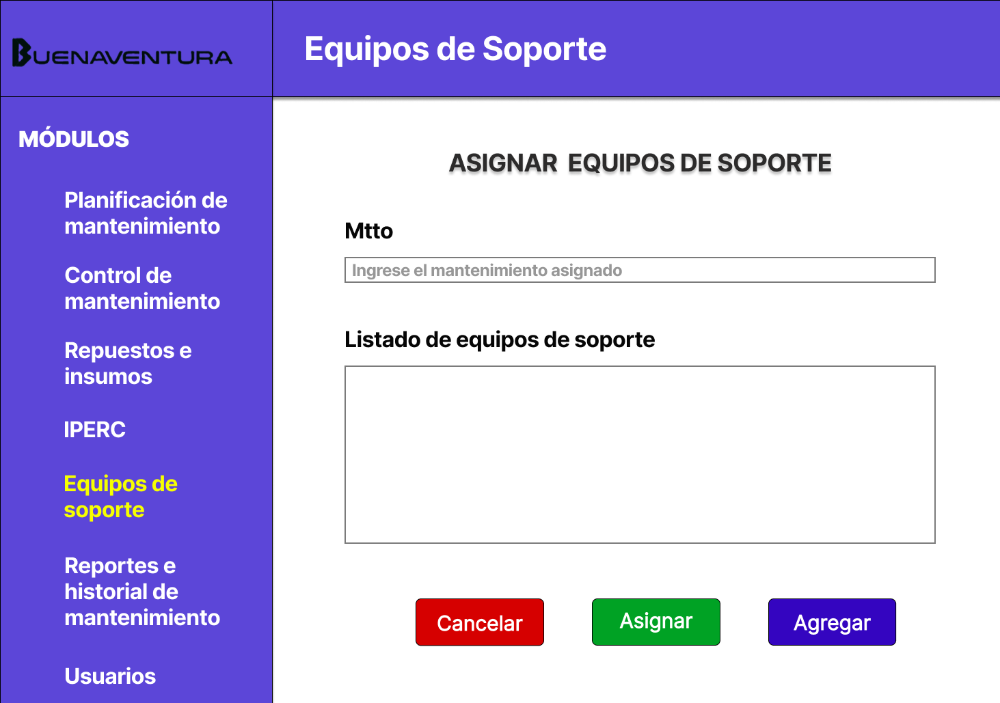

# 4.5. Módulo 5

# Módulo 5: Gestión de equipos de soporte

# Requerimientos por casos de uso

##  1) Verificación de disponibilidad de equipos de soporte

<table border="1">
	<tbody>
		<tr>
			<td>Nombre</td>
			<td colspan="2">Verificación de disponibilidad de equipos</td>
		</tr>
		<tr>
			<td>Tarea realizada por el usuario</td>
			<td colspan="2">Verificar si los equipos están disponibles en el almacén para su uso en el mantenimiento.</td>
		</tr>
		<tr>
			<td>Actor inicializador</td>
			<td colspan="2">Supervisor</td>
		</tr>
		<tr>
			<td>Actores participantes</td>
			<td colspan="2">Sistema de almacén, Supervisor</td>
		</tr>
		<tr>
            <th>Flujo de eventos</th>
            <td>
            <ol>
                <li>El supervisor accede al sistema a través de su interfaz.</li>
                <li>El sistema le solicita al supervisor que ingrese las credenciales para la verificación.</li>
                <li>El supervisor selecciona la opcion de "Equipos de Soporte".</li>
                <li>El supervisor busca los equipos de soporte.</li>
                <li>El sistema muestra dicho equipo indicando el estado de cada uno y con la opciónd de ver los detalles.</li>
				<li>El supervisor visualiza cuales son los equipos que estan o no disponibles</li>
            </ol>
            </td>
        </tr>
        <tr>
			<th>Excepciones</th>
			<td>
            <ol>
                <li>El supervisor introduce credenciales incorrectas, lo que impide el acceso al sistema.</li>
                <li>El sistema de almacén está fuera de servicio o inaccesible.</li>
                <li>No hay equipos de soporte disponibles en el almacén para la tarea requerida.</li>
            </ol>
            </td>
		</tr>
		<tr>
			<td>Precondición</td>
			<td colspan="2">El almacén debe estar actualizado y registrado en el sistema, y el supervisor debe tener credenciales válidas.</td>
		</tr>
		<tr>
			<td>Postcondición</td>
			<td colspan="2">El supervisor tiene confirmación de la disponibilidad de los equipos y la información queda registrada en el sistema.</td>
		</tr>
		<tr>
			<td>Casos de uso incluidos</td>
			<td colspan="2">Consulta del almacén de equipos, validación de credenciales.</td>
		</tr>
		<tr>
			<td>Servicios utilizados</td>
			<td colspan="2">Sistema de gestión de equipos de soporte, autenticación de usuarios.</td>
		</tr>
		<tr>
			<th>Requisitos no funcionales</th>
			<td>
            <ol>
                <li>El sistema debe ofrecer un acceso rápido y eficiente a los datos del almacén.</li>
                <li>Interfaz amigable y clara para que el supervisor pueda navegar de forma intuitiva.</li>
            </ol>
            </td>
		</tr>
	</tbody>
</table>

## 2) Asignación de equipos de soporte
<table border="1">
	<tbody>
		<tr>
			<td>Nombre</td>
			<td colspan="2">Asignación de equipos de soporte</td>
		</tr>
		<tr>
			<td>Tarea realizada por el usuario</td>
			<td colspan="2">Asignar equipos de soporte disponibles a una tarea de mantenimiento específica.</td>
		</tr>
		<tr>
			<td>Actor inicializador</td>
			<td colspan="2">Supervisor</td>
		</tr>
		<tr>
			<td>Actores participantes</td>
			<td colspan="2">Sistema de almacén, Supervisor</td>
		</tr>
		<tr>
            <th>Flujo de eventos</th>
            <td>
            <ol>
                <li>El supervisor accede al sistema a través de su interfaz.</li>
                <li>El sistema le solicita al supervisor que ingrese las credenciales para la verificación.</li>
                <li>El supervisor selecciona la opcion de "Equipos de Soporte".</li>
                <li>El supervisor selecciona la opción "Asignar" equipos de soporte.</li>
                <li>El sistema solicita que el supervisor introduzca la tarea de mantenimiento o el código de referencia asociado</li>
				<li>El supervisor selecciona el equipo o equipos a asignar a un mantenimiento.</li>
				<li>Si algún equipo no está disponible, el sistema notifica al supervisor y sugiere una fecha óptima de reprogramación para la tarea de mantenimiento, basada en la disponibilidad del equipo.</li>
				<li>El supervisor puede aceptar la fecha sugerida o ajustar la reprogramación manualmente.</li>
				<li>El supervisor confirma la asignación y el sistema actualiza el estado del equipo como "Ocupado".</li>
				<li>El sistema notifica al supervisor que los equipos han sido asignados correctamente.</li>
            </ol>
            </td>
        </tr>
        <tr>
			<th>Excepciones</th>
			<td>
            <ol>
                <li>Si el supervisor introduce una tarea incorrecta o incompleta, el sistema mostrará un mensaje de error solicitando la información faltante o errónea.</li>
            </ol>
            </td>
		</tr>
		<tr>
			<td>Precondición</td>
			<td colspan="2">El sistema debe estar actualizado con el estado de disponibilidad de los equipos y el supervisor debe contar con credenciales válidas para realizar la asignación de equipos.</td>
		</tr>
		<tr>
			<td>Postcondición</td>
			<td colspan="2">Los equipos seleccionados son asignados a la tarea de mantenimiento. La disponibilidad de los equipos asignados se actualiza en el sistema.</td>
		</tr>
		<tr>
			<td>Casos de uso incluidos</td>
			<td colspan="2">Validación de credenciales.</td>
		</tr>
		<tr>
			<td>Servicios utilizados</td>
			<td colspan="2">Sistema de gestión de equipos de soporte, autenticación de usuarios.</td>
		</tr>
		<tr>
			<th>Requisitos no funcionales</th>
			<td>
            <ol>
                <li>El sistema proporciona respuestas rápidas y precisas sobre la disponibilidad de los equipos</li>
                <li>Interfaz clara y fácil de usar para facilitar la asignación de equipos.</li>
            </ol>
            </td>
		</tr>
	</tbody>
</table>

# Prototipo

