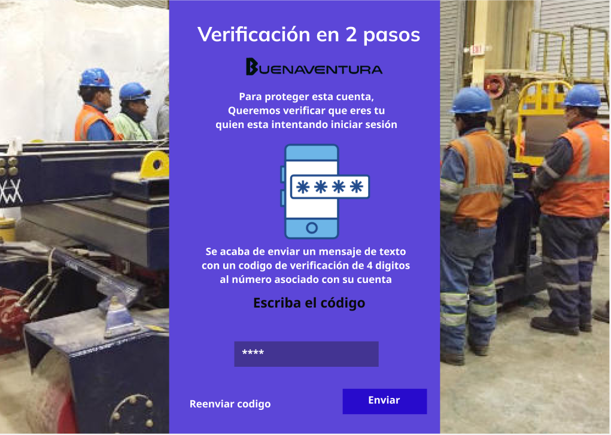
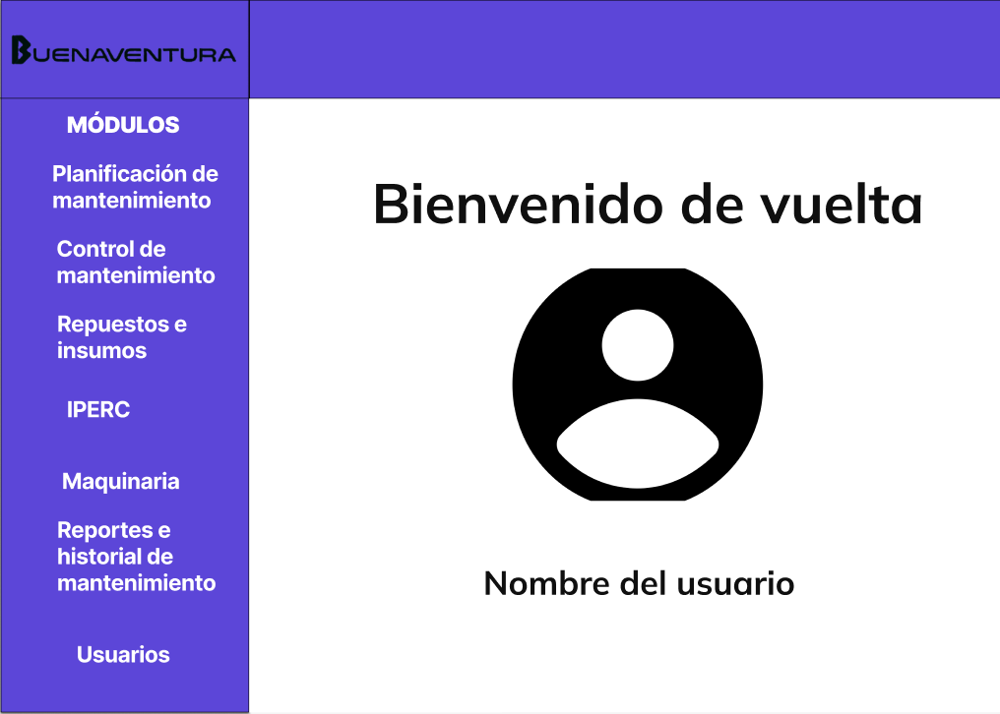
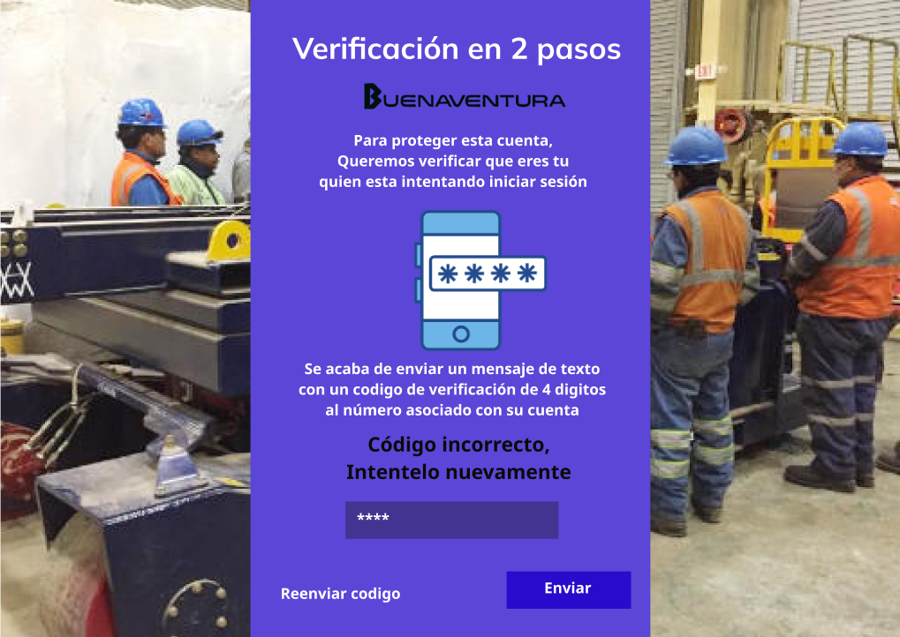
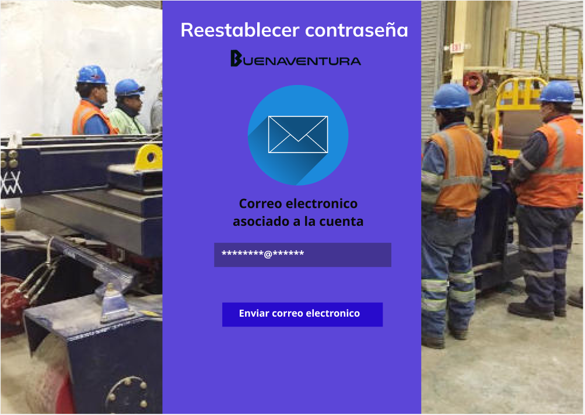
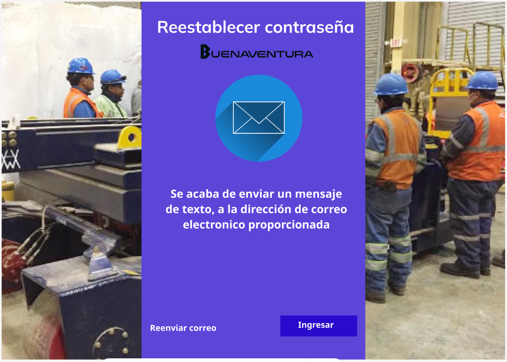
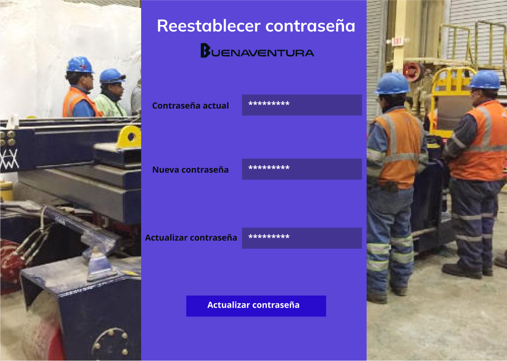
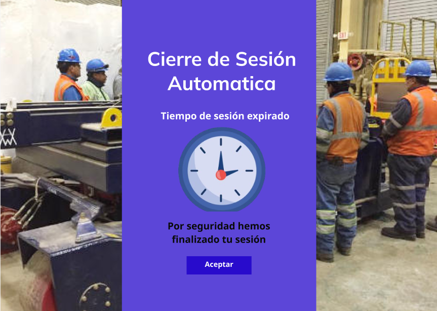

# 4.6. Módulo 6

# Módulo 6: Gestón de seguridad y usuario

# Requerimientos por casos de uso

### Caso de uso 1 : Ingreso de credenciales (Login)

<table border="1">
  <tbody>
    <tr>
      <td><strong>Nombre</strong></td>
      <td>Ingreso de credenciales al sistema</td>
    </tr>
    <tr>
      <td><strong>Tarea realizada por el usuario</strong></td>
      <td>Autenticarse en el sistema mediante la introducción de credenciales válidas (ID y contraseña).</td>
    </tr>
    <tr>
      <td><strong>Actor inicializador</strong></td>
      <td>Usuario (Usuario común, Administrador, etc.)</td>
    </tr>
    <tr>
      <td><strong>Actores participantes</strong></td>
      <td>Sistema automático, usuario</td>
    </tr>
    <tr>
      <th>Flujo de eventos</th>
      <td>
        <ol>
          <li>El usuario accede a la página de inicio de sesión del sistema.</li>
          <li>El sistema solicita las credenciales de inicio de sesión: ID y contraseña.</li>
          <li>El usuario ingresa la ID y la contraseña.</li>
          <li>El sistema valida las credenciales ingresadas.</li>
          <li>Si las credenciales son correctas, el sistema otorga acceso al usuario y redirige a la página principal.</li>
          <li>El caso de uso termina.</li>
        </ol>
      </td>
    </tr>
    <tr>
      <th>Excepciones</th>
      <td>
        <ol>
          <li>Si las credenciales son incorrectas, el sistema muestra un mensaje de error e invita al usuario a reingresar los datos.</li>
          <li>Si el usuario introduce credenciales incorrectas en tres intentos, el sistema bloquea temporalmente la cuenta y envía un correo electrónico para restablecer la contraseña.</li>
          <li>Si el sistema está en mantenimiento, se muestra un mensaje indicando que el sistema no está disponible temporalmente.</li>
        </ol>
      </td>
    </tr>
    <tr>
      <td><strong>Precondición</strong></td>
      <td colspan="2">El usuario debe estar registrado en el sistema con credenciales válidas.</td>
    </tr>
    <tr>
      <td><strong>Postcondición</strong></td>
      <td colspan="2">El usuario tiene acceso al sistema si las credenciales son correctas.</td>
    </tr>
    <tr>
      <td><strong>Casos de uso incluidos</strong></td>
      <td colspan="2">Ninguno.</td>
    </tr>
    <tr>
      <th>Requisitos no funcionales</th>
      <td>
        <ul>
          <li>Interfaz intuitiva y accesible.</li>
          <li>Seguridad en la gestión de credenciales y en el acceso a los datos.</li>
        </ul>
      </td>
    </tr>
  </tbody>
</table>

### Caso de uso 2: Autenticación en dos pasos

<table border="1">
  <tbody>
    <tr>
      <td>Nombre</td>
      <td colspan="2">Autenticación en dos pasos</td>
    </tr>
    <tr>
      <td>Tarea realizada por el usuario</td>
      <td colspan="2">Verificar su identidad a través de un segundo factor de autenticación, además de la contraseña.</td>
    </tr>
    <tr>
      <td>Actor inicializador</td>
      <td colspan="2">Usuario (usuario común, Administrador, etc.)</td>
    </tr>
    <tr>
      <td>Actores participantes</td>
      <td colspan="2">Sistema automático</td>
    </tr>
    <tr>
      <th>Flujo de eventos</th>
      <td colspan="2">
        <ol>
          <li>El usuario accede al sistema con su ID y contraseña.</li>
          <li>El sistema valida las credenciales de inicio de sesión (login).</li>
          <li>Si las credenciales son correctas, el sistema solicita un segundo factor de autenticación (código temporal).</li>
          <li>El usuario recibe un código de verificación a través de su dispositivo móvil (SMS).</li>
          <li>El usuario ingresa el código de verificación en el sistema.</li>
          <li>El sistema valida el código ingresado.</li>
          <li>Si el código es correcto, el sistema otorga acceso completo al usuario.</li>
          <li>El caso de uso termina.</li>
        </ol>
      </td>
    </tr>
    <tr>
      <th>Excepciones</th>
      <td colspan="2">
        <ol>
          <li>Si el usuario no recibe el código, puede solicitar el reenvío del mismo.</li>
          <li>Si el usuario falla en 3 intentos consecutivos, el sistema notifica al administrador por correo electrónico para que solucione el caso.</li>
          <li>Si el código ingresado es incorrecto, el sistema muestra un mensaje de error y solicita al usuario que lo reingrese.</li>
        </ol>
      </td>
    </tr>
    <tr>
      <td>Precondición</td>
      <td colspan="2">El usuario debe estar registrado en el sistema y tener habilitada la autenticación en dos pasos.</td>
    </tr>
    <tr>
      <td>Postcondición</td>
      <td colspan="2">El usuario obtiene acceso completo al sistema tras una verificación exitosa del segundo factor de autenticación.</td>
    </tr>
    <tr>
      <td>Casos de uso incluidos</td>
      <td colspan="2">Caso de uso 1: Ingreso de credenciales (Login)</td>
    </tr>
    <tr>
      <th>Requisitos no funcionales</th>
      <td colspan="2">
        <ol>
          <li>Interfaz intuitiva y fácil de usar para el ingreso del código de verificación.</li>
          <li>Envío rápido y seguro de los códigos de verificación.</li>
          <li>Acceso a la autenticación de dos pasos desde dispositivos móviles.</li>
        </ol>
      </td>
    </tr>
  </tbody>
</table>

### Caso de uso 3: Recuperar contraseña

<table border="1">
  <tbody>
    <tr>
      <td>Nombre</td>
      <td colspan="2">Recuperación de contraseña</td>
    </tr>
    <tr>
      <td>Tarea realizada por el usuario</td>
      <td colspan="2">Solicitar la recuperación de una contraseña olvidada y establecer una nueva.</td>
    </tr>
    <tr>
      <td>Actor inicializador</td>
      <td colspan="2">Usuario (Supervisor, Administrador, etc.)</td>
    </tr>
    <tr>
      <td>Actores participantes</td>
      <td colspan="2">Sistema de autenticación, Proveedor de correo electrónico o autenticación de recuperación</td>
    </tr>
    <tr>
      <th>Flujo de eventos</th>
      <td>
        <ol>
          <li>El usuario accede a la página de inicio de sesión y selecciona la opción "Olvidé mi contraseña".</li>
          <li>El sistema solicita al usuario ingresar su dirección de correo electrónico asociada a la cuenta.</li>
          <li>El usuario ingresa su dirección de correo electrónico.</li>
          <li>El sistema verifica que el correo electrónico esté registrado en el sistema.</li>
          <li>El sistema envía una contraseña provisional al correo electrónico proporcionado.</li>
          <li>El usuario recibe el correo y verifica la nueva contraseña.</li>
          <li>El sistema redirige al usuario a una página donde puede ingresar una nueva contraseña.</li>
          <li>El usuario ingresa y confirma su nueva contraseña.</li>
          <li>El sistema valida la nueva contraseña y la actualiza en el perfil del usuario.</li>
          <li>El caso de uso termina.</li>
        </ol>
      </td>
    </tr>
    <tr>
      <th>Excepciones</th>
      <td>
        <ol>
          <li>Si el correo electrónico no está registrado, el sistema muestra un mensaje de error indicando que no se encontró una cuenta asociada.</li>
          <li>Si el correo electrónico no llega, el usuario puede solicitar el reenvío el email de recuperación.</li>
          <li>Si la nueva contraseña no cumple con los requisitos de seguridad, el sistema solicita al usuario que ingrese una contraseña válida.</li>
        </ol>
      </td>
    </tr>
    <tr>
      <td>Precondición</td>
      <td colspan="2">El usuario debe tener una cuenta registrada en el sistema con una dirección de correo electrónico válida.</td>
    </tr>
    <tr>
      <td>Postcondición</td>
      <td colspan="2">El usuario puede iniciar sesión con la nueva contraseña.</td>
    </tr>
    <tr>
      <td>Casos de uso incluidos</td>
      <td colspan="2">Ninguno.</td>
    </tr>
    <tr>
      <td>Servicios utilizados</td>
      <td colspan="2">Sistema de autenticación, proveedor de correo electrónico.</td>
    </tr>
    <tr>
      <th>Requisitos no funcionales</th>
      <td>
        <ol>
          <li>Interfaz intuitiva y accesible desde dispositivos móviles para la solicitud y restablecimiento de contraseña.</li>
          <li>Seguridad en el envío del enlace de recuperación y la creación de la nueva contraseña.</li>
        </ol>
      </td>
    </tr>
  </tbody>
</table>

### Caso de uso 4: Cierre automático de sesion por inactividad

<table border="1">
  <tbody>
    <tr>
      <td>Nombre</td>
      <td colspan="2">Cierre automático de sesión</td>
    </tr>
    <tr>
      <td>Tarea realizada por el usuario</td>
      <td colspan="2">Mantener una sesión activa dentro del sistema hasta que el tiempo máximo permitido se agote, momento en el cual la sesión se cerrará automáticamente.</td>
    </tr>
    <tr>
      <td>Actor inicializador</td>
      <td colspan="2">Usuario (Usuario, Administrador, Master)</td>
    </tr>
    <tr>
      <td>Actores participantes</td>
      <td colspan="2">Sistema automatico</td>
    </tr>
    <tr>
      <th>Flujo de eventos</th>
      <td>
        <ol>
          <li>El usuario inicia sesión en el sistema utilizando sus credenciales.</li>
          <li>El sistema registra la hora de inicio de la sesión y asocia el tiempo máximo permitido basado en el rol o cargo del usuario.</li>
          <li>Mientras el usuario interactúa con el sistema, se monitorea el tiempo.</li>
          <li>Si el usuario no realiza ninguna acción durante un periodo específico de tiempo, el sistema muestra una advertencia de que la sesión está a punto de expirar.</li>
          <li>Si el usuario no responde a la advertencia o continúa inactivo, el sistema cierra automáticamente la sesión.</li>
          <li>El sistema redirige al usuario a la página de inicio de sesión y muestra un mensaje indicando que la sesión ha expirado por inactividad.</li>
          <li>El caso de uso termina.</li>
        </ol>
      </td>
    </tr>
    <tr>
      <th>Excepciones</th>
      <td>
        <ol>
          <li>Si el usuario realiza una acción antes de que expire el tiempo de inactividad, el temporizador se reinicia y la sesión continúa activa.</li>
          <li>Si el usuario responde a la advertencia de expiración, la sesión se mantiene activa y el temporizador se restablece.</li>
        </ol>
      </td>
    </tr>
    <tr>
      <td>Precondición</td>
      <td colspan="2">El usuario debe haber iniciado sesión en el sistema y tener un tiempo máximo de sesión definido según su rol.</td>
    </tr>
    <tr>
      <td>Postcondición</td>
      <td colspan="2">La sesión del usuario se cierra automáticamente si el tiempo de inactividad excede el límite permitido, asegurando que no quede acceso abierto al sistema.</td>
    </tr>
    <tr>
      <td>Casos de uso incluidos</td>
      <td colspan="2">Monitoreo de tiempo de inactividad del usuario. </td>
    </tr>
    <tr>
      <td>Servicios utilizados</td>
      <td colspan="2">Sistema automatico</td>
    </tr>
    <tr>
      <th>Requisitos no funcionales</th>
      <td>
        <ol>
          <li>El sistema debe actualizar el temporizador de inactividad en tiempo real.</li>
          <li>El sistema debe ser capaz de cerrar automáticamente la sesión sin pérdida de datos para el usuario.</li>
          <li>Mensajes claros y oportunos sobre la expiración de la sesión.</li>
        </ol>
      </td>
    </tr>
  </tbody>
</table>

## **Prototipo**
## **Caso de Uso 1**

## **Caso de Uso 2**

- Si el codigo es correcto

- Si el codigo es incorrecto

- Si el codigo es incorrecto, más de tres veces

## **Caso de Uso 3**

## **Caso de Uso 4**
-Si se vence el tiempo maximo de la sesion:

