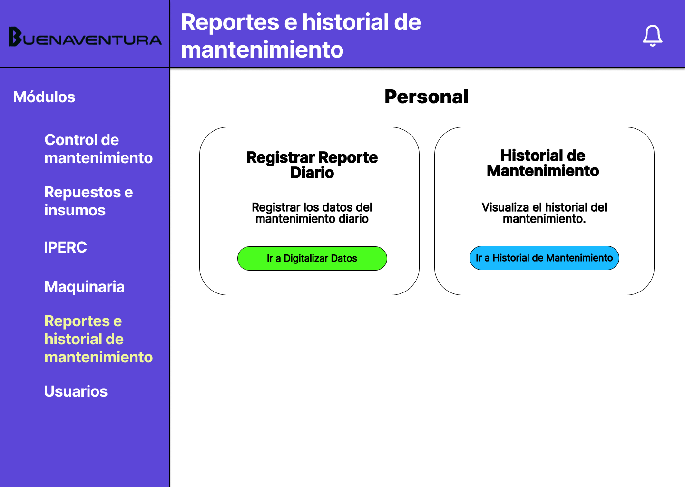
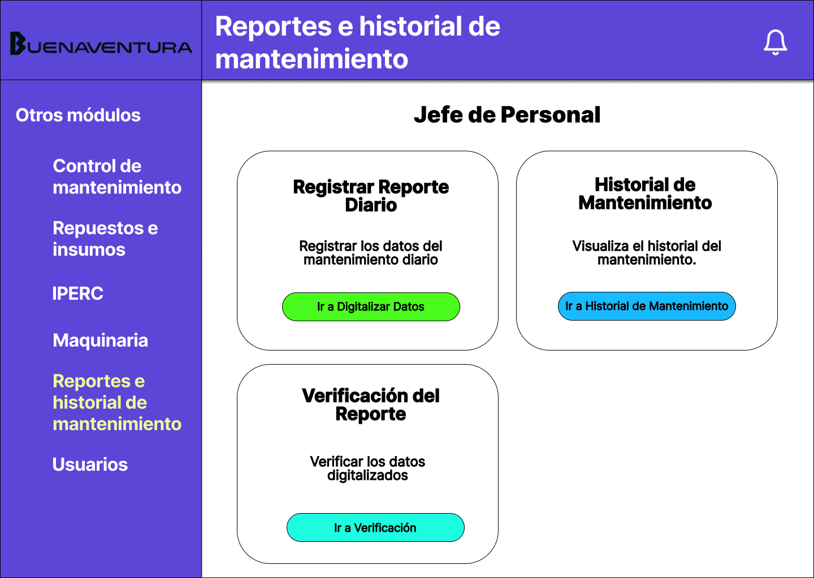
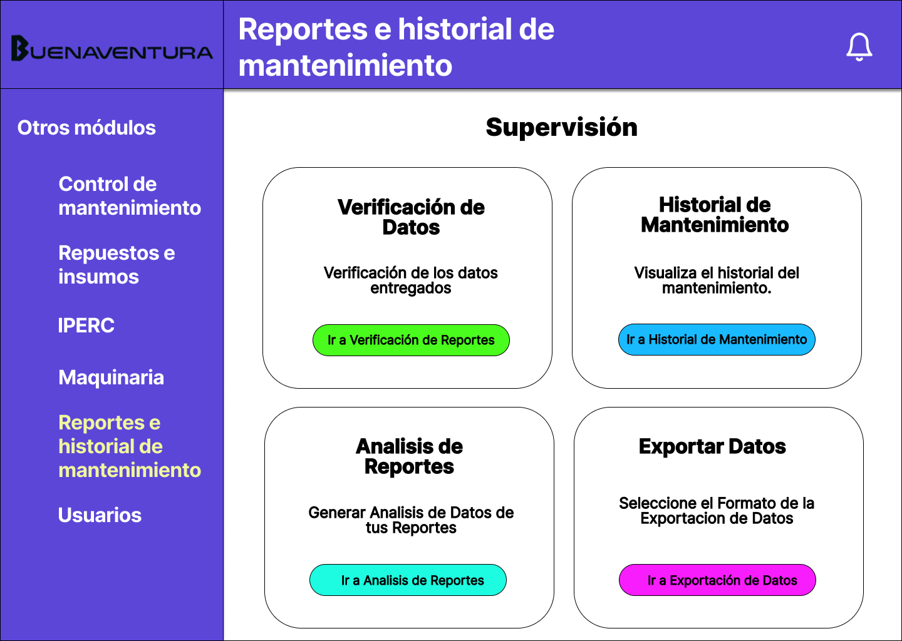
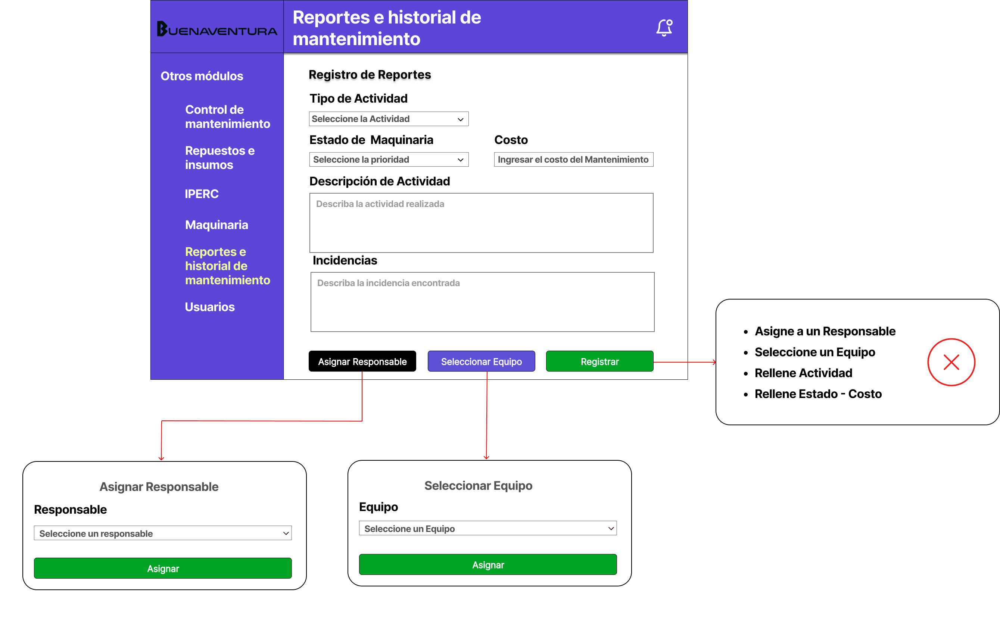
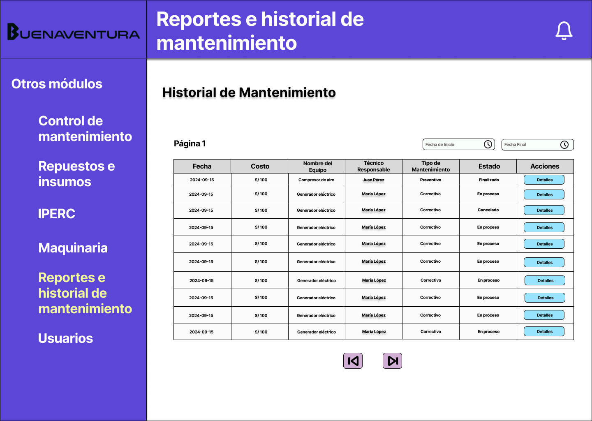
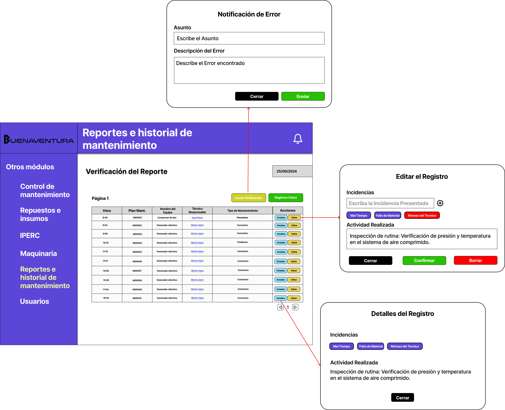
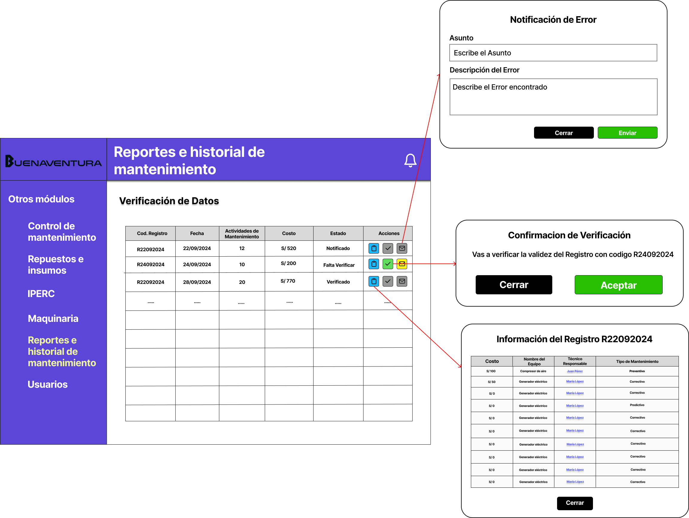
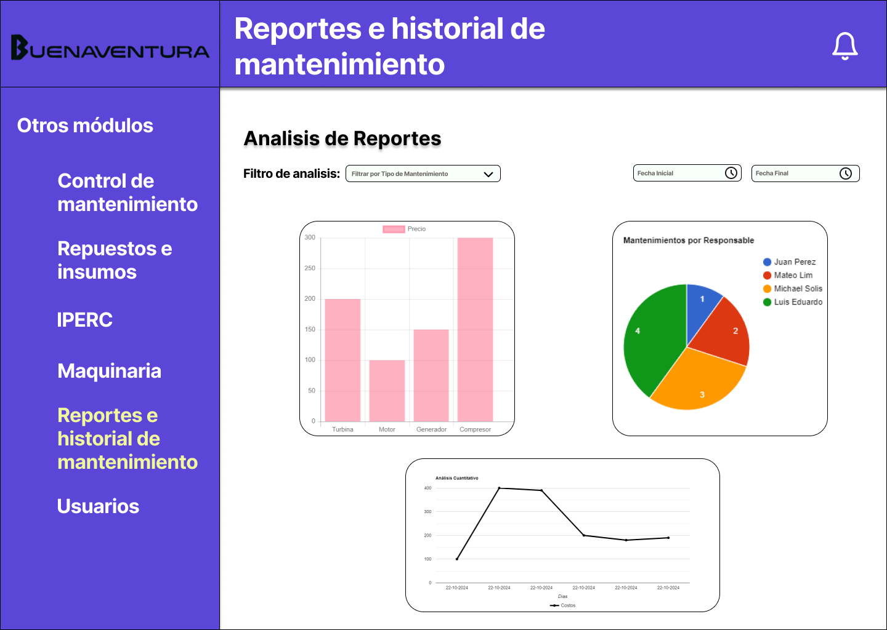
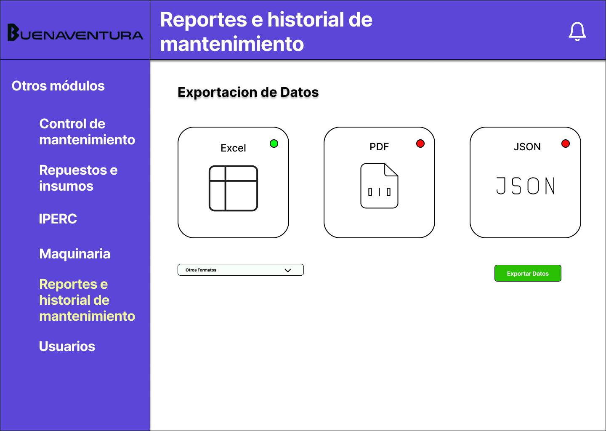

# 4.7. Módulo 7

# Módulo 7: Gestion de Reportes e Historial de Mantenimiento

## Requerimientos por casos de uso

#### Módulo: Gestión de Reportes

| **Nombre**                        | **Gestión de Reportes**                                        |
|----------------------------------- |---------------------------------------------------------------|
| **Tarea realizada por el usuario** | Registrar los datos obtenidos en las operaciones diarias dentro del sistema. |
| **Actor inicializador**            | Jefe del Personal de Mantenimiento                                             |
| **Actores participantes**          | 1. Personal de Mantenimiento   2. Jefe del Personal de Mantenimiento   3. Supervisión     |
| **Flow of Events**               | 1. El Personal/Jefe de Personal ingresa al sistema digital de gestión de reportes.   2. Registra el informe diario de las actividades realizadas por su equipo.   3. Identifica posibles incidentes o eventos que requieran seguimiento.   4. Evalúa el cumplimiento de las metas planificadas.   5. Se genera un reporte con los datos obtenidos del Personal de Mantenimiento.   6. Revisa y corrige el reporte si es necesario.   7. Aprueba el reporte final para su envío al areá de Planificación.|

#### Excepciones:

| **Titulo**      |       **Descripcion**       |
|----------------|------------------------------|
|**Excepciones** |1. Falta de datos en el sistema por ausencia de registros previos.   2. Inconsistencias o errores en la carga de información.|
|**Precondición**|El equipo debe haber ingresado los datos de actividades al sistema durante el turno.|
|**Postcondición**|El reporte final es almacenado en el sistema y enviado al área de Planificación para su uso.|
|**Casos de uso incluidos**|Revisión de reportes, Corrección de datos, Aprobación de reportes.|
|**Servicios utilizados** |Gestión de reportes, Generación de informes, Almacenamiento de datos, Notificaciones, Revisión y corrección de reportes.|

#### Requisitos no funcionales:

| **Requisitos no funcionales**      |
|------------------------------------|
| 1. Interfaz agradable de usar, compatible con navegadores móviles y de escritorio. |

---

#### Requerimientos Detallados

| **Requerimiento**                   | **Descripción**                                                                                  |
|------------------------------------ |--------------------------------------------------------------------------------------------------|
| **Funcional**                       | Registro, edición y aprobación de reportes diarios de actividades.                                |
| **Restricciones**                   | El sistema debe cumplir con normativas de protección de datos y ser accesible en todos los navegadores. |
| **Requerimientos Especiales**       | Procesos automáticos a fin de mes para generación de reportes consolidados.                        |

---

#### Detalles de Casos de Uso:

| **Caso de Uso**                    | **Registrar Informe Diario**                                                      |
|----------------------------------- |-----------------------------------------------------------------------------------|
| **Actor**                          | Jefe del Personal                                                                 |
| **Precondiciones**                 | - Credenciales válidas   - Datos de actividades registrados por el equipo       |
| **Flujo Principal**                | 1. El Jefe del Personal selecciona "Registrar Informe Diario".   2. Introduce los datos del día.   3. Revisa y aprueba el informe final. |
| **Excepciones**                    | Si hay errores en los datos, el sistema permite correcciones en la etapa de verificación.|
| **Postcondición**                  | El informe final se almacena y envía al área de Planificación.                                |

 

# Prototipo

## Dashboard Personal
**Descripcion:** Presenta las opciones disponibles para el Personal, cuenta con las siguientes opciones: 
- Registrar Reporte Diario
- Historial de Mantenimiento

## Dashboard Jefe Personal
**Descripcion:** Presenta las opciones disponibles para el Jefe del Personal, cuenta con las siguientes opciones: 
- Registrar Reporte Diario
- Historial de Mantenimiento
- Verificación del Reporte

## Dashboard Supervisión
**Descripcion:** Presenta las opciones disponibles para la Supervisión, cuenta con las siguientes opciones: 
- Verificación de Datos
- Historial de Mantenimiento
- Analisis de Reportes
- Exportar Datos

## Registro de Reportes
**Descripcion:** Permite realizar las inserciones de datos que se realizaban en el cuaderno de manera física.
Se requieren los siguientes datos:
- Equipo al que se realizo el Mantenimiento
- Responsable del Mantenimiento
- Estado del Mantenimiento
- Actividad que se realizo
- Costo

Opcionalmente se puede agregar descripcion de las incidencias encontradas en conjunto con la Actividad realizada.
Entonces estos datos se registrarán dentro de la base de datos para su verificación cuando se cierra el día.

## Historial de Mantenimiento
**Descripcion:** Se visualiza los datos historicos de los mantenimientos realizados a las maquinas

También se permite el filtrado de datos por fecha.

## Verificación del Reporte
**Descripcion:** El Jefe del Personal de Mantenimiento verifica los registros realizados durante el día. Aqui puede realizar las siguientes actividades:
- Notificar algun Error
- Revisar los detalles de los registros
- Editar los Registros

Además que se presenta arriba el día actual.

## Verificación de Datos
**Descripcion:** Es la revision inicial que presenta el TO-BE que realiza la supervisión antes de aceptar los datos obtenidos por el Personal. Aqui puede realizar las siguientes actividades:
- Revisar la Informacion de los datos obtenidos
- Revisar los detalles de los registros
- Editar los Registros

Además que se presenta arriba el día actual.

## Analisis de Reportes
**Descripcion:** Se ven algunos graficos que podrian ser de importancia para el analisis de estos.
Algunos de los graficos que se obtienen son: 
- Grafica de Barras (Maquinaria vs Precio)
- Grafica de PIE (Responsable de Mantenimiento vs Numero de Mantenimientos)
- Grafica de Lineas (Precio vs Fecha)

Además tiene un filtro por tipo de Maquinaría y Fecha.

## Exportación de Datos
**Descripcion:** Aqui se permite exportar datos de diferentes formatos.
Se puede seleccionar más de uno (cada que se selecciona a 1 se coloca de verde)

## Presentación del Video

