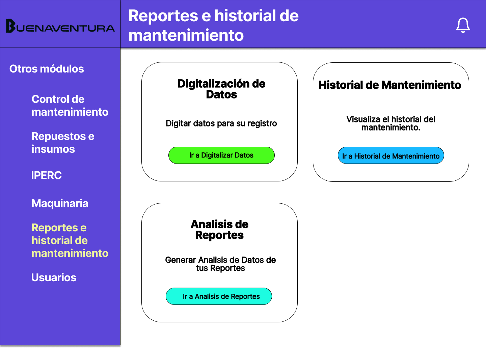
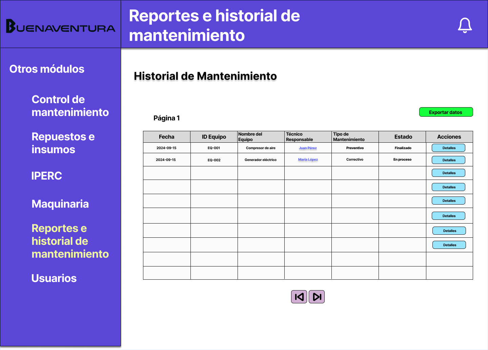
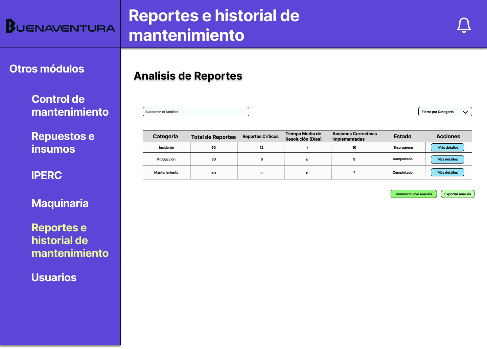

# 4.7. Módulo 7

# Módulo 7: Gestion de los IPERC

# Requerimientos por casos de uso

## Gestion de Reportes
<table border="1">
	<tbody>
		<tr>
			<td>Nombre</td>
			<td colspan="2">Gestion de Reportes</td>
		</tr>
		<tr>
			<td>Tarea realizada por el usuario</td>
			<td colspan="2">Registrar los datos obtenidos en las opperaciones diarias dentro del sistema.</td>
		</tr>
		<tr>
			<td>Actor inicializador</td>
			<td colspan="2">Jefe del Personal</td>
		</tr>
		<tr>
			<td>Actores participantes</td>
			<td colspan="2">
    <ol>
      <li>Personal</li>
      <li>Jefe del Personal</li>
      <li>Supervisión</li>
    </ol>
    </td>
    </tr>
		<tr>
    <th>Flow of Events</th>
    <td>
        <ol>
            <li>El supervisor ingresa al sistema digital de gestión de reportes.</li>
            <li>Registra el informe diario de las actividades realizadas por su equipo.</li>
            <li>Identifica posibles incidentes o eventos que requieran seguimiento.</li>
            <li>Evalúa el cumplimiento de las metas planificadas.</li>
            <li>Genera automáticamente un reporte preliminar basado en los datos ingresados.</li>
            <li>Revisa y corrige el reporte si es necesario.</li>
            <li>Aprueba el reporte final para su envío a la gerencia.</li>
        </ol>
    </td>
</tr>
<tr>
    <th>Excepciones</th>
    <td>
        <ol>
            <li>Falta de datos en el sistema por ausencia de registros previos.</li>
            <li>Inconsistencias o errores en la carga de información.</li>
            <li>Problemas de acceso a la plataforma digital durante la evaluación de los reportes.</li>
        </ol>
    </td>
</tr>
<tr>
    <td>Precondición</td>
    <td colspan="2">El equipo debe haber ingresado los datos de actividades al sistema durante el turno.</td>
</tr>
<tr>
    <td>Postcondición</td>
    <td colspan="2">El reporte final es almacenado en el sistema y enviado a la gerencia para su evaluación.</td>
</tr>
<tr>
    <td>Casos de uso incluidos</td>
    <td colspan="2">Revisión de reportes, Corrección de datos, Aprobación de reportes.</td>
</tr>
<tr>
    <td>Servicios utilizados</td>
    <td colspan="2">Gestión de reportes, Generación de informes, Almacenamiento de datos, Notificaciones, Revisión y corrección de reportes.</td>
</tr>
<tr>
    <th>Requisitos no funcionales</th>
    <td>
        <ol>
            <li>Interfaz fácil de usar, compatible con navegadores móviles y escritorio.</li>
        </ol>
    </td>
</tr>
	</tbody>
</table>

 

# Prototipo

