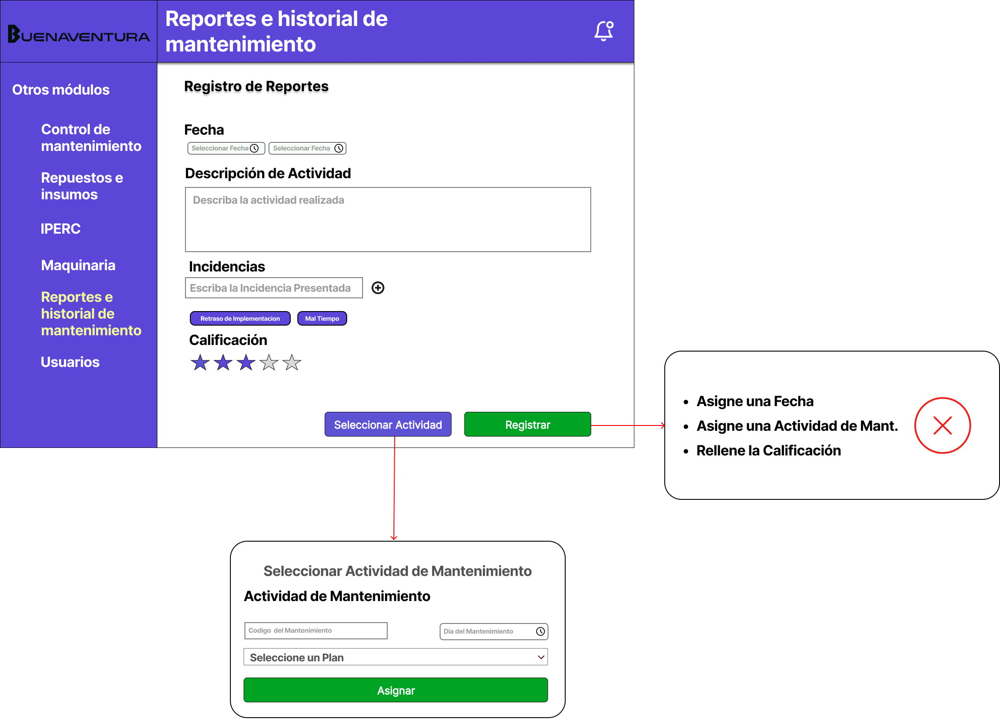
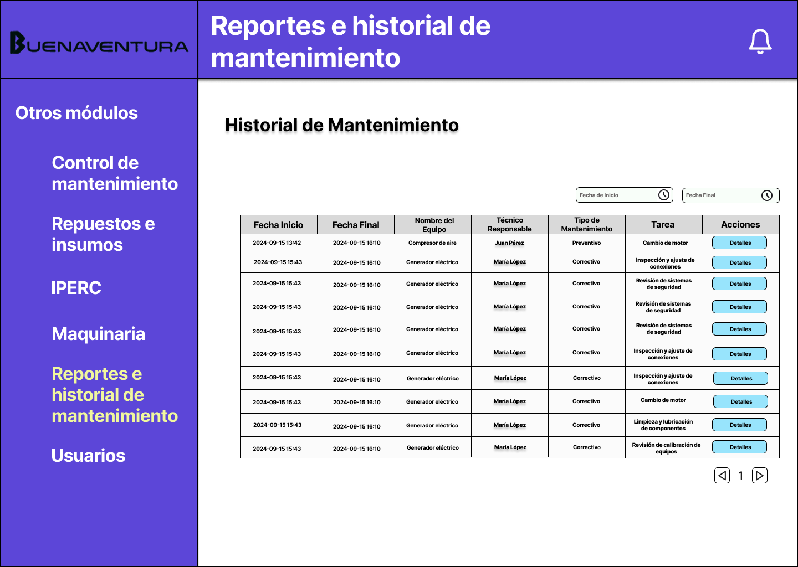

# 4.7. Módulo 7

# Módulo 7: Gestion de Reportes e Historial de Mantenimiento

## Requerimientos por casos de uso

#### Módulo: Gestión de Reportes
### Caso de Uso: Registro de Reporte Diario

| **Campo**                         | **Descripción**                                                                                                                      |
|-----------------------------------|--------------------------------------------------------------------------------------------------------------------------------------|
| **Nombre**                        | Registro de Reporte Diario                                                                                                           |
| **Tarea realizada por el usuario**| Registrar los datos obtenidos en las operaciones diarias dentro del sistema.                                                         |
| **Actor inicializador**           | Jefe del Personal de Mantenimiento                                                                                                   |
| **Actores participantes**         | 1. Personal de Mantenimiento   2. Jefe del Personal de Mantenimiento                                                              |
| **Flujo de eventos**              | 1. El Personal/Jefe de Personal ingresa al sistema de gestión de reportes.   2. Registra el informe diario de las actividades realizadas por su equipo.   3. Identifica posibles incidentes o eventos que requieran seguimiento. |
| **Excepciones**                   | 1. Falta de datos en el sistema por ausencia de registros previos.                                                                   |
| **Precondición**                  | El equipo debe haber ingresado los datos de actividades al sistema durante el turno.                                                 |
| **Postcondición**                 | El reporte se registra en el sistema para uso futuro.                                                                                |
| **Casos de uso incluidos**        | Revisión de reportes, Corrección de datos.                                                                                           |
| **Requisitos no funcionales**     | Interfaz agradable de usar, compatible con navegadores móviles y de escritorio.                                                     |

---

### Caso de Uso: Aprobación de Reporte Diario

| **Campo**                         | **Descripción**                                                                                                                      |
|-----------------------------------|--------------------------------------------------------------------------------------------------------------------------------------|
| **Nombre**                        | Aprobación de Reporte Diario                                                                                                         |
| **Tarea realizada por el usuario**| Revisar y aprobar el reporte diario registrado por el personal.                                                                      |
| **Actor inicializador**           | Jefe del Personal de Mantenimiento                                                                                                   |
| **Actores participantes**         | 1. Jefe del Personal de Mantenimiento   2. Supervisión                                                                            |
| **Flujo de eventos**              | 1. El Jefe del Personal revisa el reporte diario generado.   2. Corrige errores si es necesario.   3. Aprueba el reporte final para su envío al área de Planificación. |
| **Excepciones**                   | 1. Inconsistencias o errores en la carga de información.                                                                             |
| **Precondición**                  | El reporte debe estar registrado y listo para revisión.                                                                              |
| **Postcondición**                 | El reporte final es almacenado en el sistema y enviado al área de Planificación para su uso.                                        |
| **Casos de uso incluidos**        | Revisión de reportes, Aprobación de reportes.                                                                                        |
| **Requisitos no funcionales**     | Interfaz agradable de usar, compatible con navegadores móviles y de escritorio.                                                     |

### Caso de Uso: Verificación de Reporte (Área de Supervisión)

| **Campo**                         | **Descripción**                                                                                                                              |
|-----------------------------------|----------------------------------------------------------------------------------------------------------------------------------------------|
| **Nombre**                        | Verificación de Reporte                                                                                                                      |
| **Tarea realizada por el usuario**| El supervisor verifica el reporte aprobado por el Jefe de Personal y elige entre tres opciones: aceptar el reporte, notificar error al jefe de personal y a la directiva, o revisar el reporte detalladamente. |
| **Actor inicializador**           | Supervisor                                                                                                                                   |
| **Actores participantes**         | 1. Jefe del Personal de Mantenimiento   2. Supervisión                                                                                   |
| **Flujo de eventos**              | 1. El supervisor accede al sistema de reportes.   2. Visualiza el reporte aprobado por el Jefe de Personal.   3. Elige una de las opciones: aceptar, notificar error o revisar el reporte. |
| **Excepciones**                   | Si el reporte contiene información inconsistente, el sistema permite notificar directamente a la directiva y al Jefe de Personal.            |
| **Precondición**                  | El reporte debe estar aprobado por el Jefe de Personal y disponible en el sistema.                                                           |
| **Postcondición**                 | El reporte es aceptado o se genera una notificación de error.                                                                                |
| **Casos de uso incluidos**        | Revisión de reportes, Notificación de errores.                                                                                              |
| **Requisitos no funcionales**     | Interfaz clara para el proceso de verificación, compatible con navegadores móviles y de escritorio.                                        |

---

### Caso de Uso: Notificación de Problemas

| **Campo**                         | **Descripción**                                                                                                                      |
|-----------------------------------|--------------------------------------------------------------------------------------------------------------------------------------|
| **Nombre**                        | Notificación de Problemas                                                                                                            |
| **Tarea realizada por el usuario**| Visualizar y gestionar la bandeja de entrada de notificaciones sobre problemas en los reportes.                                     |
| **Actor inicializador**           | Sistema                                                                                                                              |
| **Actores participantes**         | 1. Jefe del Personal de Mantenimiento   2. Supervisión   3. Directiva                                                         |
| **Flujo de eventos**              | 1. Los problemas o inconsistencias detectadas en los reportes generan una notificación.   2. El usuario accede a la bandeja de entrada de notificaciones.   3. Revisa y gestiona cada notificación según prioridad. |
| **Excepciones**                   | Si se generan demasiadas notificaciones a la vez, el sistema prioriza las más críticas.                                             |
| **Precondición**                  | Deben existir problemas detectados y reportados en el sistema.                                                                      |
| **Postcondición**                 | Las notificaciones se visualizan y se gestionan según la revisión del usuario.                                                      |
| **Casos de uso incluidos**        | Revisión de notificaciones, Gestión de problemas.                                                                                   |
| **Requisitos no funcionales**     | Interfaz de notificaciones fácil de gestionar, con una experiencia de usuario clara y ágil.                                        |

---

### Caso de Uso: Historial de Mantenimiento

| **Campo**                         | **Descripción**                                                                                                                      |
|-----------------------------------|--------------------------------------------------------------------------------------------------------------------------------------|
| **Nombre**                        | Historial de Mantenimiento                                                                                                           |
| **Tarea realizada por el usuario**| Visualizar y consultar el historial de registros de mantenimiento para el análisis y seguimiento de las actividades realizadas.       |
| **Actor inicializador**           | Técnico de Mantenimiento o Supervisor                                                                                                 |
| **Actores participantes**         | 1. Técnico de Mantenimiento   2. Supervisor                                                                                       |
| **Flujo de eventos**              | 1. El usuario accede al módulo de historial de mantenimiento en el sistema.   2. Selecciona el rango de fechas para filtrar los registros.   3. Visualiza la lista de registros filtrados junto con sus detalles.|
| **Excepciones**                   | Si no hay registros disponibles en el rango de fechas seleccionado, el sistema informa al usuario que no se encontraron resultados.   |
| **Precondición**                  | Deben existir registros de mantenimiento almacenados en el sistema.                                                                   |
| **Postcondición**                 | El usuario visualiza el historial de mantenimiento, obteniendo información relevante para el análisis y seguimiento de actividades.  |
| **Casos de uso incluidos**        | Filtrado de registros por fecha, Exportación de datos a formatos específicos.                                                          |
| **Requisitos no funcionales**     | Interfaz intuitiva y de fácil navegación, con tiempos de respuesta rápidos para la carga de datos y visualización de registros.       |

### Caso de Uso: Exportación de Datos

| **Campo**                         | **Descripción**                                                                                                                      |
|-----------------------------------|--------------------------------------------------------------------------------------------------------------------------------------|
| **Nombre**                        | Exportación de Datos                                                                                                                |
| **Tarea realizada por el usuario**| Exportar datos de reportes en diferentes formatos seleccionables (e.g., PDF, Excel, CSV). Cada formato seleccionado se destaca en verde para indicar la selección. |
| **Actor inicializador**           | Supervisor o Jefe de Personal                                                                                                       |
| **Actores participantes**         | 1. Jefe del Personal de Mantenimiento   2. Supervisor                                                                            |
| **Flujo de eventos**              | 1. El usuario accede a la opción de exportación de datos.   2. Selecciona uno o más formatos de exportación (los seleccionados se resaltan en verde).   3. El sistema procesa y genera el archivo en los formatos seleccionados. |
| **Excepciones**                   | Si un formato no está disponible, el sistema muestra una advertencia.                                                               |
| **Precondición**                  | Los datos deben estar completos y disponibles para exportación.                                                                     |
| **Postcondición**                 | Se generan y descargan los archivos en los formatos seleccionados.                                                                  |
| **Casos de uso incluidos**        | Selección de formatos, Exportación de datos.                                                                                        |
| **Requisitos no funcionales**     | Exportación rápida y sin errores, con compatibilidad para múltiples formatos de archivo.                                           |

 

# Prototipo

## Dashboard Personal
**Descripcion:** Presenta las opciones disponibles para el Personal, cuenta con las siguientes opciones: 
- Registrar Reporte Diario
- Historial de Mantenimiento

## Dashboard Jefe Personal
**Descripcion:** Presenta las opciones disponibles para el Jefe del Personal, cuenta con las siguientes opciones: 
- Registrar Reporte Diario
- Historial de Mantenimiento
- Verificación del Reporte

## Dashboard Supervisión
**Descripcion:** Presenta las opciones disponibles para la Supervisión, cuenta con las siguientes opciones: 
- Verificación de Datos
- Historial de Mantenimiento
- Analisis de Reportes
- Exportar Datos

## Registro de Reportes
**Descripcion:** Permite realizar las inserciones de datos que se realizaban en el cuaderno de manera física.
Se requieren los siguientes datos:
- Equipo al que se realizo el Mantenimiento
- Responsable del Mantenimiento
- Estado del Mantenimiento
- Actividad que se realizo
- Costo

Opcionalmente se puede agregar descripcion de las incidencias encontradas en conjunto con la Actividad realizada.
Entonces estos datos se registrarán dentro de la base de datos para su verificación cuando se cierra el día.

## Historial de Mantenimiento
**Descripcion:** Se visualiza los datos historicos de los mantenimientos realizados a las maquinas

También se permite el filtrado de datos por fecha.

## Verificación del Reporte
**Descripcion:** El Jefe del Personal de Mantenimiento verifica los registros realizados durante el día. Aqui puede realizar las siguientes actividades:
- Notificar algun Error
- Revisar los detalles de los registros
- Editar los Registros

Además que se presenta arriba el día actual.

## Verificación de Datos
**Descripcion:** Es la revision inicial que presenta el TO-BE que realiza la supervisión antes de aceptar los datos obtenidos por el Personal. Aqui puede realizar las siguientes actividades:
- Revisar la Informacion de los datos obtenidos
- Revisar los detalles de los registros
- Editar los Registros

Además que se presenta arriba el día actual.

## Notificaciones de Problemas
**Descripcion:** En este apartado se presenta la bandeja del usuario sobre las notificaciones recibidas en ambas partes de las verificaciones (Jefe del Personal o Supervision), aqui la persona puede realizar acciones basicas con las Notificaciones, asi como revisar los detalles de los errores e ir directamente al registro/reporte con el error.

## Exportación de Datos
**Descripcion:** Aqui se permite exportar datos de diferentes formatos.
Se puede seleccionar más de uno (cada que se selecciona a 1 se coloca de verde)

---

<table>
  <tr>
    <td colspan="2" align="center"><strong>TABLA 1</strong></td>
  </tr>
  <tr>
    <td><strong>Codigo Requerimiento</strong></td>
    <td>R-701</td>
  </tr>
  <tr>
    <td><strong>Codigo Interfaz</strong></td>
    <td>I-701</td>
  </tr>
  <tr>
    <td colspan="2"><strong>Imagen Interfaz</strong></td>
  </tr>
  <tr>
    <td colspan="2"></td>
  </tr>
  <tr>
    <td colspan="2"><strong>Sentencias SQL</strong></td>
  </tr>
  <tr>
    <td colspan="2">
      Eventos :   <strong>1. Botón Registrar:</strong> Se procede a guardar los valores en un nuevo registro.  <strong>1.1 Concepciones:</strong>
      <ul>
        <li> Fecha Izq: 1</li>
        <li> Fecha Der: 2</li>
        <li> Descripcion : 3</li>
        <li> Incidencias: 4.*</li>
        <li> Calificación: 5</li>
        <li> Usuario (Manejado en el Login): 6</li>
        <li> Actividad Mantenimiento: 7</li>
      </ul>

    -- Creacion del Registro
    INSERT INTO Registro (Fecha_inicial,Fecha_registro, Observaciones, Calificacion,Id_empleado, Id_act_mantto, ) 
    VALUES (<1>, <2>, <3>, <5>, <6>, <7>);

    -- Creacion de Incidencias
    INSERT INTO Incidencias_Tags (Incidencia,id_Registro) VALUES
    (<4*>, <ID CREADO>),
    (<4*>, <ID CREADO>),
    (<4*>, <ID CREADO>)....
</td>
  </tr>
</table>

<table>
  <tr>
    <td colspan="2" align="center"><strong>TABLA 2</strong></td>
  </tr>
  <tr>
    <td><strong>Codigo Requerimiento</strong></td>
    <td>R-701</td>
  </tr>
  <tr>
    <td><strong>Codigo Interfaz</strong></td>
    <td>I-702</td>
  </tr>
  <tr>
    <td colspan="2"><strong>Imagen Interfaz</strong></td>
  </tr>
  <tr>
    <td colspan="2"></td>
  </tr>
  <tr>
    <td colspan="2"><strong>Sentencias SQL</strong></td>
  </tr>
  <tr>
    <td colspan="2">
      Eventos :   <strong>1. Rellenar Desplegable:</strong> Se busca rellenar el Desplegable con datos apropiados o que cumplan con los Filtros de arriba <strong>1.1 Concepciones: </strong> <ul>
        <li> Codigo Mantenimiento: 1</li>
        <li> Día del Mantenimiento: 2</li>
      </ul>
      
    SELECT 
    Id_Act_mantto || ' - ' || Tarea AS Resultado
    FROM Mantenimiento
    WHERE 
    (Fecha_inicio_programado = <2> OR <2> IS NULL) 
    AND (Id_Act_mantto = <1> OR <1> IS NULL);

</td>
  </tr>
</table>

<table>
  <tr>
    <td colspan="2" align="center"><strong>TABLA 3</strong></td>
  </tr>
  <tr>
    <td><strong>Codigo Requerimiento</strong></td>
    <td>R-702</td>
  </tr>
  <tr>
    <td><strong>Codigo Interfaz</strong></td>
    <td>I-703</td>
  </tr>
  <tr>
    <td colspan="2"><strong>Imagen Interfaz</strong></td>
  </tr>
  <tr>
    <td colspan="2"></td>
  </tr>
  <tr>
    <td colspan="2"><strong>Sentencias SQL</strong></td>
  </tr>
  <tr>
    <td colspan="2">
      Eventos :   <strong>1. Carga de Datos:</strong> Se carga los datos con los registros del día <strong>1.1 Concepciones: </strong> <ul>
        <li> Dia de Hoy: con el <CODE>CURRENT_TIMESTAMP</code></li>
      </ul>
    <pre><code>
SELECT 
TO_CHAR(r.Fecha_registro, 'HH24:MI') AS Hora_registro, 
'M00' || r.Id_Act_mantto AS Codigo_actividad, 
m.Descripcion AS Nombre_equipo,
e.Nombre AS Tecnico_responsable,
tm.Descripcion AS Tipo_mantenimiento,
TO_CHAR(r.Fecha_registro, 'YYYY-MM-DD') AS Fecha_dia
FROM 
Registro r
INNER JOIN 
Mantenimiento m ON r.Id_Act_mantto = m.Id_Act_mantto
INNER JOIN 
Plan_de_mantenimiento pm ON m.Id_plan = pm.Id_plan
INNER JOIN 
Empleado e ON r.Id_empleado = e.Id_empleado
INNER JOIN 
Maquina ma ON m.Id_maquina = ma.Id_maquina
INNER JOIN 
Tipo_mantenimiento tm ON m.id_tipo_mant = tm.id_tipo_mant
WHERE 
DATE(r.Fecha_registro) = CURRENT_DATE;
</code></pre>

  <strong>2. Boton Registrar Datos:</strong> Se acepta los datos entregados, se crea el reporte correspondiente <strong>2.1 Concepciones: </strong>
<ul>
    <li> Dia de Hoy: con el <CODE>CURRENT_TIMESTAMP</code></li>
    <li> Jefe: Se maneja en el login (1)</li>
</ul>
<pre><code>
INSERT INTO Reportes (Fecha_reporte, Id_estado_reporte, id_jefe) VALUES 
(CURRENT_TIMESTAMP, 1, <1>),
</code></pre>
</td>
  </tr>
</table>

<table>
  <tr>
    <td colspan="2" align="center"><strong>TABLA 4</strong></td>
  </tr>
  <tr>
    <td><strong>Codigo Requerimiento</strong></td>
    <td>R-704</td>
  </tr>
  <tr>
    <td><strong>Codigo Interfaz</strong></td>
    <td>I-704</td>
  </tr>
  <tr>
    <td colspan="2"><strong>Imagen Interfaz</strong></td>
  </tr>
  <tr>
    <td colspan="2"></td>
  </tr>
  <tr>
    <td colspan="2"><strong>Sentencias SQL</strong></td>
  </tr>
  <tr>
    <td colspan="2">
      Eventos : 
  <strong>1. Boton Enviar:</strong> Se genera la notificacion de error a las personas correspondientes. <strong>1.1 Concepciones: </strong>
<ul>
    <li> Asunto: (1)</li>
    <li> Mensaje: (2)</li>
</ul>
<pre><code>
INSERT INTO Reportes (Fecha_reporte, Id_estado_reporte, id_jefe) VALUES 
(CURRENT_TIMESTAMP, 1, <1>),
</code></pre>
</td>
  </tr>
</table>

<table>
  <tr>
    <td colspan="2" align="center"><strong>TABLA 5</strong></td>
  </tr>
  <tr>
    <td><strong>Codigo Requerimiento</strong></td>
    <td>R-702</td>
  </tr>
  <tr>
    <td><strong>Codigo Interfaz</strong></td>
    <td>I-705</td>
  </tr>
  <tr>
    <td colspan="2"><strong>Imagen Interfaz</strong></td>
  </tr>
  <tr>
    <td colspan="2"></td>
  </tr>
  <tr>
    <td colspan="2"><strong>Sentencias SQL</strong></td>
  </tr>
  <tr>
    <td colspan="2">
      Eventos : 
  <strong>1. Borrar Registro:</strong> Se valora la opcion de borrar el registro si este no causa mayores complicaciones. <strong>1.1 Concepciones: </strong>
<ul>
    <li> Id_del Registro escogido: (1)</li>
</ul>
<pre><code>
DELETE FROM Registro
WHERE Id_registro = <1>; 
</code></pre>
  <strong>2. Boton Confirmar:</strong> Se realiza los cambios correspondientes. <strong>2.1 Concepciones: </strong>
<ul>
    <li> Id_del Registro escogido: (1)</li>
    <li> Actividad Realizada: (2)</li>
    <li> Incidencias: (3*)</li>
    <li> Texto Incidencias: (4)</li>
</ul>
<pre><code>
UPDATE table_name
SET Observaciones = <2>
WHERE Id_registro = <1>; 
-- Si se escogio algun valor para borrar incidencias
DELETE FROM Incidencias_Tags
WHERE Id_registro = <1> AND Incidencia = <4*>; 
-- Si se agrego incidencias
INSERT INTO Incidencias_Tags (Incidencia,id_Registro) VALUES
(<4*>, <1>)...;
</code></pre>
</td>
  </tr>
</table>

<table>
  <tr>
    <td colspan="2" align="center"><strong>TABLA 6</strong></td>
  </tr>
  <tr>
    <td><strong>Codigo Requerimiento</strong></td>
    <td>R-703</td>
  </tr>
  <tr>
    <td><strong>Codigo Interfaz</strong></td>
    <td>I-705</td>
  </tr>
  <tr>
    <td colspan="2"><strong>Imagen Interfaz</strong></td>
  </tr>
  <tr>
    <td colspan="2"></td>
  </tr>
  <tr>
    <td colspan="2"><strong>Sentencias SQL</strong></td>
  </tr>
  <tr>
    <td colspan="2">
      Eventos : 
  <strong>1. Carga de Datos:</strong> Se cargan todos los datos de los reportes obtenidos.
 <strong>1.1 Concepciones: </strong>
<ul>
    <li>Fecha Inicio : (1)</li>
    <li>Fecha Final :  (2)</li>
  
</ul>
<pre><code>
SELECT 
    'R' || TO_CHAR(rep.Fecha_reporte, 'YYYYMMDD') AS Codigo_Registro,
    TO_CHAR(rep.Fecha_reporte, 'YYYY-MM-DD') AS Fecha_del_Dia,
    registros_por_dia.Numero_Registros_Dia,
    rep.Fecha_reporte,
    est.nombre_estado AS "Estado_Reporte",
    rep.id_jefe
FROM 
    Reportes AS rep
JOIN 
    (
        SELECT 
            TO_CHAR(Fecha_registro, 'YYYY-MM-DD') AS Fecha_del_Dia,
            COUNT(Id_registro) AS Numero_Registros_Dia
        FROM 
            Registro
        WHERE 
            Fecha_inicial >= <1>
            AND Fecha_inicial <= <2>
        GROUP BY 
            TO_CHAR(Fecha_registro, 'YYYY-MM-DD')
    ) AS registros_por_dia
ON 
    TO_CHAR(rep.Fecha_reporte, 'YYYY-MM-DD') = registros_por_dia.Fecha_del_Dia
JOIN 
    Estado_Reporte AS est ON rep.id_estado_reporte = est.id_estado_reporte
ORDER BY 
    Fecha_del_Dia;

</code></pre>

</td>
  </tr>
</table>

<table>
  <tr>
    <td colspan="2" align="center"><strong>TABLA 7</strong></td>
  </tr>
  <tr>
    <td><strong>Codigo Requerimiento</strong></td>
    <td>R-703</td>
  </tr>
  <tr>
    <td><strong>Codigo Interfaz</strong></td>
    <td>I-706</td>
  </tr>
  <tr>
    <td colspan="2"><strong>Imagen Interfaz</strong></td>
  </tr>
  <tr>
    <td colspan="2"></td>
  </tr>
  <tr>
    <td colspan="2"><strong>Sentencias SQL</strong></td>
  </tr>
  <tr>
    <td colspan="2">
      Eventos : 
  <strong>1. Boton Aceptar:</strong> Se acepta la entrega del Reporte.
 <strong>1.1 Concepciones: </strong>
<ul>
    <li>Id del Registro seleccionado: (1)</li>
  
</ul>
<pre><code>
UPDATE Reportes SET id_estado_reporte = 2 WHERE Id_reporte  = <1>;
</code></pre>

</td>
  </tr>
</table>

<table>
  <tr>
    <td colspan="2" align="center"><strong>TABLA 8</strong></td>
  </tr>
  <tr>
    <td><strong>Codigo Requerimiento</strong></td>
    <td>R-705</td>
  </tr>
  <tr>
    <td><strong>Codigo Interfaz</strong></td>
    <td>I-707</td>
  </tr>
  <tr>
    <td colspan="2"><strong>Imagen Interfaz</strong></td>
  </tr>
  <tr>
    <td colspan="2"></td>
  </tr>
  <tr>
    <td colspan="2"><strong>Sentencias SQL</strong></td>
  </tr>
  <tr>
    <td colspan="2">
      Eventos : 
  <strong>1. Visualizar los datos de Historial:</strong> Se debe cargar los datos correspondientes para obtener el historial de mantenimiento
 <strong>1.1 Concepciones: </strong>
<ul>
    <li>Fecha Inicio: (1)</li>
    <li>Fecha Final:  (2)</li>
  
</ul>
<pre><code>
SELECT 
    m2.nombre_maquina AS "Nombre de la Máquina", 
    e.Nombre AS "Técnico Responsable", 
    tm.nombre_tipo_mant AS "Tipo de Mantenimiento", 
    m.Tarea, 
    r.Fecha_inicial AS "Fecha Inicio", 
    r.Fecha_registro AS "Fecha Final", 
    r.Calificacion, 
    r.Observaciones
FROM 
    Registro r
INNER JOIN 
    Mantenimiento m ON r.Id_Act_mantto = m.Id_Act_mantto
INNER JOIN 
    Empleado e ON r.Id_empleado = e.Id_empleado
INNER JOIN 
    Tipo_mantenimiento tm ON m.id_tipo_mant = tm.id_tipo_mant
INNER JOIN 
    Maquina m2 ON m.id_maquina = m2.id_maquina
WHERE 
    r.Fecha_inicial BETWEEN '<1>' AND '<2>'
ORDER BY 
    r.Fecha_inicial;

</code></pre>

</td>
  </tr>
</table>

<table>
  <tr>
    <td colspan="2" align="center"><strong>TABLA 9</strong></td>
  </tr>
  <tr>
    <td><strong>Codigo Requerimiento</strong></td>
    <td>R-706</td>
  </tr>
  <tr>
    <td><strong>Codigo Interfaz</strong></td>
    <td>I-708</td>
  </tr>
  <tr>
    <td colspan="2"><strong>Imagen Interfaz</strong></td>
  </tr>
  <tr>
    <td colspan="2"></td>
  </tr>
  <tr>
    <td colspan="2"><strong>Sentencias SQL</strong></td>
  </tr>
  <tr>
    <td colspan="2">
      Eventos : 
  <strong>1. Boton Exportar Datos:</strong> Se genera la exportacion de datos para el formato escogido (Se maneja ya en el backend). 
 <strong>1.1 Concepciones: </strong>
<ul>
    <li>Fecha Inicio: (1)</li>
    <li>Fecha Final:  (2)</li>
</ul>
<pre><code>
COPY (
    SELECT 
        m2.nombre_maquina AS "Nombre de la Máquina", 
        e.Nombre AS "Técnico Responsable", 
        tm.nombre_tipo_mant AS "Tipo de Mantenimiento", 
        m.Tarea, 
        r.Fecha_inicial AS "Fecha Inicio", 
        r.Fecha_registro AS "Fecha Final", 
        r.Calificacion, 
        r.Observaciones
    FROM 
        Registro r
    INNER JOIN 
        Mantenimiento m ON r.Id_Act_mantto = m.Id_Act_mantto
    INNER JOIN 
        Empleado e ON r.Id_empleado = e.Id_empleado
    INNER JOIN 
        Tipo_mantenimiento tm ON m.id_tipo_mant = tm.id_tipo_mant
    INNER JOIN 
        Maquina m2 ON m.id_maquina = m2.id_maquina
    WHERE 
        r.Fecha_inicial BETWEEN '<1>' AND '<2>'
    ORDER BY 
        r.Fecha_inicial
) TO '/ruta/del/archivo/historial_mantenimiento.csv' WITH (FORMAT CSV, HEADER);
</code></pre>

</td>
  </tr>
</table>
