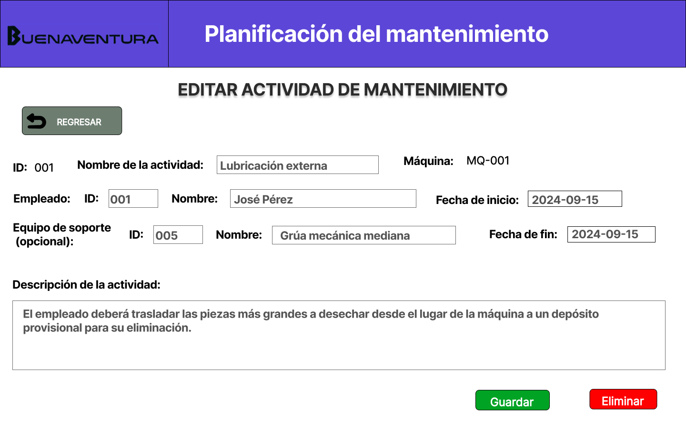
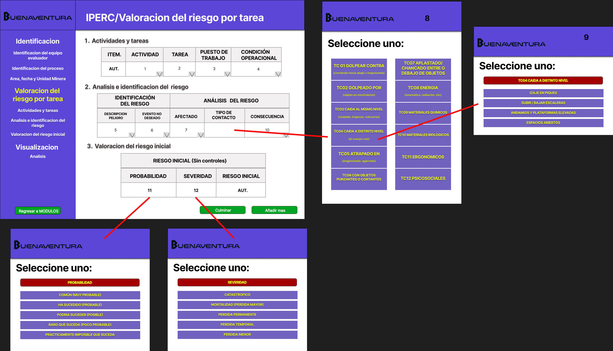
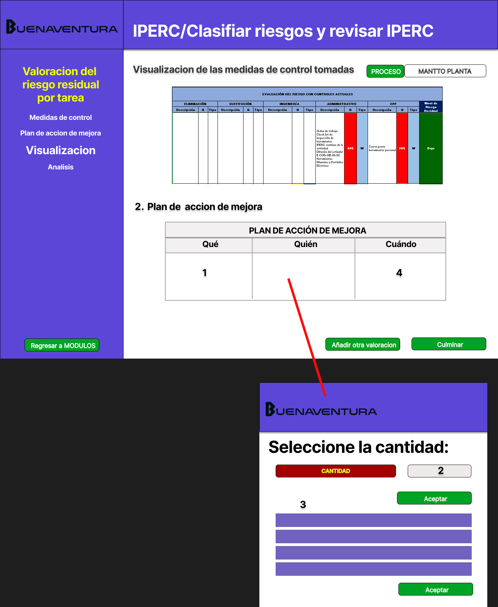

# 8.1. Sentencias SQL por módulo / prototipo

# Modulo 1 (Planificación del mantenimiento)

**Código Requerimiento:** R-101

**Código Interfaz:** I-101

**Imagen Interfaz**


**Sentencias SQL**

**Eventos:**

1. Botón Crear Nuevo Plan de mantenimiento:
	Redirecciona a la interfaz I-102.

2. Botón Listado de Planes de mantenimiento:
   	Redirecciona a la interfaz I-103.

3. Botón Crear Nueva Orden de Trabajo:
	Redirecciona a la interfaz I-104.

4. Botón Listado de Órdenes de Trabajo:
	Redirecciona a la interfaz I-105.

5. Botón Editar Actividades de Mantenimiento:
	Redirecciona a la interfaz I-106.


**Código Requerimiento:** R-102

**Código Interfaz:** I-102

**Imagen Interfaz**


**Sentencias SQL**

**Eventos:**

1. Boton Añadir recurso:

	Añade una fila temporal para especificar un nuevo recurso en el plan de mantenimiento que se está creando. (implementación en el frontend)

2. Boton Añadir equipo:

	Añade una fila temporal para especificar un nuevo equipo de soporte en el plan de mantenimiento que se está creando. (implementación en el frontend)

3. Boton Guardar y Programar:

	```sql
	--- Guarda todos los datos llenados en el formulario y los sube a la base de datos ---
	--- Actualización en la tabla plan de mantenimiento ---
	INSERT INTO Plan_de_mantenimiento (id_plan,descripcion,fecha_plan,empleado_asigna,id_criticidad)
	VALUES (<1>,<2>,<3>,<4>,<5>);

	--- Actualización en la tabla Mantenimiento ---
	INSERT INTO Mantenimiento (id_act_mantto,fecha_inicio_programado,fecha_fin_programado,id_orden,id_plan,id_tipo_mant,id_maquina,id_estado)
	VALUES (<6>,<7>,<8>,null,<1>,<9>,<10>,<11>)
	```

 	Donde:

	|  | Descripción                                           |
	|-------------|-------------------------------------------------------|
	| `<1>`       | Id del plan creado automáticamente |
	| `<2>`       | Descripción obtenida del formulario |
	| `<3>`       | Fecha de creación del plan, se obtiene automáticamente |
	| `<4>`       | Id del empleado que creó el plan  |
	| `<5>`       | Id de criticidad obtenida del formulario (se envía el id en vez del nivel) |
	| `<6>`       | Id del mantenimiento creado automáticamente |
	| `<7>`       | Fecha inicial del mantenimiento obtenida del formulario |
	| `<8>`       | Fecha final del mantenimiento obtenida del formulario |
	| `<9>`       | Fecha inicial del mantenimiento obtenida del formulario |
	| `<10>`      | Id de la máquina obtenido del formulario |
	| `<11>`      | Id del estado luego de crear el plan. En este evento, será igual a 2 (En mantenimiento) |


**Código Requerimiento:** R-103

**Código Interfaz:** I-103

**Imagen Interfaz**


**Sentencias SQL**

**Eventos:**

1. Lista de Planes de Mantenimiento:

	```sql
	--- Obtiene el resumen de los planes de mantenimiento, incluyendo criticidad ---
	SELECT p.id_plan, m.id_maquina, tm.nombre_tipo_mant, c.nivel, m.fecha_inicio_programado
	FROM Plan_de_Mantenimiento p 
	INNER JOIN Mantenimiento m
	ON m.id_plan = p.id_plan
	INNER JOIN Tipo_mantenimiento tm
	ON tm.id_tipo_mant = m.id_tipo_mant
	INNER JOIN Criticidad c
	ON c.id_criticidad = p.id_criticidad

	LIMIT 10
	OFFSET <1>-1
	```
	Donde:

	|  | Descripción                                           |
	|-------------|-------------------------------------------------------|
	| `<1>`       | Número del id del plan para empezar a mostrar, se obtiene del servidor |
	


**Código Requerimiento:** R-104

**Código Interfaz:** I-104

**Imagen Interfaz**


**Sentencias SQL**

**Eventos:**

1. Botón Asignar responsable:

	Establece al empleado como responsable con la actividad de responsabilidad para ese mantenimiento en particular.

2. Botón Guardar y Programar:

	```sql
	--- Crea la orden de trabajo y la primera actividad(responsable) para la orden ---
	--- Creación de la orden de trabajo y actualización de la tabla ---
	INSERT INTO Orden_de_trabajo (id_orden,descripcion,fecha_orden)
	VALUES (<1>,<2>,<3>);

	--- Creación de variables para la asignación posterior en actividad de empleado responsable ---
	DECLARE @Id_plan INT = <4>,
		@Fecha_inicio DATE,
		@Fecha_fin DATE,

	---------------------------------------------------------------------------

	--- Esta sección solo se implementa si se rellena un plan de mantenimiento asociado ---
	--- Actualizar la tabla Mantenimiento para relacionar el plan y la orden de trabajo ---
	IF @Id_plan IS NOT NULL THEN
		UPDATE Mantenimiento
		SET id_orden = <1>
		WHERE id_plan = <4>

		--- Obtener el mantenimiento específico --- 
		WITH Plan_a_Mant AS
		(
			SELECT * FROM Mantenimiento m
			WHERE m.id_plan = @Id_plan
		)
		
		--- Obtener las fechas para la inserción de la actividad ---
		SET @Fecha_inicio = Plan_a_Mant.fecha_inicio_programado;
		SET @Fecha_fin = Plan_a_Mant.fecha_fin_programado;
	END IF

	---------------------------------------------------------------------------

	--- Añade la actividad responsable para esta orden de trabajo ---
	INSERT INTO Actividad_empleado (id_actv_empleado, nombre_actv, descripcion_actv, fecha_inicio, fecha_fin, id_equipo_soporte, id_empleado, id_estado, id_orden)
	VALUES (<5>,'Responsable','Es responsable de la ejecución completa del mantenimiento y su supervisión', @Fecha_inicio,@Fecha_fin,null,<5>,<6>,<1>)

	```

	Donde:

	|  | Descripción                                           |
	|-------------|-------------------------------------------------------|
	| `<1>`       | Id de la orden de trabajo creado automáticamente |
	| `<2>`       | Descripción obtenida del formulario |
	| `<3>`       | Fecha de creación de la orden, se obtiene automáticamente |
	| `<4>`       | Id del plan a relacionar (de no llenarse en el formulario, es null) |
	| `<5>`       | Id del empleado responsable obtenida del evento 1 |
	| `<6>`       | Estado de la actividad, en este evento será igual a 1 (Borrador) |


**Código Requerimiento:** R-105

**Código Interfaz:** I-105

**Imagen Interfaz**


**Sentencias SQL**

**Eventos:**

1. Lista de Órdenes de Mantenimiento:

	```sql
	--- Obtiene el resumen de las órdenes de mantenimiento, sin incluir criticidad ---
	SELECT p.id_plan, m.id_maquina, tm.nombre_tipo_mant, m.fecha_inicio_programada
	FROM Plan_de_Mantenimiento p 
	INNER JOIN Mantenimiento m
	ON m.id_plan = p.id_plan
	INNER JOIN Tipo_mantenimiento tm
	ON tm.id_tipo_mant = m.id_tipo_mant

	WHERE 
	```
	


**Código Requerimiento:** R-106

**Código Interfaz:** I-106

**Imagen Interfaz**


**Sentencias SQL**

**Eventos:**

1. Selección de orden de trabajo

	El usuario selecciona la orden de trabajo para mostrar las actividades de empleado que contiene.

2. Lista de Actividades de Empleados:

	```sql
	--- Obtiene el resumen de las órdenes de mantenimiento, sin incluir criticidad ---
	SELECT a.id_actvempleado, emp.nombre, es.id_equipo_soporte, a.fecha_inicio
	FROM Actividad_empleado a
	INNER JOIN Empleado emp
	ON emp.id_empleado = a.id_empleado
	INNER JOIN Equipo_de_Soporte
	ON es.id_equipo_soporte = a.id_equipo_soporte

	WHERE a.id_orden = <1>
	```

	Donde:

	|  | Descripción                                           |
	|-------------|-------------------------------------------------------|
	| `<1>`       | Id de la orden de trabajo obtenida del evento 1|


**Código Requerimiento:** R-107

**Código Interfaz:** I-107

**Imagen Interfaz**


**Sentencias SQL**

**Eventos:**

1. Detalle completo del plan de mantenimiento
 
	```sql
	--- Obtiene el detalle del plan de mantenimiento ---
	--- Se acceden a los datos de las tablas plan de mantenimiento, mantenimiento y actividad empleado ---
	SELECT p.id_plan, tm.nombre_tipo_mant, m.id_maquina, creador.nombre, est.estado, p.fecha_plan, m.fecha_inicio_programado, m.fecha_fin_programado, responsable.nombre, crit.nivel, o.id_orden,

	 -- Lista de equipos de soporte
    string_agg(DISTINCT es.nombre_equipo || ' (Cantidad: ' || esm.cantidad || ')', ', ') AS equipos_soporte,
    
    -- Lista de insumos
    string_agg(DISTINCT i.nombre_insumo || ' (Cantidad: ' || im.cantidad || ')', ', ') AS insumos_utilizados

	FROM Plan p

	INNER JOIN Mantenimiento m
	ON m.id_plan = p.id_plan

	INNER JOIN Tipo_mantenimiento tm
	ON tm.id_tipo_mant = m.id_tipo_mant

	INNER JOIN Empleado creador
	ON creador.id_empleado = p.empleado_asigna

	INNER JOIN Orden_de_trabajo o
	ON o.id_orden = m.id_orden

	INNER JOIN Actividad_empleado act
	ON act.id_orden = o.id_orden

	INNER JOIN Empleado responsable
	ON responsable.id_empleado = act.id_empleado

	INNER JOIN EquipoSXMantenimiento esm
	ON esm.id_act_mantto = m.id_act_mantto

	INNER JOIN Equipo_de_Soporte es
	ON es.id_equipo_soporte = esm.id_equipo_soporte

	INNER JOIN InsumoXMantenimiento im
	ON im.id_act_mantto = m.id_act_mantto

	INNER JOIN Insumo i
	ON i.id_insumo = im.id_insumo

	WHERE act.nombre_actv = 'Responsable' AND id_plan = <1>

	```

	Donde:

	|  | Descripción                                           |
	|-------------|-------------------------------------------------------|
	| `<1>`       | Id del plan obtenido del servidor |

2. Notificación del responsable (funcionalidad principal):

	```sql
	--- Envía una notificación al empleado responsable, lo que cambia el estado del plan a notificado y se encuentra a la espera de ser aceptado en el módulo de control del mantenimiento ---
	--- Definicion de variables ----
	WITH Destino AS
	(
		SELECT e.id_empleado FROM Empleado

		INNER JOIN Actividad_empleado act
		ON act.id_empleado = e.act_empleado

		INNER JOIN Orden_de_trabajo o
		ON o.id_orden = act.id_orden

		INNER JOIN Mantenimiento m
		ON m.id_orden = o.id_orden

		INNER JOIN Plan_de_Mantenimiento p
		ON p.id_plan = m.id_plan

		WHERE p.id_plan = <1>
	)

	DECLARE @Destinatario INT = Destino.id_empleado;

	--- Se modifica una tabla de notificaciones, la cual se carga en cada inicio de sesión ---
	INSERT INTO Notificaciones (id_notificacion, mensaje, fecha_notificacion, id_remitente, id_destinatario, id_registro, id_reporte, id_tipo)
	VALUES (<2>,"Nuevo plan de mantenimiento disponible con fecha " + <3>, <3>, <4>, @Destinatario, null, null, 2)
	```
	Donde:

	|  | Descripción                                           |
	|-------------|-------------------------------------------------------|
	| `<1>`       | Id del plan obtenido del servidor |
	| `<2>`       | Id de notificación generado automáticamente |
	| `<3>`       | Fecha de la notificación obtenida automáticamente (del sistema) |
	| `<4>`       | Id del remitente (usuario actual) obtenida de la sesión actual |
	


**Código Requerimiento:** R-108

**Código Interfaz:** I-108

**Imagen Interfaz**


**Sentencias SQL**

**Eventos:**

1. Detalle del plan (para autocompletar los campos)
 
	```sql
	--- Obtiene el detalle del plan de mantenimiento ---
	--- Se acceden a los datos de las tablas plan de mantenimiento, mantenimiento y actividad empleado ---
	SELECT p.id_plan, o.id_orden, tm.nombre_tipo_mant, crit.nivel, m.id_maquina, m.fecha_inicio_programado, m.fecha_fin_programado, p.descripcion,

	 -- Lista de equipos de soporte
    string_agg(DISTINCT es.nombre_equipo || ' (Cantidad: ' || esm.cantidad || ')', ', ') AS equipos_soporte,
    
    -- Lista de insumos
    string_agg(DISTINCT i.nombre_insumo || ' (Cantidad: ' || im.cantidad || ')', ', ') AS insumos_utilizados

	FROM Plan p

	INNER JOIN Mantenimiento m
	ON m.id_plan = p.id_plan

	INNER JOIN Tipo_mantenimiento tm
	ON tm.id_tipo_mant = m.id_tipo_mant

	INNER JOIN Orden_de_trabajo o
	ON o.id_orden = m.id_orden

	INNER JOIN EquipoSXMantenimiento esm
	ON esm.id_act_mantto = m.id_act_mantto

	INNER JOIN Equipo_de_Soporte es
	ON es.id_equipo_soporte = esm.id_equipo_soporte

	INNER JOIN InsumoXMantenimiento im
	ON im.id_act_mantto = m.id_act_mantto

	INNER JOIN Insumo i
	ON i.id_insumo = im.id_insumo

	WHERE id_plan = <1>

	```
	Donde:

	|  | Descripción                                           |
	|-------------|-------------------------------------------------------|
	| `<1>`       | Id del plan obtenido del servidor |

2. Botón Guardar:

	```sql
	--- Actualiza las tablas de plan y mantenimiento ---
	UPDATE Plan_de_Mantenimiento
	SET descripcion = <2>, id_criticidad = <3>
	WHERE id_plan = <1>;

	UPDATE Mantenimiento
	SET id_orden = <4>, id_tipo_mant = <5>, id_maquina = <6>, fecha_inicio_programado = <7>, fecha_fin_programado = <8>
	WHERE id_plan = <1>;

	--- Actualizar equipos de soporte e insumos, eliminando los actuales e insertando los nuevos ---
	--- Obtención del Id de mantenimiento ---
	WITH IdMant AS
	(
		SELECT m.id_act_mantto FROM Mantenimiento m
		WHERE m.id_plan = <1>
	) 
	--- Esta implementación debe realizarse con una estructura repetitiva en el backend ---
	DELETE FROM Equipo_Soporte_X_Mantenimiento
	WHERE id_mant = IdMant.id_act_mantto;
	INSERT INTO Equipo_Soporte_X_Mantenimiento (id_equipo, id_mant, cantidad)
	VALUES 
    (<9>, IdMant.id_act_mantto, <10>),

	DELETE FROM Insumo_X_Mantenimiento
	WHERE id_mant = IdMant.id_act_mantto;
	INSERT INTO Insumo_X_Mantenimiento (id_insumo, id_mant, cantidad)
	VALUES 
		(<11>, IdMant.id_act_mantto, <12>),
	```
	Donde:

	|  | Descripción                                           |
	|-------------|-------------------------------------------------------|
	| `<1>`       | Id del plan obtenido del servidor |
	| `<2>`       | Descripción obtenida del formulario |
	| `<3>`       | Id de criticidad obtenida del formulario |
	| `<4>`       | Id de la orden obtenida del formulario |
	| `<5>`       | Id del tipo de mantenimiento obtenido del formulario |
	| `<6>`       | Id de la máquia obtenido del formulario |
	| `<7>`       | Fecha de inicio obtenida del formulario |
	| `<8>`       | Fecha de fin obtenida del formulario |
	| `<9>`       | Id de un elemento de la lista de equipos de soporte a insertar, obtenida del formulario |
	| `<10>`       | Cantidad de un elemento de la lista de equipos de soporte a insertar, obtenida del formulario |
	| `<11>`       | Id de un elemento de la lista de insumos a insertar, obtenida del formulario |
	| `<12>`       | Cantidad de un elemento de la lista de insumos a insertar, obtenida del formulario |


**Código Requerimiento:** R-109

**Código Interfaz:** I-109

**Imagen Interfaz**


**Sentencias SQL**

**Eventos:**

1. Detalle de la orden (para autocompletar los campos)
 
	```sql
	--- Obtiene el detalle de la orden de trabajo ---
	--- Se acceden a los datos de las tablas plan de mantenimiento, mantenimiento, actividad empleado y orden de trabajo ---
	SELECT o.id_orden, est.estado, m.id_maquina, o.fecha_orden, tm.nombre_tipo_mant, m.fecha_inicio_programado, m.fecha_fin_programado, responsable.nombre, p.id_plan,

	 -- Lista de empleados
    string_agg(DISTINCT emp.id_empleado , emp.nombre, act.id_actvempleado) AS lista_empleados,
    
	FROM Orden_de_Trabajo o

	INNER JOIN Actividad_empleado act
	ON act.id_orden = o.id_orden

	INNER JOIN Empleado emp
	ON emp.id_empleado = act.id_empleado

	INNER JOIN Mantenimiento m
	ON m.id_plan = o.id_orden

	INNER JOIN Tipo_mantenimiento tm
	ON tm.id_tipo_mant = m.id_tipo_mant

	INNER JOIN Orden_de_trabajo o
	ON o.id_orden = m.id_orden

	INNER JOIN Plan_de_mantenimiento p
	ON p.id_plan = m.id_plan

	INNER JOIN Empleado responsable
	ON p.empleado_asigna = responsable.id_empleado

	INNER JOIN Estado_mantto est
	ON est.id_estado = m.id_estado

	WHERE id_orden = <1>

	```
	Donde:

	|  | Descripción                                           |
	|-------------|-------------------------------------------------------|
	| `<1>`       | Id de la orden obtenido del servidor |


**Código Requerimiento:** R-110

**Código Interfaz:** I-110

**Imagen Interfaz**


**Sentencias SQL**

**Eventos:**

1. Detalle de la orden (para autocompletar los campos)
 
	```sql
	--- Obtiene el detalle de la orden de trabajo ---
	--- Se acceden a los datos de las tablas plan de mantenimiento, mantenimiento,  actividad empleado y orden de trabajo ---
	SELECT o.id_orden, p.id_plan, o.descripcion,

	  -- Lista de empleados
    string_agg(DISTINCT emp.id_empleado , emp.nombre, act.id_actvempleado) AS lista_empleados,

	FROM Orden_de_Trabajo o

	INNER JOIN Mantenimiento m
	ON m.id_orden = p.id_orden

	INNER JOIN Plan_de_Mantenimiento p
	ON p.id_plan = m.id_plan

	INNER JOIN Actividad_empleado act
	ON act.id_orden = o.id_orden

	INNER JOIN Empleado emp
	ON emp.id_empleado = act.id_empleado

	WHERE id_orden = <1>

	```
	Donde:

	|  | Descripción                                           |
	|-------------|-------------------------------------------------------|
	| `<1>`       | Id de la orden obtenido del servidor |

2. Botón Guardar:

	```sql
	--- Actualiza las tablas de orden y mantenimiento ---
	UPDATE Orden_de_Trabajo
	SET descripcion = <2>, 
	WHERE id_orden = <1>;

	UPDATE Mantenimiento
	SET id_plan = (SELECT m.id_plan FROM Mantenimiento m WHERE m.id_orden = <1>)
	WHERE id_orden = <1>;

	--- Actualizar empleados y sus actividades, eliminando los actuales e insertando los nuevos ---
	
	--- Esta implementación debe realizarse con una estructura repetitiva en el backend ---
	DELETE FROM Actividad_Empleado
	WHERE id_orden = <1>;
	INSERT INTO Actividad_Empleado (id_empleado, id_actv)
	VALUES 
    (<3>, <4>);
	```
	Donde:

	|  | Descripción                                           |
	|-------------|-------------------------------------------------------|
	| `<1>`       | Id de la orden obtenido del servidor |
	| `<2>`       | Descripción obtenida del formulario |
	| `<3>`       | Id de un elemento de la lista de empleados a insertar, obtenida del formulario |
	| `<4>`       | Id de la actividad de empleado generada automáticamente |


**Código Requerimiento:** R-111

**Código Interfaz:** I-111

**Imagen Interfaz**


**Sentencias SQL**

**Eventos:**

1. Detalle completo de la actividad del empleado
 
	```sql
	--- Obtiene el detalle de la actividad del empleado ---
	--- Se acceden a los datos de las tablas plan de mantenimiento, mantenimiento, actividad empleado y orden de trabajo ---

	SELECT act.id_actvempleado, est.estado, m.id_maquina, act.nombre_actv, emp.id_empleado, emp.nombre, act.fecha_inicio, act.fecha_fin, es.id_equipo_soporte, es.nombre_equipo_soporte, o.id_orden, act.descripcion

	FROM Actividad_empleado act

	INNER JOIN Empleado emp
	ON emp.id_empleado = act.id_empleado

	INNER JOIN Orden_de_trabajo o
	ON o.id_orden = m.id_orden

	INNER JOIN Mantenimiento m
	ON m.id_orden = p.id_orden

	INNER JOIN Tipo_mantenimiento tm
	ON tm.id_tipo_mant = m.id_tipo_mant

	INNER JOIN Equipo_de_Soporte es
	ON es.id_equipo_soporte = act.id_equipo_soporte

	INNER JOIN Estado_mantto est
	ON est.id_estado = m.id_estado

	WHERE act.id_actvempleado = <1>

	```

	Donde:

	|  | Descripción                                           |
	|-------------|-------------------------------------------------------|
	| `<1>`       | Id de la actividad obtenido del servidor |


**Código Requerimiento:** R-112

**Código Interfaz:** I-112

**Imagen Interfaz**



**Sentencias SQL**

**Eventos:**

1. Detalle de la actividad (para autocompletar los campos)
 
	```sql
	--- Obtiene el detalle del plan de mantenimiento ---
	--- Se acceden a los datos de las tablas plan de mantenimiento, mantenimiento, actividad empleado y orden de trabajo ---

	SELECT act.id_actvempleado, act.nombre_actv, emp.id_empleado, emp.nombre, act.fecha_inicio, act.fecha_fin, es.id_equipo_soporte, es.nombre_equipo_soporte, act.descripcion

	FROM Actividad_empleado act

	INNER JOIN Empleado emp
	ON emp.id_empleado = act.id_empleado

	INNER JOIN Orden_de_trabajo o
	ON o.id_orden = m.id_orden

	INNER JOIN Mantenimiento m
	ON m.id_orden = p.id_orden

	INNER JOIN Tipo_mantenimiento tm
	ON tm.id_tipo_mant = m.id_tipo_mant

	INNER JOIN Equipo_de_Soporte es
	ON es.id_equipo_soporte = act.id_equipo_soporte

	INNER JOIN Estado_mantto est
	ON est.id_estado = m.id_estado

	WHERE act.id_actvempleado = <1>

	```
	Donde:

	|  | Descripción                                           |
	|-------------|-------------------------------------------------------|
	| `<1>`       | Id del plan obtenido del servidor |

2. Botón Guardar:

	```sql
	--- Actualiza las tablas de plan y mantenimiento ---
	UPDATE Actividad_Empleado
	SET nombre_actv = <2>, id_empleado = <3>, id_equipo_soporte = <4> fecha_inicio = <5>, fecha_fin = <6>, descripcion = <7>
	WHERE id_actvempleado = <1>;
	```
	Donde:

	|  | Descripción                                           |
	|-------------|-------------------------------------------------------|
	| `<1>`       | Id de la actividad obtenido del servidor |
	| `<2>`       | Nombre de la actividad obtenido del formulario |
	| `<3>`       | Id del empleado obtenido del formulario |
	| `<4>`       | Id del equipo de soporte obtenida del formulario |
	| `<5>`       | Fecha de inicio obtenida del formulario |
	| `<6>`       | Fecha final obtenida del formulario |
	| `<7>`       | Descripción obtenida del formulario |


# Modulo 2 (Control del proceso de mantenimiento)

**Código Requerimiento:** R-201

**Código Interfaz:** I-201

**Imagen Interfaz**


**Sentencias SQL**

**Eventos:**

1. Lista de Planes de Mantenimiento:

	```sql
	--- Obtiene el resumen de los planes de mantenimiento, incluyendo criticidad ---
	SELECT 
    m.Id_Act_mantto,
    m.Id_maquina,
    tm.Nombre_tipo_mant,
    c.Nivel_criticidad,
    m.Fecha_inicio_programado,
    em.Estado_mantenimiento
    FROM 
    	Mantenimiento m
    INNER JOIN 
    	Tipo_Mantenimiento tm ON m.Id_tipo_mant = tm.Id_tipo_mant
    INNER JOIN 
    	Criticidad c ON m.Id_criticidad = c.Id_criticidad
    INNER JOIN 
    	Estado_Mantenimiento em ON m.Id_estado_mant = em.Id_estado_mant
	```


**Código Requerimiento:** R-202

**Código Interfaz:** I-202

**Imagen Interfaz**


**Sentencias SQL**

**Eventos:**

1. Detalle completo de la tarea de mantenimiento
 
	```sql
	SELECT 
    m.Id_Act_mantto AS "ID",
    m.Tipo_mantto AS "Tipo",
    m.Nombre_maquina AS "Máquina",
    m.Estado AS "Estado",
    p.Nombre AS "Creó el plan",
    r.Nombre AS "Responsable",
    m.Fecha_Plan AS "Fecha del plan",
    m.Fecha_Inicio AS "Fecha de inicio",
    m.Fecha_Fin AS "Fecha de fin",
    m.Criticidad AS "Criticidad",
    m.Orden_trabajo AS "Orden de trabajo",
    i.Id_insumo AS "ID insumo",
    i.Nombre AS "Insumo",
    mi.Cantidad AS "Cantidad de insumo",
    e.Id_equipo AS "ID equipo",
    e.Nombre AS "Equipo de soporte",
    me.Cantidad AS "Cantidad de equipo",
    m.Descripcion AS "Descripción"
FROM 
    Mantenimiento m
JOIN 
    Empleado p ON m.Id_Empleado = p.Id_empleado  -- Creó el plan
JOIN 
    Empleado r ON m.Id_responsable = r.Id_empleado  -- Responsable
LEFT JOIN 
    Mantenimiento_Insumos mi ON m.Id_Act_mantto = mi.Id_Act_mantto
LEFT JOIN 
    Insumo i ON mi.Id_insumo = i.Id_insumo
LEFT JOIN 
    Mantenimiento_Equipos me ON m.Id_Act_mantto = me.Id_Act_mantto
LEFT JOIN 
    Equipos e ON me.Id_equipo = e.Id_equipo
WHERE 
    m.Id_Act_mantto = '001'; ---<1>

	```

	Donde:

	|  | Descripción                                           |
	|-------------|-------------------------------------------------------|
	| `<1>`       | Id de la actividad de mantenimiento |


**Código Requerimiento:** R-203

**Código Interfaz:** I-203

**Imagen Interfaz**


**Sentencias SQL**

**Eventos:**

1. Visualización de la pantalla Estado y Disponibilidad
 
	```sql
	SELECT 
    m.Id_Act_mantto AS "ID",
    m.Tipo_mantto AS "Tipo",
    m.Nombre_maquina AS "Máquina",
    m.Estado AS "Estado",
    p.Nombre AS "Creó el plan",
    r.Nombre AS "Responsable",
    m.Fecha_Plan AS "Fecha del plan",
    m.Fecha_Inicio AS "Fecha de inicio",
    m.Fecha_Fin AS "Fecha de fin",
    m.Criticidad AS "Criticidad",
    m.Orden_trabajo AS "Orden de trabajo",
    s.Estado AS "Estado de Disponibilidad"
FROM 
    Mantenimiento m
JOIN 
    Empleado p ON m.Id_Empleado = p.Id_empleado  -- Creó el plan
JOIN 
    Empleado r ON m.Id_responsable = r.Id_empleado  -- Responsable
LEFT JOIN 
    Sesion_Empleado se ON se.Id_Empleado = r.Id_empleado
LEFT JOIN 
    Estado_Sesion s ON se.Id_estado_sesion = s.Id_estado_sesion
WHERE 
    m.Id_Act_mantto = '001'; ---<1>

	```

	Donde:

	|  | Descripción                                           |
	|-------------|-------------------------------------------------------|
	| `<1>`       | Id de la actividad de mantenimiento |


2. Actualizar el estado de la actividad de mantenimiento 
 
	```sql
	UPDATE Mantenimiento
SET Estado = 'Completa'  -- Cambia a 'En curso' o 'Pendiente' según el estado deseado
WHERE Id_Act_mantto = '001'; ---<1>

	```

	Donde:

	|  | Descripción                                           |
	|-------------|-------------------------------------------------------|
	| `<1>`       | Id de la actividad de mantenimiento |

3. Insertar un comentario 
 
	```sql
	INSERT INTO Registro (Fecha_registro, Fecha_inicial, Id_empleado, Id_Act_mantto, Calificacion, Observaciones)
VALUES (NOW(), NOW(), 1, '001', NULL, 'Escribe aquí');  -- Ajusta `Id_empleado`, `Id_Act_mantto` y el comentario como sea necesario

	```

4. Notificación al jefe (funcionalidad principal):

	```sql
	--- Enviar notificación al jefe sobre un nuevo plan de mantenimiento ---

-- Definir variables para obtener el ID del jefe --
WITH JefeDestino AS (
    SELECT jefe.id_empleado AS id_empleado
    FROM Empleado jefe
    INNER JOIN Equipo eq ON jefe.id_empleado = eq.id_jefe  -- Relación entre jefe y equipo
    INNER JOIN Actividad_empleado act ON eq.id_equipo = act.id_equipo
    INNER JOIN Orden_de_trabajo o ON o.id_orden = act.id_orden
    INNER JOIN Mantenimiento m ON m.id_orden = o.id_orden
    INNER JOIN Plan_de_Mantenimiento p ON p.id_plan = m.id_plan
    WHERE p.id_plan = <1>  -- <1> debe ser reemplazado con el ID del plan específico
)

-- Variable que almacena el ID del jefe --
DECLARE @JefeDestinatario INT = (SELECT id_empleado FROM JefeDestino);

-- Insertar notificación para el jefe --
INSERT INTO Notificaciones (
    id_notificacion, 
    mensaje, 
    fecha_notificacion, 
    id_remitente, 
    id_destinatario, 
    id_registro, 
    id_reporte, 
    id_tipo
)
VALUES (
    DEFAULT,  -- ID de notificación generado automáticamente
    'Nuevo plan de mantenimiento disponible con fecha ' + CONVERT(VARCHAR, GETDATE(), 120),  -- Mensaje de la notificación
    GETDATE(),  -- Fecha de notificación actual
    <4>,  -- <4> debe ser reemplazado con el ID del usuario remitente (obtenido de la sesión actual)
    @JefeDestinatario,  -- ID del jefe
    NULL,  -- ID de registro (si aplica)
    NULL,  -- ID de reporte (si aplica)
    2      -- Tipo de notificación para planes de mantenimiento
);

-- Actualizar estado del plan para indicar que fue notificado --
UPDATE Plan_de_Mantenimiento
SET estado = 'Notificado'  -- Cambia el estado a "Notificado"
WHERE id_plan = <1>;  -- Reemplaza <1> con el ID del plan de mantenimiento
	```
	Donde:

	|  | Descripción                                           |
	|-------------|-------------------------------------------------------|
	| `<1>`       | Id del plan especifico |
	| `<2>`       | Id de notificación generado automáticamente |
	| `<3>`       | Fecha de la notificación obtenida automáticamente (del sistema) |
	| `<4>`       | Id del remitente (usuario actual) obtenida de la sesión actual |


# Modulo 3 (Gestión de insumos de mantenimiento)

**Código Requerimiento:** R-301

**Código Interfaz:** I-301

**Imagen Interfaz**


**Sentencias SQL**

**Eventos:**

1. Botón crear reserva: Se da click en este botón para abrir una interfaz específica para la reserva de insumos

	```sql
	--- 1 Al ingresar a la opción reservar insumo
	TRUNCATE TABLE Detalle_reserva_temporal RESTART IDENTITY;
	```

---

**Código Interfaz:** I-302

**Imagen Interfaz**


**Sentencias SQL**

**Eventos:**

1. Botón reservar: Se da click en este botón para reservar determinado insumo.
	
	```sql
	--Cada que registra una reserva
	INSERT INTO Detalle_reserva_temporal(Cant_reserv,Id_insumo,Id_reserva) 
	VALUES (12,3,[1]);
	```
Donde [1] = Id_reserva almacenado en un contador de reservas en la lógica de programación.

2. Ver resumen de pedidos: Se da click en este botón para observar todos los insumos solicitados hasta el momento en una misma reserva.
	
	```sql
	SELECT i.Nombre, d.Cant_reserv as 'Cantidad reservada'
	FROM Detalle_reserva_temporal as d
	JOIN Insumo as i ON d.Id_insumo = i.Id_insumo;
	```

3. Confirmar reserva de pedidos: Se da click en este botón para confirmar la reserva con todos los insumos solicitados; en este momento se procede a ejecutar una serie de sentencias sql.

	```sql
	---Cuando hace click en confirmar reserva
	INSERT INTO Reserva (Id_reserva,Fecha,Hora,Id_estado_reserva,Id_empleado)
	VALUES ([1],2024/11/5,22:10:00,0,[2]);
	INSERT INTO Detalle_reserva (Cant_reserv,Id_insumo,Id_reserva)
	SELECT Cant_reserv,Id_insumo,Id_reserva,
	FROM Detalle_reserva_temporal;
	```

Donde

[1]= Id_reserva que se tiene almacenado en un contador de reservas dentro de la lógica de programación.

[2]= Id_empleado se obtiene del logeo inicial del usuario. Después de ejecutar las sentencias, se retorna el contador de reservas como número de reserva y posteriormente se actualiza el contador.

4. Mostrar lista de insumos en almacén: Esta es la tabla que aparece incialmente para que el usuario pueda reservar los insumos.

	```sql
	---Mostrar la tabla de insumos disponibles para reserva
	--**Los primeros 10 
	SELECT i.Id_insumo,i.Nombre,i.Cantidad;
	FROM Insumo as i
	LIMIT 10 OFFSET 0;
	--**Los 10 registros siguientes
	SELECT i.Id_insumo,i.Nombre,i.Cantidad;
	FROM Insumo as i
	LIMIT 10 OFFSET 10;
	```

5. Filtro de búsqueda: Este permite buscar insumo por su nombre

	```sql
	--Busqueda con filtrado por nombre material
	SELECT i.id_insumo,i.nombre,i.cantidad
	FROM Insumo as i
	WHERE nombre = [1];
	```
Donde [1]= Es el nombre ingresado para filtrado

---

**Código Requerimiento:** R-304

**Código Interfaz:** I-303

**Imagen Interfaz**


**Sentencias SQL**

**Eventos:**

1. 	Mostrar lista de reservas solicitadas por empleado: Se da click en este botón para observar el estado de todas sus reservas.

	```sql
	------Busqueda con filtrado por nombre material
	SELECT i.id_insumo,i.nombre,i.cantidad;
	FROM Insumo as i
	WHERE nombre=[1];
 	```

Donde [1] = Id_empleado obtenido del login.

2. Ver fecha: Se da click en este botón para observar el detalle de la fecha de regristro de la reserva.

	```sql
	---Mostrar detalle de fecha y hora de solicitud de reserva
	SELECT Id_reserva,Fecha,Hora
	FROM Reserva
	WHERE Id_reserva = [1];
	```	

Donde [1] = Id_reserva de la fila seleccionada 3. Ver insumos solicitados por reserva: Se da click en este botón para observar el detalle de todos los insumos que fueron solicitados en la reserva.

	```sql
	---------- Mostrar detalle reserva
	SELECT i.Nombre, d.Cant_reserv as 'Cantidad reservada'
	FROM Detalle_reserva as d
	JOIN Insumo as i ON d.Id_insumo = i.Id_insumo
	JOIN Reserva as r ON r.Id_reserva = d.Id_reserva
	WHERE r.Id_reserva = [1];
	```

Donde [1] = Id_reserva de la fila seleccionada 4. Ver estado de reserva: Esta consulta sirve para saber que boton resaltar con el color morado en la sección estado.

	```sql
	 --- Mostrar estado de reserva
	SELECT e.Nombre_estado
	FROM Reserva as r
	JOIN Estado_reserva as e ON e.Id_estado_reserva = r.				Id_estado_reserva 
	WHERE r.Id_reserva = [1];
	```

Donde [1] = Id_reserva de la fila seleccionada

---

**Código Requerimiento:** R-303

**Código Interfaz:** I-301

**Imagen Interfaz**


**Sentencias SQL**

**Eventos:**

1. Solicitar entrega: Se da click en este botón para solicitar la reserva a almacén(internamente solo se cambia el estado de la reserva)

	```sql
	---- Validación de número de reserva
	SELECT COALESCE((SELECT  Id_reserva FROM Reserva WHERE Id_reserva=81), -1) AS resultado;
	----Actualizar condición de reserva
	UPDATE Reserva
	SET Id_estado_reserva = 1
	WHERE Id_reserva = [1];
	```

Donde [1] = Id_reserva obtenido del número ingresado por el usuario.

---

**Código Requerimiento:** R-302

**Código Interfaz:** I-305

**Imagen Interfaz**


**Sentencias SQL**

**Eventos:**

1. Mostrar lista de solicitudes pendientes: Esta es la tabla principal que se muestra.

	```sql
	---------1 Mostrar lista de solicitudes de almacén
	SELECT Id_reserva
	FROM Reserva
	WHERE Id_estado_reserva <> 0 and Id_estado_reserva <> 3
	ORDER BY Fecha,Hora;
	```

Donde [1] = Id_reserva obtenido del número ingresado por el usuario.

2. Ver fecha: Se da click en este botón para ver la fecha y hora de registro de la reserva

	```sql
	-----Mostrar detalle de fecha y hora de solicitud de reserva
	SELECT Id_reserva,Fecha,Hora
	FROM Reserva
	WHERE Id_reserva = [1];
	```

Donde [1] = Id_reserva obtenido de la fila.

3. Ver detalle de insumos: Se da click en este botón para ver los insumos registrados en la reserva seleccionada.

	```sql
	-----Mostrar detalle de fecha y hora de solicitud de reserva
	SELECT i.Nombre, d.Cant_reserv as 'Cantidad reservada'
	FROM Detalle_reserva as d
	JOIN Insumo as i ON d.Id_insumo = i.Id_insumo
	JOIN Reserva as r ON r.Id_reserva = d.Id_reserva
	WHERE r.Id_reserva = [1];
	```

Donde:

[1] = Id_reserva obtenido de la fila. 4. Cambiar el botón de estado: Se da click en cuaqluiera de los botones para cambiar el estado de las solicitudes.

	```sql
	   ---Al hacer click en algún botón de cambio de estado
		UPDATE Reserva
		SET Id_estado_reserva = [2]
		WHERE Id_reserva = [1];
	```

Donde:

[1] = Id_reserva obtenido de la fila.

[2]= Puede ser 2,3 que son los posibes estados a los que puede cambiar el personal.

# Modulo 4 (IPERC)

**Código Requerimiento:** R-401

**Código Interfaz:** I-401

**Imagen Interfaz**


**Sentencias SQL**

**Eventos:**

1. Botón llenado de datos: Redirecciona a la interfaz I-402.

2. Botón clasificacion: Redirecciona a la interfaz I-406.

---

**Código Requerimiento:** R-402

**Código Interfaz:** I-402

**Imagen Interfaz**


**Sentencias SQL**

**Eventos:** Muestra todos los registros ipercs editables segun la ultima fecha de act, seleccionar ir redirecciona a la interfaz I-403

	```sql
	SELECT
		p.descripcion_proceso AS "Proceso",
		i.fecha_act AS "Última Fecha de Actualización"
	FROM
		informe_iperc i
	JOIN
		proceso p ON i.id_proceso = p.id_proceso
	ORDER BY
		i.fecha_act DESC;
	```

---

**Código Requerimiento:** R-401

**Código Interfaz:** I-401

**Imagen Interfaz**


**Sentencias SQL**

**Eventos:**

1. Boton siguiente:

	```sql
	-- Insertar un nuevo equipo evaluador con un ID generado automáticamente
	INSERT INTO equipo_evaluador (cant_empleados)
	VALUES (?, 0);
	
	-- Insertar empleados asociados al equipo evaluador usando nombres que serán reemplazados por el ID generado del equipo evaluador
	INSERT INTO equipoevaluadorxempleado (id_equipo_evaluador, id_empleado)
	SELECT ?, empleado.id_empleado
	FROM empleado
	WHERE empleado.nombre IN (<1>, <2>, <3>)
	ON CONFLICT DO NOTHING;
	
	-- Actualizar la cantidad de empleados en el equipo evaluador con ID generado
	UPDATE equipo_evaluador
	SET cant_empleados = (SELECT COUNT(*)
	                      FROM equipoevaluadorxempleado
	                      WHERE id_equipo_evaluador = ?)
	WHERE id_equipo_evaluador = ?;
	
	-- Insertar un nuevo proceso asociado al equipo evaluador
	INSERT INTO proceso (id_proceso, id_equipo_evaluador, descripcion_proceso)
	VALUES (?, ?, <4>);
	
	-- Insertar datos en la tabla Informe_IPERC usando el ID de proceso generado y otros valores proporcionados
	INSERT INTO Informe_IPERC (id_informe_iperc, fecha_registro, cant_riesgos_analizados, unidad_minera, area, id_proceso)
	VALUES (?, <6>, 0, <5>, <7>, ?);
	```

 	Donde:

	|  | Descripción                                           |
	|-------------|-------------------------------------------------------|
	| `<1>`       | Nombre del primer empleado asociado al equipo evaluador |
	| `<2>`       | Nombre del segundo empleado asociado al equipo evaluador |
	| `<3>`       | Nombre del tercer empleado asociado al equipo evaluador |
	| `<4>`       | Descripción del proceso asociado al equipo evaluador  |
	| `<5>`       | Nombre de la unidad minera en Informe_IPERC           |
	| `<6>`       | Fecha de registro en Informe_IPERC (formato: 'YYYY-MM-DD') |
	| `<7>`       | Área de trabajo en Informe_IPERC                      |

Luego redirecciona a la interfaz I-404
	
**Código Requerimiento:** R-404

**Código Interfaz:** I-404

**Imagen Interfaz**

 
 
 **Sentencias SQL**

 **Eventos:**

1. Boton añadir mas:
   
	Primero verificaremos si existe alguna actividad como la ingresada en la base de datos para eso declararemos algunos valores para retornarlos
	
	```sql
	DECLARE
	actividad_id INT := NULL;
	tarea_id INT := NULL;
	des_actividad CHAR(255) := <1>;
	des_tarea CHAR(255) := <2>;
	```
	
	```sql
	SELECT id_actividad INTO actividad_id
	FROM actividades
	WHERE id_proceso = ? AND descripcion_actividad = des_actividad;
	```
	
	Si actividad_id es NULL, entonces la actividad no existe, agregamos la nueva actividad y la nueva tarea. 
	
	```sql
	IF actividad_id IS NULL THEN
	    INSERT INTO actividades (id_proceso, id_actividad, descripcion_actividad)
	    VALUES (?, ?, des_actividad)
	    RETURNING id_actividad INTO actividad_id;
	END IF;
	
	INSERT INTO tareas (id_actividad, id_tarea, descripcion_tarea, puesto_trabajo, cond_operacional)
	VALUES (actividad_id, ?, des_tarea, <3>, <4>)
	RETURNING id_tarea INTO tarea_id;
	```
	
	En caso que la actividad exista, reutilizamos su id. Verificar si ya existe la tarea en la actividad especificada
	
	```sql
	ELSE
	    SELECT id_tarea INTO tarea_id
	    FROM tareas
	    WHERE id_actividad = actividad_id AND descripcion_tarea = des_tarea;
	```
	
	Si tarea_id es NULL, entonces la tarea no existe y debemos crearla.
	
	```sql
	IF tarea_id IS NULL THEN
	    INSERT INTO tareas (id_actividad, id_tarea, descripcion_tarea, puesto_trabajo, cond_operacional)
	    VALUES (actividad_id, ?, des_tarea, <3>, <4>)
	    RETURNING id_tarea INTO tarea_id;
	END IF;
	```
	
	Insertamos la identificación del riesgo, el analisis y la valoracion del riesgo inicial.
	
	```sql
	INSERT INTO identificacion_del_riesgo (id_riesgo, descripcion_peligro, evento_no_deseado, id_tarea)
	VALUES (?, <5>, <6>, tarea_id);
	
	INSERT INTO analisis_riesgo (id_riesgo, id_analisis, afectado, id_tipo_contacto, id_tipo_peligro, consecuencia)
	VALUES (?, ?, <7>, <8>, <9>, <10>);
	
	INSERT INTO valoracion_del_riesgo_inicial (id_valoracion_inicial, id_tipo_severidad, id_tipo_probabilidad, id_tipo_riesgo, id_analisis)
	VALUES (?, <11>, <12>, ?, ?);
	```

	Y vuelve a la misma interfaz para llenar datos otra vez.
	
2. Boton culminar:

	Este boton tiene la misma forma de arriba, sin embargo se agrega un update para contar la cantidad de riesgo analizados.
	
	```sql
	UPDATE Informe_IPERC
	SET 
	    fecha_act = NOW(),
	    cant_riesgos_analizados = (SELECT COUNT(*) FROM TareasXIdentRiesgo WHERE id_proceso = ?)
	WHERE 
	    id_informe_iperc = ?;
	```
	Donde:
	
	| Marcador de posición | Descripción                                                                                   |
	|----------------------|-----------------------------------------------------------------------------------------------|
	| `<1>`                | Descripción de la actividad a ser ingresada o verificada en la base de datos.                 |
	| `<2>`                | Descripción de la tarea a ser ingresada o verificada en la actividad especificada.            |
	| `<3>`                | Puesto de trabajo asociado a la tarea ingresada.                                              |
	| `<4>`                | Condición operacional asociada a la tarea ingresada.                                          |
	| `<5>`                | Descripción del peligro asociado al riesgo identificado.                                      |
	| `<6>`                | Evento no deseado asociado al riesgo identificado.                                            |
	| `<7>`                | Descripción de a quién o qué afecta el riesgo identificado.                                   |
	| `<8>`                | Tipo de contacto asociado al riesgo (SELECCIONADO).                                        |
	| `<9>`                | Tipo de peligro asociado al riesgo (SELECCIONADO).                                         |
	| `<10>`               | Consecuencia asociada al riesgo identificado.                                                 |
	| `<11>`               | Tipo de severidad asociado a la valoración del riesgo (SELECCIONADO).                      |
	| `<12>`               | Tipo de probabilidad asociado a la valoración del riesgo (SELECCIONADO).                   |
	
---

**Código Requerimiento:** R-405

**Código Interfaz:** I-405

**Imagen Interfaz**


**Sentencias SQL**

**Eventos:**

1. Carga de datos de la pantalla principal:

	```sql
	-- Consulta para visualizar todos los datos completos de las actividades, tareas y riesgos
	SELECT 
	    a.descripcion_actividad AS Actividad,                   -- Descripción de la actividad
	    t.descripcion_tarea AS Tarea,                           -- Descripción de la tarea
	    t.puesto_trabajo AS "Puesto de Trabajo",                -- Puesto de trabajo
	    t.cond_operacional AS "Condición Operacional",          -- Condición operacional
	    ir.descripcion_peligro AS "Descripción Peligro",        -- Descripción del peligro asociado a la tarea
	    ir.evento_no_deseado AS "Evento No Deseado",            -- Evento no deseado del riesgo
	    ar.afectado AS Afectado,                                -- Persona o proceso afectado
	    CONCAT(tc.nombre_tipo_contacto, ' ', tp.nombre_tipo_peligro) AS "Contacto y Peligro", 
	                                                           -- Unión de tipo de contacto y tipo de peligro sin delimitador
	    ar.consecuencia AS Consecuencia,                        -- Consecuencia del riesgo
	    tp_prob.nombre_tipo_probabilidad AS Probabilidad,       -- Probabilidad de ocurrencia del riesgo
	    ts.nombre_tipo_severidad AS Severidad,                  -- Severidad del riesgo
	    tr.nombre_tipo_riesgo AS "Riesgo Inicial"               -- Nivel de riesgo inicial (alto, medio, bajo)
	FROM 
	    actividades a
	    INNER JOIN tareas t ON a.id_actividad = t.id_actividad
	    INNER JOIN identificacion_del_riesgo ir ON t.id_tarea = ir.id_tarea -- Asocia directamente la tarea con el riesgo
	    INNER JOIN analisis_riesgo ar ON ar.id_riesgo = ir.id_riesgo       -- Relación del riesgo con el análisis
	    INNER JOIN tipos_contacto tc ON ar.id_tipo_contacto = tc.id_tipo_contacto
	    INNER JOIN tipos_peligro tp ON ar.id_tipo_peligro = tp.id_tipo_peligro
	    INNER JOIN valoracion_del_riesgo_inicial vi ON vi.id_analisis = ar.id_analisis
	    INNER JOIN tipo_probabilidad tp_prob ON vi.id_tipo_probabilidad = tp_prob.id_tipo_probabilidad
	    INNER JOIN tipo_severidad ts ON vi.id_tipo_severidad = ts.id_tipo_severidad
	    INNER JOIN tipo_riesgo tr ON vi.id_tipo_riesgo = tr.id_tipo_riesgo
	ORDER BY 
	    a.descripcion_actividad,  -- Ordenar primero por actividad
	    t.descripcion_tarea;      -- Luego ordenar por tarea dentro de cada actividad
	```

2. Buscar por tarea:

	En esta barra se buscara segun tarea ingresada, mostrando todos los datos relacionados.
	
	```sql
	SELECT 
	    a.descripcion_actividad AS "Actividad",              
	    t.descripcion_tarea AS "Tarea",                       
	    t.puesto_trabajo AS "Puesto de Trabajo",               
	    t.cond_operacional AS "Condición Operacional",          
	    ir.descripcion_peligro AS "Descripción del Peligro",    
	    ir.evento_no_deseado AS "Evento No Deseado",           
	    ar.afectado AS "Afectado",                            
	    tc.nombre_tipo_contacto AS "Tipo de Contacto",      
	    ar.consecuencia AS "Consecuencia",                   
	    tp.nombre_tipo_probabilidad AS "Probabilidad",         
	    vs.nombre_tipo_severidad AS "Severidad",                
	    tr.nombre_tipo_riesgo AS "Riesgo Inicial"               
	FROM 
	    tareas t
	INNER JOIN 
	    actividades a ON t.id_actividad = a.id_actividad
	INNER JOIN 
	    identificacion_del_riesgo ir ON t.id_tarea = ir.id_tarea           
	INNER JOIN 
	    analisis_riesgo ar ON ar.id_riesgo = ir.id_riesgo                  
	INNER JOIN 
	    tipos_contacto tc ON ar.id_tipo_contacto = tc.id_tipo_contacto
	INNER JOIN 
	    valoracion_del_riesgo_inicial vi ON vi.id_analisis = ar.id_analisis
	INNER JOIN 
	    tipo_probabilidad tp ON vi.id_tipo_probabilidad = tp.id_tipo_probabilidad
	INNER JOIN 
	    tipo_severidad vs ON vi.id_tipo_severidad = vs.id_tipo_severidad
	INNER JOIN 
	    tipo_riesgo tr ON vi.id_tipo_riesgo = tr.id_tipo_riesgo
	WHERE 
	    t.descripcion_tarea = <2>;           -
	```
	
3. Botón Seleccionar registro: 

	Con este boton nos mandara un apartado para ver el registro y saber que hacer con el.

4. Boton buscar:

   	El boton busca el registro segun actividad, tarea y riesgo.
	
	```sql
	SELECT 
	    a.descripcion_actividad AS "Actividad",              
	    t.descripcion_tarea AS "Tarea",                       
	    t.puesto_trabajo AS "Puesto de Trabajo",                  
	    t.cond_operacional AS "Condición Operacional",            
	    ir.descripcion_peligro AS "Descripción del Peligro",      
	    ir.evento_no_deseado AS "Evento No Deseado",              
	    ar.afectado AS "Afectado",                                
	    CONCAT(tc.nombre_tipo_contacto, ' ', tp.nombre_tipo_peligro) AS "Contacto y Peligro", 
	    ar.consecuencia AS "Consecuencia",                        
	    tp_prob.nombre_tipo_probabilidad AS "Probabilidad",       
	    ts.nombre_tipo_severidad AS "Severidad",                  
	    tr.nombre_tipo_riesgo AS "Riesgo Inicial"                
	FROM 
	    actividades a
	JOIN 
	    tareas t ON a.id_actividad = t.id_actividad
	JOIN 
	    identificacion_del_riesgo ir ON t.id_tarea = ir.id_tarea
	JOIN 
	    analisis_riesgo ar ON ar.id_riesgo = ir.id_riesgo
	JOIN 
	    tipos_contacto tc ON ar.id_tipo_contacto = tc.id_tipo_contacto
	JOIN 
	    tipos_peligro tp ON ar.id_tipo_peligro = tp.id_tipo_peligro
	JOIN 
	    valoracion_del_riesgo_inicial vi ON vi.id_analisis = ar.id_analisis
	JOIN 
	    tipo_probabilidad tp_prob ON vi.id_tipo_probabilidad = tp_prob.id_tipo_probabilidad
	JOIN 
	    tipo_severidad ts ON vi.id_tipo_severidad = ts.id_tipo_severidad
	JOIN 
	    tipo_riesgo tr ON vi.id_tipo_riesgo = tr.id_tipo_riesgo
	WHERE 
	    a.descripcion_actividad = <1>      
	    AND t.descripcion_tarea = <2>    
	    AND ir.descripcion_peligro = <3>; 
	```
	
5. Boton eliminar:

   	Elimina el registro seleccionado.

	```sql
	DO $$
	DECLARE
	    v_id_tarea INT;
	    v_id_riesgo INT;
	    v_id_actividad INT;
	BEGIN
	    -- Paso 1: Buscar el id_riesgo, id_tarea y id_actividad en identificacion_del_riesgo usando descripcion_peligro, descripcion_tarea y descripcion_actividad
	    SELECT ir.id_riesgo, ir.id_tarea, t.id_actividad
	    INTO v_id_riesgo, v_id_tarea, v_id_actividad
	    FROM identificacion_del_riesgo ir
	    JOIN tareas t ON ir.id_tarea = t.id_tarea
	    JOIN actividades a ON t.id_actividad = a.id_actividad
	    WHERE ir.descripcion_peligro = <3>  -- Descripción del riesgo (peligro)
	      AND t.descripcion_tarea = <2>     -- Descripción de la tarea
	      AND a.descripcion_actividad = <1>;-- Descripción de la actividad
	
	    -- Validar que los IDs fueron encontrados antes de proceder con la eliminación
	    IF v_id_tarea IS NOT NULL AND v_id_riesgo IS NOT NULL THEN
	        
	        -- Paso 2: Proceder con la eliminación en cascada
	
	        -- Eliminar en valoracion_del_riesgo_inicial usando id_riesgo
	        DELETE FROM valoracion_del_riesgo_inicial
	        USING analisis_riesgo ar
	        WHERE ar.id_analisis = valoracion_del_riesgo_inicial.id_analisis
	          AND ar.id_riesgo = v_id_riesgo;
	
	        -- Eliminar en analisis_riesgo usando id_riesgo
	        DELETE FROM analisis_riesgo
	        WHERE id_riesgo = v_id_riesgo;
	
	        -- Eliminar en identificacion_del_riesgo usando id_riesgo y id_tarea
	        DELETE FROM identificacion_del_riesgo
	        WHERE id_riesgo = v_id_riesgo 
	          AND id_tarea = v_id_tarea;
	
	        -- Finalmente, eliminar la tarea específica si es necesario (opcional)
	        DELETE FROM tareas
	        WHERE id_tarea = v_id_tarea;
	
	        RAISE NOTICE 'El registro ha sido eliminado exitosamente.';
	
	    ELSE
	        RAISE NOTICE 'No se encontraron registros con las descripciones especificadas.';
	    END IF;
	END $$;
	```
 	Donde:

 	| Placeholder | Descripción |
	|-------------|-------------|
	| `<1>`       | Descripción de la actividad ingresada (nombre de la actividad específica). |
	| `<2>`       | Descripción de la tarea ingresada (nombre de la tarea específica). |
	| `<3>`       | Descripción del peligro ingresada (nombre del riesgo o peligro específico). |

6. Boton editar:

   	Este boton nos lleva a otra pantalla unica solo para cambiar los datos.

7. Boton terminar:

   	Este boton si contiene la funcionalidad de actualizar los cambios.

	Actualizar la actividad, si se ha cambiado
	
	```sql
	UPDATE actividades
	SET descripcion_actividad = <1>
	WHERE id_actividad = ?;
	```
	
	Actualizar la tarea, si se han modificado sus datos
	
	```sql
	UPDATE tareas
	SET descripcion_tarea = <2>,
	    puesto_trabajo = <3>,
	    cond_operacional = <4>
	WHERE id_tarea = ?;
	```
	
	Actualizar la identificación del riesgo, si se ha cambiado el peligro o el evento no deseado
	
	```sql
	UPDATE identificacion_del_riesgo
	SET descripcion_peligro = <5>,
	    evento_no_deseado = <6>
	WHERE id_riesgo = ?;
	```
	
	Actualizar el análisis del riesgo, si se ha cambiado el afectado, tipo de contacto, o consecuencia
	
	```sql
	UPDATE analisis_riesgo
	SET afectado = <7>,
	    id_tipo_contacto = <8>,
	    id_tipo_peligro = <9>,
	    consecuencia = <10>
	WHERE id_riesgo = ?;
	```
	
	Actualizar la valoración inicial del riesgo, si se han cambiado la severidad, probabilidad o tipo de riesgo
	
	```sql
	UPDATE valoracion_del_riesgo_inicial
	SET id_tipo_severidad = <11>,
	    id_tipo_probabilidad = <12>,
	    id_tipo_riesgo = ?
	WHERE id_analisis = ?;
	```
 
	Donde:

	| Placeholder | Descripción |
	|-------------|-------------|
	| `<1>`       | Nueva descripción de la actividad.                    |
	| `<2>`       | Nueva descripción de la tarea.                        |
	| `<3>`       | Nuevo puesto de trabajo para la tarea.                |
	| `<4>`       | Nueva condición operacional para la tarea.            |
	| `<5>`       | Nueva descripción del peligro en la identificación.   |
	| `<6>`       | Nuevo evento no deseado en la identificación.         |
	| `<7>`       | Nuevo afectado en el análisis del riesgo.             |
	| `<8>`       | Nuevo ID de tipo de contacto en el análisis del riesgo. |
	| `<9>`       | Nuevo ID de tipo de peligro en el análisis del riesgo. |
	| `<10>`      | Nueva consecuencia en el análisis del riesgo.         |
	| `<11>`      | Nuevo ID de severidad en la valoración inicial.       |
	| `<12>`      | Nuevo ID de probabilidad en la valoración inicial.    |


**Código Requerimiento:** R-406

**Código Interfaz:** I-406

**Imagen Interfaz**


**Sentencias SQL**

**Eventos:** Nos muestras todos los IPERCS editables segun ultima fecha de act por el ingenierio de seguridad, redirecciona a la interfaz I-407.

---

**Código Requerimiento:** R-407

**Código Interfaz:** I-407

**Imagen Interfaz**


**Sentencias SQL**

**Eventos:**

1. Boton seleccionar:

	Se selecciona un registro y se busca el id_valoracion_inicial capturando los datos del registro seleccionado

	```sql	
	SELECT 
	    vri.id_valoracion_inicial
	FROM 
	    actividades a
	JOIN 
	    tareas t ON a.id_actividad = t.id_actividad
	JOIN 
	    identificacion_del_riesgo ir ON t.id_tarea = ir.id_tarea
	JOIN 
	    analisis_riesgo ar ON ir.id_riesgo = ar.id_riesgo
	JOIN 
	    valoracion_del_riesgo_inicial vri ON ar.id_analisis = vri.id_analisis
	WHERE 
	    a.descripcion_actividad = 'Actividad seleccionada'
	    AND t.descripcion_tarea = 'Tarea seleccionada'      
	    AND ir.descripcion_peligro = 'Peligro seleccionado';   
	```
 
 	Asi encontramos el id_valoracion_inicial y lo utilizamos para el boton evaluar.

 2. Boton evaluar:

	 Se insertan todos los controles que se quieren aplicar segun el analisis del riesgo inicial que ya se hizo y la app devuelve el nuevo nivel de riesgo.

	```sql
  	-- Insertar un registro en Valoracion_del_riesgo_residual con valores iniciales
	INSERT INTO Valoracion_del_riesgo_residual (id_valoracion_residual, id_valoracion_inicial, cantidad_controles, id_tipo_riesgo)
	VALUES (?, ?, 0, ?);

	-- Insertar Control Administrativo si tiene datos
	IF <1> IS NOT NULL AND <2> IS NOT NULL THEN
	    INSERT INTO Control (id_control, id_valoracion_residual, descripcion_control, id_tipo_estgia_control, id_tipo_med_control, id_tipo_qcontrol)
	    VALUES ( ? , ? , <1> , <3> , 'ADM' , <2> );
	END IF;
	
	-- Insertar Control de Eliminación si tiene datos
	IF <4> IS NOT NULL AND <5> IS NOT NULL THEN
	    INSERT INTO Control (id_control, id_valoracion_residual, descripcion_control, id_tipo_estgia_control, id_tipo_med_control, id_tipo_qcontrol)
	    VALUES ( ? , ? , <4> , <6> , 'ELI' , <5> );
	END IF;
	
	-- Insertar Control de Sustitución si tiene datos
	IF <7> IS NOT NULL AND <8> IS NOT NULL THEN
	    INSERT INTO Control (id_control, id_valoracion_residual, descripcion_control, id_tipo_estgia_control, id_tipo_med_control, id_tipo_qcontrol)
	    VALUES ( ? , ? , <7> , <9> , 'SUS' , <8> );
	END IF;
	
	-- Insertar Control de Ingeniería si tiene datos
	IF <10> IS NOT NULL AND <11> IS NOT NULL THEN
	    INSERT INTO Control (id_control, id_valoracion_residual, descripcion_control, id_tipo_estgia_control, id_tipo_med_control, id_tipo_qcontrol)
	    VALUES ( ? , ? , <10> , <12> , 'INH' , <11> );
	END IF;
	
	-- Insertar Control de EPP si tiene datos
	IF <13> IS NOT NULL AND <14> IS NOT NULL THEN
	    INSERT INTO Control (id_control, id_valoracion_residual, descripcion_control, id_tipo_estgia_control, id_tipo_med_control, id_tipo_qcontrol)
	    VALUES ( ? , ? , <13> , <15> , 'EPP' , <14> );
	END IF;
	
	-- Actualizar la cantidad de controles después de insertar solo los controles válidos
	UPDATE Valoracion_del_riesgo_residual
	SET cantidad_controles = (SELECT COUNT(*) FROM Control WHERE id_valoracion_residual = ?)
	WHERE id_valoracion_residual = ?;
	```
	
	Donde:
 
	| Placeholder | Descripción                                           |
	|-------------|-------------------------------------------------------|
	| `<1>`       | Descripción del Control Administrativo                |
	| `<2>`       | Calidad del Control (`Q`) para el Control Administrativo |
	| `<3>`       | Tipo de Estrategia del Control Administrativo         |
	| `<4>`       | Descripción del Control de Eliminación                |
	| `<5>`       | Calidad del Control (`Q`) para el Control de Eliminación |
	| `<6>`       | Tipo de Estrategia del Control de Eliminación         |
	| `<7>`       | Descripción del Control de Sustitución                |
	| `<8>`       | Calidad del Control (`Q`) para el Control de Sustitución |
	| `<9>`       | Tipo de Estrategia del Control de Sustitución         |
	| `<10>`      | Descripción del Control de Ingeniería                 |
	| `<11>`      | Calidad del Control (`Q`) para el Control de Ingeniería |
	| `<12>`      | Tipo de Estrategia del Control de Ingeniería          |
	| `<13>`      | Descripción del Control de EPP                        |
	| `<14>`      | Calidad del Control (`Q`) para el Control de EPP      |
	| `<15>`      | Tipo de Estrategia del Control de EPP                 |
	| `?`         | ID dinámico (para `id_control` y `id_valoracion_residual`) |
	

3. Boton siguiente: Solo nos lleva a la siguiente pantalla porque el registro se hace en el boton evaluar si es que agrada el nivel de riesgo, redirecciona a la interfaz I-408.

---

**Código Requerimiento:** R-408

**Código Interfaz:** I-408

**Imagen Interfaz**



**Sentencias SQL**

**Eventos:**

1. Carga de pantalla: Carga la valoracion del riesgo residual y sus controles ingresados anteriormente.

	```sql
	SELECT 
		vr.id_valoracion_residual,
		vr.cantidad_controles,
		vr.id_valoracion_inicial,
		tr.nombre_tipo_riesgo AS "Nivel de Riesgo Residual"
	FROM 
		valoracion_del_riesgo vr
	JOIN 
		tipo_riesgo tr ON vr.id_tipo_riesgo = tr.id_tipo_riesgo
	WHERE 
		vr.id_valoracion_residual = ?; -- Reemplaza con el ID específico
	```

Visualizacion de los controles aplicados en la valoracion del riesgo.

	```sql
	SELECT 
		c.id_control,
		c.descripcion_control AS "Descripción",
		c.id_tipo_qcontrol AS "Q",
		tc.nombre_tipo_estgia_control AS "Tipo Estrategia",
		tm.nombre_tipo_med_control AS "Tipo Medida"
	FROM 
		Control c
	JOIN 
		tipo_estrategia_control tc ON c.id_tipo_estgia_control = tc.id_tipo_estgia_control
	JOIN 
		tipo_medida_control tm ON c.id_tipo_med_control = tm.id_tipo_med_control
	WHERE 
		c.id_valoracion_residual = ?; -- Reemplaza con el mismo ID del análisis residual
	```

2. Boton culminar y añadir mas: Los dos tiene la misma funcionalidad sin embargo uno abre otro registro y culminar te lleva a otra pantalla, el boto de añadir mas redirecciona a la misma interfaz mientras que el boton de culminar redirecciona a la interfaz I-409.

	```sql
	DO $$
	DECLARE
		v_id_plan_mejora INT;  -- Cambiamos el nombre de la variable para evitar conflictos
		empleado_id INT;
	BEGIN
		-- Paso 1: Insertar el Plan de Acción de Mejora con datos dinámicos y almacenar el ID generado
		INSERT INTO plan_de_accion_de_mejora (accion_que, fecha_cuando, cantidad_empleados, id_plan_mejora, id_valoracion_residual)
		VALUES (<1>, <4>, <2>, ?, ?)
		RETURNING id_plan_mejora INTO v_id_plan_mejora;

		-- Paso 2: Vincular Empleados al Plan de Acción
		FOR empleado_id IN 
			SELECT id_empleado 
			FROM empleado 
			WHERE nombre IN (<3>)  -- Lista de nombres de empleados separados por comas
		LOOP
			INSERT INTO planaccionxempleado (id_plan_mejora, id_empleado)
			VALUES (v_id_plan_mejora, empleado_id);
		END LOOP;

		RAISE NOTICE 'Plan de acción de mejora y empleados vinculados exitosamente.';
	END $$;
	```

Actualizamos tambien la fecha de act del ingeniero de seguridad.

	```sql
	UPDATE Informe_IPERC
	SET 
		fecha_act_seg = NOW(),
		cant_riesgos_analizados = (SELECT COUNT(*) FROM TareasXIdentRiesgo WHERE id_proceso = ?)
	WHERE 
		id_informe_iperc = ?;
	```

	Donde:
 
	| Marcador | Descripción                                           |
	|-------------|-------------------------------------------------------|
	| `<1>`       | Acción de mejora               |
	| `<2>`       | Cantidad de empleados involucrados |
	| `<3>`       | Empleados asignados        |
	| `<4>`       | Fecha cuando se realize             |

---

**Código Requerimiento:** R-409

**Código Interfaz:** I-409

**Imagen Interfaz**


**Sentencias SQL**

**Eventos:**

1. Carga de pantalla:

Se mostrara todos los registros.

	```sql
	SELECT
		a.descripcion_actividad AS "Actividad",
		t.descripcion_tarea AS "Tarea",
		t.puesto_trabajo AS "Puesto de Trabajo",
		t.cond_operacional AS "Condición Operacional",
		ir.descripcion_peligro AS "Descripción del Peligro",
		ir.evento_no_deseado AS "Evento No Deseado",
		ar.afectado AS "Afectado",
		tc.nombre_tipo_contacto AS "Tipo de Contacto",
		ar.consecuencia AS "Consecuencia",
		vs.nombre_tipo_severidad AS "Severidad",
		vp.nombre_tipo_probabilidad AS "Probabilidad",
		tr.nombre_tipo_riesgo AS "Riesgo Inicial",
		tr2.nombre_tipo_riesgo AS "Nivel de Riesgo Residual",
		pam.accion_que AS "Acción a Realizar",
		STRING_AGG(e.nombre, ', ') AS "Empleados",
		pam.fecha_cuando AS "Fecha del Plan de Acción"
	FROM
		actividades a
	JOIN
		tareas t ON a.id_actividad = t.id_actividad
	JOIN
		identificacion_del_riesgo ir ON t.id_tarea = ir.id_tarea
	JOIN
		analisis_riesgo ar ON ir.id_riesgo = ar.id_riesgo
	JOIN
		valoracion_del_riesgo_inicial vri ON ar.id_analisis = vri.id_analisis
	JOIN
		tipo_severidad vs ON vri.id_tipo_severidad = vs.id_tipo_severidad
	JOIN
		tipo_probabilidad vp ON vri.id_tipo_probabilidad = vp.id_tipo_probabilidad
	JOIN
		tipo_riesgo tr ON vri.id_tipo_riesgo = tr.id_tipo_riesgo
	JOIN
		valoracion_del_riesgo vdr ON vri.id_valoracion_inicial = vdr.id_valoracion_inicial
	JOIN
		tipo_riesgo tr2 ON vdr.id_tipo_riesgo = tr2.id_tipo_riesgo
	JOIN
		tipos_contacto tc ON ar.id_tipo_contacto = tc.id_tipo_contacto
	JOIN
		plan_de_accion_de_mejora pam ON vdr.id_valoracion_residual = pam.id_valoracion_residual
	JOIN
		planaccionxempleado pxe ON pam.id_plan_mejora = pxe.id_plan_mejora
	JOIN
		empleado e ON pxe.id_empleado = e.id_empleado
	GROUP BY
		a.descripcion_actividad,
		t.descripcion_tarea,
		t.puesto_trabajo,
		t.cond_operacional,
		ir.descripcion_peligro,
		ir.evento_no_deseado,
		ar.afectado,
		tc.nombre_tipo_contacto,
		ar.consecuencia,
		vs.nombre_tipo_severidad,
		vp.nombre_tipo_probabilidad,
		tr.nombre_tipo_riesgo,
		tr2.nombre_tipo_riesgo,
		pam.accion_que,
		pam.fecha_cuando;
	```

2. Buscar por tarea:

Muy parecido al query que hicimos para el primer apartado.

3. Seleccionar registro:

Mismo query para seleccionar el registro con el boton buscar.

4. Boton editar y eliminar:

Mismos querys para editar solo que ahora te lleva a la pantalla de valoracion del riesgo final para editar y eliminar son mas deletes pero misma estructura, el boton editar redirecciona a la interfaz I-407.

5. Ordenar por riesgo:

Solo se agrega a la carga de datos de la pantalla el query de ordenar.

	```sql
	ORDER BY 
		CASE 
			WHEN tr.nombre_tipo_riesgo = 'Alto' THEN 1
			WHEN tr.nombre_tipo_riesgo = 'Medio' THEN 2
			WHEN tr.nombre_tipo_riesgo = 'Bajo' THEN 3
			ELSE 4
		END;
	```

# Modulo 5 (Gestion de Equipos de Soporte)

**Código Requerimiento:** R-501

**Código Interfaz:** I-501

**Imagen Interfaz**


**Sentencias SQL**

**Eventos:**

1. Boton para ver el inventario de equipos de soporte. Redirecciona a la interfaz I-502
2. Boton para solicitar un pedido de compra de equipo(s). Redirecciona a la interfaz de soporte I-503
3. Boton para gestionar los pedidos de compra de los equipos de soporte. Redirecciona a la interfaz I-504

---

**Código Requerimiento:** R-502

**Código Interfaz:** I-502

**Imagen Interfaz**


**Sentencias SQL**

**Eventos:**

1. Visualización de las caracteristicas de los equipos de soporte
	```sql
	```
2. Boton ver para ver con mas detalle las condiciones del equipo de soporte en especifico.
	```sql
	```
3. Boton buscar para filtrar algun equipo de soporte en especifico que se requiera ver

---

**Código Requerimiento:** R-503

**Código Interfaz:** I-503

**Imagen Interfaz**


**Sentencias SQL**

**Eventos:**

1. Boton para añadir los equipos de soporte a la solicitud de pedido de compra, mostrando una pantalla para su seleccion el cual puede ser mas de uno.
	```sql
	```
2. Rellenar los campos requeridos para crear el pedido de compra
	```sql
	```

--

**Código Requerimiento:** R-504

**Código Interfaz:** I-504

**Imagen Interfaz**


**Sentencias SQL**

**Eventos:**

1. Visualizar el id, urgencia, fecha y estado de los pedidos solicitados de los equipos de soporte
	```sql
	```
2. Boton ver para poder apreciar con mas detalle el pedido que se realizo
	```sql
	```
3. Boton de buscar para filtrar algun pedido que se requiere visualizar

--


# Modulo 6 (Gestion de seguridad y usuario)

**Código Requerimiento:** R-601

**Código Interfaz:** I-601

**Imagen Interfaz**


**Sentencias SQL**

**Eventos:**
1. Botón Ver lista de sesiones de usuarios:
	Redirecciona a la interfaz I-605.

2. Botón  Bloquear o Desbloquear usuarios:
   	Redirecciona a la interfaz I-602.

3. Botón Editar roles de usuario:
	Redirecciona a la interfaz I-603.

4. Botón Ver información de usuarios:
	Redirecciona a la interfaz I-605.

5. Botón Ver notificaciones:
	poner 


**Código Requerimiento:** R-601

**Código Interfaz:** I-602

**Imagen Interfaz**


**Sentencias SQL**
**Eventos:**
1. Botón refrescar y al cargar la pagina:
	```sql
		SELECT 
		e.Nombre AS "Nombre",
		e.Id_empleado AS "ID",
		es.Descripcion AS "Estado de la sesión",
		a.Nombre_acceso AS "Rol",  
		s.Direccion_IP AS "IP"
	FROM 
		Empleado e
	JOIN 
		Sesion_Empleado s ON e.Id_empleado = s.Id_empleado
	JOIN 
		Estado_Sesion es ON s.Id_estado_sesion = es.Id_estado_sesion
	JOIN 
		Acceso_empleado a ON e.Id_acceso = a.Id_acceso
	ORDER BY e.Id_empleado ASC;
	```
2. Botón Anterior y siguiente:
	Solo sirve para ver los datos de manera clara y ordenada (implementación en el frontend)
3. Boton Volver:
 Este botón no requiere una consulta SQL, sino que simplemente redirige a la pantalla anterior en el flujo de navegación de la interfaz de usuario. (implementación en el frontend)
4. Boton bloquear: Reemplaza este valor con el Id_sesion correspondiente para bloquear esa sesión específica.
	```sql
		UPDATE Sesion_Empleado
	SET Id_estado_sesion = 3  -- ID del estado "Bloqueada"
	WHERE Id_sesion = <1>;
	```
5. Boton desbloquear: Reemplaza este valor con el Id_sesion correspondiente para desbloquear esa sesión específica.
	```sql
		UPDATE Sesion_Empleado
	SET Id_estado_sesion = 1  -- ID del estado "Activa"
	WHERE Id_sesion = <1>;
	```	
 	Donde:

	|  | Descripción                                           |
	|-------------|-------------------------------------------------------|
	| `<1>`       | Id de la sesion |
6. Busqueda:
Cuando el usuario presione el botón buscar se llenará la grilla de resultados utilizando la siguiente sentencia:
	```sql
		SELECT 
		e.Nombre AS "Nombre",
		e.Id_empleado AS "ID",
		s.Id_sesion AS "ID de la sesión",
		es.Descripcion AS "Estado de la sesión",
		a.Nombre_acceso AS "Rol",
		s.Direccion_IP AS "IP"
	FROM 
		Empleado e
	JOIN 
		Sesion_Empleado s ON e.Id_empleado = s.Id_empleado
	JOIN 
		Estado_Sesion es ON s.Id_estado_sesion = es.Id_estado_sesion
	JOIN 
		Acceso_empleado a ON e.Id_acceso = a.Id_acceso
	WHERE 
		e.Nombre ILIKE '%' || <search> || '%' 
		OR CAST(s.Id_sesion AS TEXT) ILIKE '%' || <search> || '%'
	ORDER BY e.Id_empleado ASC;
	```
 	Donde:

	|  | Descripción                                           |
	|-------------|-------------------------------------------------------|
	| `<search>`       | Valor de búsqueda introducido por el usuario. Puede ser parte de Nombre o Id_sesion. |

**Código Requerimiento:** R-601

**Código Interfaz:** I-603

**Imagen Interfaz**


**Sentencias SQL**

**Eventos:**
1. Botón refrescar y al cargar la pagina:
	```sql
	SELECT 
		e.Nombre AS "Nombre",
		e.Id_empleado AS "Código",
		e.Email_contacto AS "Correo",
		a.Nombre_acceso AS "Rol",  
		e.DNI AS "DNI"
	FROM 
		Empleado e
	JOIN 
		Acceso_empleado a ON e.Id_acceso = a.Id_acceso
	ORDER BY e.Id_empleado ASC;
	```
2. Botón Anterior y siguiente:
	Solo sirve para ver los datos de manera clara y ordenada (implementación en el frontend)
3. Boton Volver:
	Este botón no requiere una consulta SQL, sino que simplemente redirige a la pantalla anterior en el flujo de navegación de la interfaz de usuario. (implementación en el frontend)
4. Boton Editar Rol:
	```sql
	UPDATE Empleado
	SET Id_acceso = <ID_NUEVO_ROL>  
	WHERE Id_empleado = <ID_DEL_EMPLEADO>
	AND <ID_NUEVO_ROL> IN (1, 2);  
	```
 	Donde:

	|  | Descripción                                           |
	|-------------|-------------------------------------------------------|
	| `<1>`       | Id del rol a cambiar |
	| `<2>`       | Id del empleado |
5. Busqueda:
	Cuando el usuario presione el botón buscar se llenará la grilla de resultados utilizando la siguiente sentencia:
	```sql
	SELECT 
		e.Nombre AS "Nombre",
		e.Id_empleado AS "Código",
		e.Email_contacto AS "Correo",
		a.Nombre_acceso AS "Rol",
		e.DNI AS "DNI"
	FROM 
		Empleado e
	JOIN 
		Acceso_empleado a ON e.Id_acceso = a.Id_acceso
	WHERE 
		e.Nombre ILIKE '%' || <search> || '%' 
		OR e.Email_contacto ILIKE '%' || <search> || '%'
		OR CAST(e.Id_empleado AS TEXT) ILIKE '%' || <search> || '%'
	ORDER BY e.Id_empleado ASC;

	```
		Donde:

		|  | Descripción                                           |
		|-------------|-------------------------------------------------------|
		| `<search>` | Valor de búsqueda introducido por el usuario. Puede ser parte de Nombre, Correo o ID. |


**Código Requerimiento:** R-601

**Código Interfaz:** I-604

**Imagen Interfaz**


**Sentencias SQL**

**Eventos:**
1. Botón refrescar y al cargar la pagina:
	```sql
	SELECT 
		e.Nombre AS "Nombre",
		e.Id_empleado AS "ID",
		e.Email_contacto AS "Correo",
		e.DNI AS "DNI",
		a.Nombre_acceso AS "Rol",  
		e.Numero_contacto AS "Numero de Contacto",
		c.Nombre_cargo AS "Cargo", 
		e.Sexo AS "Sexo"
	FROM 
		Empleado e
	JOIN 
		Cargo_empleado c ON e.Id_cargo = c.Id_cargo
	JOIN 
		Acceso_empleado a ON e.Id_acceso = a.Id_acceso
	ORDER BY e.Id_empleado ASC;
	```

2. Botón Anterior y siguiente:
	Solo sirve para ver los datos de manera clara y ordenada (implementación en el frontend)
3. Boton Volver:
	Este botón no requiere una consulta SQL, sino que simplemente redirige a la pantalla anterior en el flujo de navegación de la interfaz de usuario. (implementación en el frontend)
4. Busqueda:
Cuando el usuario presione el botón buscar se llenará la grilla de resultados utilizando la siguiente sentencia:
```sql
SELECT 
    e.Nombre AS "Nombre",
    e.Id_empleado AS "ID",
    e.Email_contacto AS "Correo",
    e.DNI AS "DNI",
    a.Nombre_acceso AS "Rol",  
    e.Numero_contacto AS "Numero de Contacto",
    c.Nombre_cargo AS "Cargo", 
    e.Sexo AS "Sexo"
FROM 
    Empleado e
JOIN 
    Cargo_empleado c ON e.Id_cargo = c.Id_cargo
JOIN 
    Acceso_empleado a ON e.Id_acceso = a.Id_acceso
WHERE 
    e.Nombre ILIKE '%' || <search> || '%' 
    OR e.Email_contacto ILIKE '%' || <search> || '%'
    OR CAST(e.Id_empleado AS TEXT) ILIKE '%' || <search> || '%'
ORDER BY e.Id_empleado ASC;
```
 	Donde:

	|  | Descripción                                           |
	|-------------|-------------------------------------------------------|
	| `<search>`  | Valor de búsqueda introducido por el usuario. Puede ser parte de Nombre, Correo o ID. |


**Código Requerimiento:** R-601

**Código Interfaz:** I-605

**Imagen Interfaz**


**Sentencias SQL**
**Eventos:**
1. Botón refrescar y al cargar la pagina:
	```sql
	SELECT 
		e.Nombre AS "Nombre",
		s.Id_sesion AS "Código",
		es.Descripcion AS "Estado de la sesión",
		a.Nombre_acceso AS "Rol",
		s.Direccion_IP AS "IP",
		t.T_max_cargo || ' minutes' AS "T-max sesion",
		s.t_inactividad || ' minutes' AS "T inactividad"
	FROM 
		Empleado e
	JOIN 
		Sesion_Empleado s ON e.Id_empleado = s.Id_empleado
	JOIN 
		Estado_Sesion es ON s.Id_estado_sesion = es.Id_estado_sesion
	JOIN 
		Acceso_empleado a ON e.Id_acceso = a.Id_acceso
	JOIN 
		Tiempo_max_sesion t ON s.Cargo = t.Cargo
	ORDER BY s.Id_sesion ASC;
	```
2. Botón Anterior y siguiente:
	Solo sirve para ver los datos de manera clara y ordenada (implementación en el frontend)
3. Boton Volver:
	Este botón no requiere una consulta SQL, sino que simplemente redirige a la pantalla anterior en el flujo de navegación de la interfaz de usuario. (implementación en el frontend)
4. Busqueda:
	Cuando el usuario presione el botón buscar se llenará la grilla de resultados utilizando la siguiente sentencia:
	```sql
		SELECT 
			e.Nombre AS "Nombre",
			s.Id_sesion AS "Código",
			es.Descripcion AS "Estado de la sesión",
			a.Nombre_acceso AS "Rol",
			s.Direccion_IP AS "IP",
			t.T_max_cargo || ' minutes' AS "T-max sesion",
			s.t_inactividad || ' minutes' AS "T inactividad"
		FROM 
			Empleado e
		JOIN 
			Sesion_Empleado s ON e.Id_empleado = s.Id_empleado
		JOIN 
			Estado_Sesion es ON s.Id_estado_sesion = es.Id_estado_sesion
		JOIN 
			Acceso_empleado a ON e.Id_acceso = a.Id_acceso
		JOIN 
			Tiempo_max_sesion t ON s.Cargo = t.Cargo
		WHERE 
			e.Nombre ILIKE '%' || <:search> || '%' 
			OR CAST(s.Id_sesion AS TEXT) ILIKE '%' || <:search> || '%'
		ORDER BY s.Id_sesion ASC;
	```
 	Donde:

	|  | Descripción                                           |
	|-------------|-------------------------------------------------------|
	| `<:search>`       | Valor de búsqueda introducido por el usuario. Puede ser parte de Nombre o ID. |

**Código Requerimiento:** R-602

**Código Interfaz:** I-606

**Imagen Interfaz**


**Nota**
La encriptacion de contraseñas, obtencion de ip, contador de intentos fallidos se haran en el backend 

**Sentencias SQL**

**Eventos:**
1. Boton de ojo en la contraseña:
	Sirve para esconder o mostrar la insercion de datos en contraseña (implementación en el frontend)
2. Boton de iniciar sesion:
	```sql
	DO $$
	DECLARE
		v_id_empleado INT;
		v_contraseña_db VARCHAR(255);
		v_acceso VARCHAR(50);
		v_random_ip VARCHAR(15);
		v_nuevo_id_sesion INT;
		v_estado_sesion INT := 1;  -- ID del estado "Activa"
	BEGIN
		SELECT Id_empleado, Contraseña, a.Nombre_acceso INTO v_id_empleado, v_contraseña_db, v_acceso
		FROM Empleado e
		JOIN Acceso_empleado a ON e.Id_acceso = a.Id_acceso
		WHERE e.Id_empleado = <1>;

		IF v_id_empleado IS NULL THEN
			RAISE NOTICE 'El usuario no existe.';
			RETURN;
		END IF;

		-- Compara la contraseña ingresada con la almacenada
		IF v_contraseña_db = '<2>' THEN
			v_random_ip := '192.168.' || (RANDOM() * 255)::INT || '.' || (RANDOM() * 255)::INT;


			IF NOT EXISTS (SELECT 1 FROM Acceso_empleado WHERE Nombre_acceso = v_acceso) THEN
				RAISE NOTICE 'El acceso % no está en Acceso_empleado. No se puede iniciar sesión.', v_acceso;
				RETURN;
			END IF;

			-- Obtiene el nuevo Id_sesion
			SELECT COALESCE(MAX(Id_sesion), 0) + 1 INTO v_nuevo_id_sesion FROM Sesion_Empleado;

			-- Inserta una nueva sesión
			INSERT INTO Sesion_Empleado (
				Id_sesion, Id_empleado, Fecha_Hora_Inicio, Direccion_IP, Id_estado_sesion, Cargo, t_inactividad
			)
			VALUES (
				v_nuevo_id_sesion, v_id_empleado, NOW(), v_random_ip, v_estado_sesion, v_acceso, INTERVAL '0 minutes'
			);

			RAISE NOTICE 'Inicio de sesión exitoso. Sesión registrada con Id_sesion %.', v_nuevo_id_sesion;
		ELSE
			-- Mensaje si la contraseña es incorrecta
			RAISE NOTICE 'Contraseña incorrecta. Inicio de sesión fallido.';
		END IF;
	END $$;
	```
 	Donde:

	|  | Descripción                                           |
	|-------------|-------------------------------------------------------|
	| `<1>`       | Codigo de usuario de la empresa. |
	| `<2>`       | Contraseña de usuario de la empresa. |

3. Boton ¿Haz olvidado tu contraseña?
   	Redirecciona a la interfaz I-608.  


**Código Requerimiento:** R-603

**Código Interfaz:** I-607

**Imagen Interfaz**


**Sentencias SQL**

**Eventos:**
1. Boton Enviar:

	```sql
	DO $$
	DECLARE
		v_id_sesion INT := <1>;  -- ID de sesión
		v_codigo INT := <2>;  -- Código de verificación ingresado por el usuario
		v_id_autenticacion INT;
		v_fecha_envio TIMESTAMP;
		v_codigo_correcto INT;
		v_contador INT;
	BEGIN
		-- Obtener la autenticación más reciente para la sesión dada
		SELECT Id_Autenticacion, Fecha_Hora_Envio, Cod_Verificacion, Contador_Intentos
		INTO v_id_autenticacion, v_fecha_envio, v_codigo_correcto, v_contador
		FROM Autenticacion_en_2_pasos
		WHERE Id_sesion = v_id_sesion
		ORDER BY Fecha_Hora_Envio DESC
		LIMIT 1;

		-- Si no hay autenticación registrada para esta sesión, termina el proceso
		IF v_id_autenticacion IS NULL THEN
			RAISE NOTICE 'No existe una solicitud de autenticación para esta sesión.';
			RETURN;
		END IF;

		-- Incrementar el contador de intentos
		UPDATE Autenticacion_en_2_pasos
		SET Contador_Intentos = v_contador + 1
		WHERE Id_Autenticacion = v_id_autenticacion;

		-- Verificar el código y el tiempo de validez
		IF v_codigo = v_codigo_correcto AND NOW() - v_fecha_envio <= INTERVAL '10 minutes' THEN
			-- Código correcto y dentro del tiempo de validez: marcar como "Utilizado" (2)
			UPDATE Autenticacion_en_2_pasos
			SET Id_estado_autenticador = 2  -- 2 = "Utilizado"
			WHERE Id_Autenticacion = v_id_autenticacion;
			RAISE NOTICE 'Código verificado exitosamente. Estado actualizado a Utilizado.';
		ELSE
			-- Código incorrecto o expirado: marcar como "Expirado" (3)
			UPDATE Autenticacion_en_2_pasos
			SET Id_estado_autenticador = 3  -- 3 = "Expirado"
			WHERE Id_Autenticacion = v_id_autenticacion;
			RAISE NOTICE 'Código incorrecto o expirado. Estado actualizado a Expirado.';
		END IF;
	END $$;
	```
	 	Donde:

	|  | Descripción                                           |
	|-------------|-------------------------------------------------------|
	| `<1>`       |Id de la sesion generada al logearse|
	| `<2>`       | Codigo de verificacion en 2 pasos. |

3. Boton reenviar
	```sql
	DO $$
	DECLARE
		v_id_sesion INT <1> := ; -- ID de la sesión del usuario (ajustar según el caso)
		v_nuevo_codigo INT := floor(random() * 900000 + 100000); -- Genera un código de 6 dígitos
		v_nuevo_id_autenticacion INT;
	BEGIN
		-- Obtener el siguiente Id_Autenticacion disponible
		SELECT COALESCE(MAX(Id_Autenticacion), 0) + 1 INTO v_nuevo_id_autenticacion FROM Autenticacion_en_2_pasos;

		-- Marcar el código anterior como "Expirado" (estado 3) en la tabla Autenticacion_en_2_pasos
		UPDATE Autenticacion_en_2_pasos
		SET Id_estado_autenticador = 3  -- 3 = "Expirado"
		WHERE Id_sesion = v_id_sesion AND Id_estado_autenticador = 1; -- 1 = "Generado"
		
		-- Insertar un nuevo registro con el nuevo código de verificación de 6 dígitos
		INSERT INTO Autenticacion_en_2_pasos (Id_Autenticacion, Fecha_Hora_Envio, Contador_Intentos, Cod_Verificacion, Id_sesion, Id_estado_autenticador)
		VALUES (v_nuevo_id_autenticacion, NOW(), 0, v_nuevo_codigo, v_id_sesion, 1); -- NOW() toma la fecha y hora del sistema

		-- Notificación al usuario (simulada con un mensaje en este caso)
		RAISE NOTICE 'Se ha generado y enviado un nuevo código de verificación: %', v_nuevo_codigo;
	END $$;
	```
	 	Donde:

	|  | Descripción                                           |
	|-------------|-------------------------------------------------------|
	| `<1>`       |Id de la sesion generada al logearse|

	
**Código Requerimiento:** R-604

**Código Interfaz:** I-608

**Imagen Interfaz**


**Sentencias SQL**

**Eventos:**
1. Boton Enviar correo electronico
	```sql
	DO $$
	DECLARE
		v_email VARCHAR(100) := '<1>'; -- Reemplaza con el correo ingresado por el usuario
		v_id_empleado INT;
		v_nueva_contraseña VARCHAR(40);
		v_id_recupcontra INT;
		v_id_sesion INT := <2> ;  -- Asigna el Id_sesion manualmente
	BEGIN
		-- Verificar si el Id_sesion proporcionado existe en la tabla Sesion_Empleado y corresponde al empleado
		SELECT Id_empleado INTO v_id_empleado
		FROM Empleado
		WHERE Email_contacto = v_email
		AND EXISTS (
			SELECT 1 
			FROM Sesion_Empleado 
			WHERE Id_sesion = v_id_sesion AND Id_empleado = Empleado.Id_empleado
		);

		-- Si el correo y el Id_sesion existen y coinciden
		IF FOUND THEN
			-- Generar una contraseña aleatoria de 12 caracteres
			v_nueva_contraseña := substring(md5(random()::text) FROM 1 FOR 12);

			-- Obtener el siguiente valor para Id_recupcontra
			SELECT COALESCE(MAX(Id_recupcontra), 0) + 1 INTO v_id_recupcontra FROM Recuperacion_de_contraseña;

			-- Insertar los datos en Recuperacion_de_contraseña
			INSERT INTO Recuperacion_de_contraseña (Id_recupcontra, Id_sesion, Fecha_Hora_Envio, Nueva_contraseña, Email_envio, Id_estado_codigo)
			VALUES (
				v_id_recupcontra,           -- ID de recuperación generado en función del valor máximo actual
				v_id_sesion,                -- ID de sesión proporcionado y validado
				NOW(),                      -- Fecha y hora actual del sistema
				v_nueva_contraseña,         -- Contraseña provisional generada aleatoriamente
				v_email,                    -- Correo del usuario
				'Generado'                  -- Estado inicial 'Generado'
			);

			-- Actualizar la contraseña en la tabla Empleado
			UPDATE Empleado
			SET Contraseña = v_nueva_contraseña
			WHERE Id_empleado = v_id_empleado;

			-- Notificar que la contraseña provisional ha sido registrada y actualizada
			RAISE NOTICE 'Se ha generado y actualizado una contraseña provisional para el correo %', v_email;

		ELSE
			-- Si no se encuentra el correo o Id_sesion, mostrar un mensaje de error
			RAISE NOTICE 'El correo ingresado o el ID de sesión no están registrados en el sistema o no coinciden.';
		END IF;
	END $$;
	```
	 	Donde:

	|  | Descripción                                           |
	|-------------|-------------------------------------------------------|
	| `<1>`       | Email del empleado|
	| `<2>`       | ID de la sesion generada en el logueo |
Te redirecciona a I-609

**Código Requerimiento:** R-604

**Código Interfaz:** I-609

**Imagen Interfaz**


**Sentencias SQL**
**Eventos:**
1. Boton ingresar 
	redirecciona a I-606.
2. Boton reenviar correo 
	redirecciona a I-608.

**Código Requerimiento:** R-604

**Código Interfaz:** I-610

**Imagen Interfaz**


**NOTA**
La funcionalidad de enviar al correo ya validado, se agregara en el backend de la aplicacion


**Sentencias SQL**
**Eventos:**
1. Boton actualizar contraseña
	```sql
	DO $$
	DECLARE
	    v_id_empleado INT := <1>; -- Reemplaza con el ID del usuario
	    v_nueva_contraseña VARCHAR(12); -- Nueva contraseña generada aleatoriamente
	BEGIN
	    -- Generar una contraseña aleatoria de 12 caracteres
	    v_nueva_contraseña := substring(md5(random()::text) FROM 1 FOR 12);

	    -- Actualizar la contraseña en la tabla Empleado
	    UPDATE Empleado
	    SET Contraseña = v_nueva_contraseña
	    WHERE Id_empleado = v_id_empleado;

	    -- Mostrar la nueva contraseña en la consola
	    RAISE NOTICE 'La nueva contraseña generada para el usuario con ID % es: %', v_id_empleado, v_nueva_contraseña;

	END $$;
	```

	 	Donde:

	|  | Descripción                                           |
	|-------------|-------------------------------------------------------|
	| `<1>`       | ID del empleado|
	| `<2>`       |  Nueva contraseña aleatoria enviada por correo|

**Código Requerimiento:** R-605

**Código Interfaz:** I-611

**Imagen Interfaz**


**Eventos:**
1. Boton aceptar
	redirecciona a I-606.

2. Boton extender sesion
		```sql
	UPDATE Sesion_Empleado
	SET t_inactividad = INTERVAL '0'
	WHERE Id_Sesion = <1>; 
		```

	 	Donde:

	|  | Descripción                                           |
	|-------------|-------------------------------------------------------|
	| `<1>`       | ID de la sesión que se desea extender.|

**Código Requerimiento:** R-604

**Código Interfaz:** I-610

**Imagen Interfaz**


**NOTA**
Se genera la incidencia y se pasa toda la info a la tabla sesion sospechosa (implementacion en el backend)


**Sentencias SQL**
**Eventos:**
**Código Requerimiento:** R-605

**Código Interfaz:** I-611

**Imagen Interfaz**


**Eventos:**
1. Boton aceptar
	redirecciona a I-606.


2. Boton extender sesion
	```sql
	DO $$
	DECLARE
	    v_id_empleado INT := <1>; -- Reemplaza con el ID del usuario
	    v_nueva_contraseña VARCHAR(12); -- Nueva contraseña generada aleatoriamente
	BEGIN
	    -- Generar una contraseña aleatoria de 12 caracteres
	    v_nueva_contraseña := substring(md5(random()::text) FROM 1 FOR 12);

	    -- Actualizar la contraseña en la tabla Empleado
	    UPDATE Empleado
	    SET Contraseña = v_nueva_contraseña
	    WHERE Id_empleado = v_id_empleado;

	    -- Mostrar la nueva contraseña en la consola
	    RAISE NOTICE 'La nueva contraseña generada para el usuario con ID % es: %', v_id_empleado, v_nueva_contraseña;

	END $$;
	```

	 	Donde:

	|  | Descripción                                           |
	|-------------|-------------------------------------------------------|
	| `<1>`       | ID del empleado|
	| `<2>`       |  Nueva contraseña aleatoria enviada por correo|

**Código Requerimiento:** R-605

**Código Interfaz:** I-612

**Imagen Interfaz**


**Eventos:**
1. Botón refrescar y al cargar la pagina:
	```sql
	SELECT 
		Tipo_Evento AS "Tipo de evento",
		Id_Notificacion AS "ID notificacion",
		Fecha_Hora_Notificacion AS "Fecha y hora",
		Estado_Notificacion AS "Estado notificacion",
		Prioridad AS "Prioridad",
		Id_Sesion AS "ID de sesion"
	FROM 
		Notificacion_Administrador
	ORDER BY 
		Fecha_Hora_Notificacion DESC;
	```
2. Botón Anterior y siguiente:
	Solo sirve para ver los datos de manera clara y ordenada (implementación en el frontend)
3. Boton Volver:
	Este botón no requiere una consulta SQL, sino que simplemente redirige a la pantalla anterior en el flujo de navegación de la interfaz de usuario. (implementación en el frontend)
4. Boton Detalles:
	```sql
	SELECT * FROM Notificacion_Administrador 
	

# Modulo 7 (Gestion de Reportes e Historial de Mantenimiento)

**Código Requerimiento:** R-701

**Código Interfaz:** I-701

**Imagen Interfaz**


**Sentencias SQL**
**Eventos:**
1. Botón Registrar: Se procede a guardar los valores en un nuevo registro.

   | Concepción               | Código |
	|--------------------------|--------|
	| Fecha Izq                | 1      |
	| Fecha Der                | 2      |
	| Descripción              | 3      |
	| Incidencias              | 4.*    |
	| Calificación             | 5      |
	| Usuario (Manejado en el Login) | 6      |
	| Actividad Mantenimiento  | 7      |

	```sql
	-- Creación del Registro
	INSERT INTO Registro (Fecha_inicial, Fecha_registro, Observaciones, Calificacion, Id_empleado, Id_act_mantto) 
	VALUES (<1>, <2>, <3>, <5>, <6>, <7>);

	-- Creación de Incidencias
	INSERT INTO Incidencias_Tags (Incidencia, id_Registro) VALUES
	(<4*>, <ID CREADO>),
	(<4*>, <ID CREADO>),
	(<4*>, <ID CREADO>),
	```

---

**Código Requerimiento:** R-701

**Código Interfaz:** I-702

**Imagen Interfaz**


**Sentencias SQL**

**Eventos:**


1. **Rellenar Desplegable:** Se busca rellenar el desplegable con datos apropiados o que cumplan con los filtros.

	| Concepción | Código                                          |
	|-------------|-------------------------------------------------------|
	| Coódigo Mantenimiento       | 1 |
	|	Día del Mantenimiento	| 2 |

	```sql
	SELECT 
		Id_Act_mantto || ' - ' || Tarea AS Resultado
	FROM Mantenimiento
	WHERE 
		(Fecha_inicio_programado = <2> OR <2> IS NULL) 
		AND (Id_Act_mantto = <1> OR <1> IS NULL);

	```

---

**Código Requerimiento:** R-702

**Código Interfaz:** I-703

**Imagen Interfaz**


**Sentencias SQL**

**Eventos: **

1. Carga de Datos: Se cargan los datos con los registros del día.

   | Concepción      | Código                |
   |-----------------|-----------------------|
   | Día de Hoy      | `CURRENT_TIMESTAMP`   |
   | Numero Pag      | 1   |

   ```sql
   SELECT 
       TO_CHAR(r.Fecha_registro, 'HH24:MI') AS Hora_registro, 
       'M00' || r.Id_Act_mantto AS Codigo_actividad, 
       m.Descripcion AS Nombre_equipo,
       e.Nombre AS Tecnico_responsable,
       tm.Descripcion AS Tipo_mantenimiento,
       TO_CHAR(r.Fecha_registro, 'YYYY-MM-DD') AS Fecha_dia
   FROM 
       Registro r
   INNER JOIN 
       Mantenimiento m ON r.Id_Act_mantto = m.Id_Act_mantto
   INNER JOIN 
       Plan_de_mantenimiento pm ON m.Id_plan = pm.Id_plan
   INNER JOIN 
       Empleado e ON r.Id_empleado = e.Id_empleado
   INNER JOIN 
       Maquina ma ON m.Id_maquina = ma.Id_maquina
   INNER JOIN 
       Tipo_mantenimiento tm ON m.id_tipo_mant = tm.id_tipo_mant
   WHERE 
       DATE(r.Fecha_registro) = CURRENT_DATE;
	LIMIT 10 OFFSET (10 * (<1> - 1));
2. **Botón Registrar Datos:** Se aceptan los datos entregados y se crea el reporte correspondiente.
	| Concepción      | Código                |
   |-----------------|-----------------------|
   | Día de Hoy      | `CURRENT_TIMESTAMP`   |
   |Jefe|	Manejado en el login (1)|
   

	```sql
	INSERT INTO Reportes (Fecha_reporte, Id_estado_reporte, id_jefe) VALUES 
	(CURRENT_TIMESTAMP, 1, <1>);
	```

---

**Código Requerimiento:** R-704

**Código Interfaz:** I-704

**Imagen Interfaz**


**Sentencias SQL**

**Eventos: **

1. Botón Enviar: Se genera la notificación de error a las personas correspondientes.

   | Concepción | Código |
   |------------|--------|
   | Registro   | 1      |
   | Asunto     | 2      |
   | Mensaje    | 3      |
   | Jefe Pers. | 4      |

   ```sql
   INSERT INTO INSERT INTO Notificaciones (Fecha_notificacion, Asunto,Mensaje, Id_remitente, Id_destinatario, Id_registro, Id_reporte,id_tipo) VALUES  
   (CURRENT_TIME, <2> , <3>, <4>, (
	SELECT Id_empleado
	FROM Registro
	WHERE Id_registro = <1>
   ), <1>, NULL, 1);

**Código Requerimiento:** R-702

**Código Interfaz:** I-705

**Imagen Interfaz**


**Sentencias SQL**

**Eventos: **

1. Borrar Registro: Se valora la opción de borrar el registro si este no causa mayores complicaciones.

	|Concepción |	Código |	
	|Id del Registro escogido	| 1|

	```sql
	DELETE FROM Registro
	WHERE Id_registro = <1>; 
	```

2. Botón Confirmar: Se realizan los cambios correspondientes.

	|Concepción		|Código	|
	|Id del Registro escogido	|	1	|
	|Actividad Realizada		|2	|
	|Incidencias		|3	|
	|Texto Incidencias	|	4	|

	```sql
	UPDATE Registro
	SET Observaciones = <2>
	WHERE Id_registro = <1>; 
	-- Si se escogió algún valor para borrar incidencias
	DELETE FROM Incidencias_Tags
	WHERE Id_registro = <1> AND Incidencia = <4*>; 
	-- Si se agregó incidencias
	INSERT INTO Incidencias_Tags (Incidencia, id_Registro)VALUES
	(<4*>, <1>)...;
	```

---

**Código Requerimiento:** R-703

**Código Interfaz:** I-706

**Imagen Interfaz**


**Sentencias SQL**

**Eventos: **

1. Carga de Datos: Se cargan todos los datos de los reportes obtenidos.

   | Concepción     | Código |
   |----------------|--------|
   | Fecha Inicio   | 1      |
   | Fecha Final    | 2      |
   | Numero Pag     | 3      |

   ```sql
   SELECT 
      'R' || TO_CHAR(rep.Fecha_reporte, 'YYYYMMDD') AS Codigo_Registro,
      TO_CHAR(rep.Fecha_reporte, 'YYYY-MM-DD') AS Fecha_del_Dia,
      registros_por_dia.Numero_Registros_Dia,
      rep.Fecha_reporte,
      est.nombre_estado AS "Estado_Reporte",
      rep.id_jefe
   FROM 
      Reportes AS rep
   JOIN 
      (
         SELECT 
            TO_CHAR(Fecha_registro, 'YYYY-MM-DD') AS Fecha_del_Dia,
            COUNT(Id_registro) AS Numero_Registros_Dia
         FROM 
            Registro
         WHERE 
            Fecha_inicial >= <1>
            AND Fecha_inicial <= <2>
         GROUP BY 
            TO_CHAR(Fecha_registro, 'YYYY-MM-DD')
      ) AS registros_por_dia
   ON 
      TO_CHAR(rep.Fecha_reporte, 'YYYY-MM-DD') = registros_por_dia.Fecha_del_Dia
   JOIN 
      Estado_Reporte AS est ON rep.id_estado_reporte = est.id_estado_reporte
   ORDER BY 
      Fecha_del_Dia;
	LIMIT 10 OFFSET (10 * (<3> - 1));
	

**Código Requerimiento:** R-703

**Código Interfaz:** I-707

**Imagen Interfaz**


**Sentencias SQL**

**Eventos: **

1. Botón Aceptar: Se acepta la entrega del Reporte.

	|Concepción	|	Código	|
	|Id del Registro seleccionado	|	1	|

	```sql
	UPDATE Reportes SET id_estado_reporte = 2 WHERE Id_reporte = <1>;
	```
	
---

**Código Requerimiento:** R-704

**Código Interfaz:** I-708

**Imagen Interfaz**


**Sentencias SQL**

**Eventos: **

1. Botón Enviar: Se genera la notificación de error a las personas correspondienstes. Además, se genera el cambio de tipo en reporte.

   | Concepción | Código |
   |------------|--------|
   | Reporte    | 1      |
   | Asunto     | 2      |
   | Mensaje    | 3      |
   | Supervisor | 4      |

   ```sql
   INSERT INTO INSERT INTO Notificaciones (Fecha_notificacion, Asunto,Mensaje, Id_remitente, Id_destinatario, Id_registro, Id_reporte,id_tipo) VALUES  
   (CURRENT_TIME, <2> , <3>, <4>, (
	SELECT id_jefe
	FROM Reporte
	WHERE Id_reporte = <1>
   ), NULL, <1>, 1);
   

	UPDATE Reportes SET id_estado_reporte = 3 WHERE Id_reporte = <1>;
	```

---

**Código Requerimiento:** R-705

**Código Interfaz:** I-709

**Imagen Interfaz**


**Sentencias SQL**

**Eventos: **

1. Visualizar los datos de Historial: Se debe cargar los datos correspondientes para obtener el historial de mantenimiento.

   | Concepción       | Código |
   |------------------|--------|
   | Fecha Inicio     | 1      |
   | Fecha Final      | 2      |
   | Numero Pag       | 3      |

   ```sql
   SELECT 
   m2.nombre_maquina AS "Nombre de la Máquina", 
   e.Nombre AS "Técnico Responsable", 
   tm.nombre_tipo_mant AS "Tipo de Mantenimiento", 
   m.Tarea, 
   r.Fecha_inicial AS "Fecha Inicio", 
   r.Fecha_registro AS "Fecha Final", 
   r.Calificacion, 
   r.Observaciones
   
	FROM 
	Registro r
	INNER JOIN 
	Mantenimiento m ON r.Id_Act_mantto = m.Id_Act_mantto
	INNER JOIN 
	Empleado e ON r.Id_empleado = e.Id_empleado
	INNER JOIN 
	Tipo_mantenimiento tm ON m.id_tipo_mant = tm.id_tipo_mant
	INNER JOIN 
	Maquina m2 ON m.id_maquina = m2.id_maquina
	WHERE 
	r.Fecha_inicial BETWEEN <1> AND <2>
	ORDER BY 
	
	r.Fecha_inicial
	LIMIT 10 OFFSET (10 * (<3> - 1));


---

**Código Requerimiento:** R-706

**Código Interfaz:** I-710

**Imagen Interfaz**


**Sentencias SQL**

**Eventos: **

Botón Exportar Datos: Se genera la exportación de datos para el formato escogido (Se maneja ya en el backend).

   | Concepción       | Código |
   |------------------|--------|
   | Fecha Inicio     | 1      |
   | Fecha Final      | 2      |

   ```sql
   COPY (
   SELECT 
       m2.nombre_maquina AS "Nombre de la Máquina", 
       e.Nombre AS "Técnico Responsable", 
       tm.nombre_tipo_mant AS "Tipo de Mantenimiento", 
       m.Tarea, 
       r.Fecha_inicial AS "Fecha Inicio", 
       r.Fecha_registro AS "Fecha Final", 
       r.Calificacion, 
       r.Observaciones
   FROM 
       Registro r
   INNER JOIN 
       Mantenimiento m ON r.Id_Act_mantto = m.Id_Act_mantto
   INNER JOIN 
       Empleado e ON r.Id_empleado = e.Id_empleado
   INNER JOIN 
       Tipo_mantenimiento tm ON m.id_tipo_mant = tm.id_tipo_mant
   INNER JOIN 
       Maquina m2 ON m.id_maquina = m2.id_maquina
   WHERE 
       r.Fecha_inicial BETWEEN '<1>' AND '<2>'
   ORDER BY 
       r.Fecha_inicial
   ) TO '/ruta/del/archivo/historial_mantenimiento.csv' WITH (FORMAT CSV, HEADER);

	```
	```sql
	COPY (
	SELECT 
		m2.nombre_maquina AS "Nombre de la Máquina", 
		e.Nombre AS "Técnico Responsable", 
		tm.nombre_tipo_mant AS "Tipo de Mantenimiento", 
		m.Tarea, 
		r.Fecha_inicial AS "Fecha Inicio", 
		r.Fecha_registro AS "Fecha Final", 
		r.Calificacion, 
		r.Observaciones
	FROM 
		Registro r
	INNER JOIN 
		Mantenimiento m ON r.Id_Act_mantto = m.Id_Act_mantto
	INNER JOIN 
		Empleado e ON r.Id_empleado = e.Id_empleado
	INNER JOIN 
		Tipo_mantenimiento tm ON m.id_tipo_mant = tm.id_tipo_mant
	INNER JOIN 
		Maquina m2 ON m.id_maquina = m2.id_maquina
	WHERE 
		r.Fecha_inicial BETWEEN '<1>' AND '<2>'
	ORDER BY 
		r.Fecha_inicial
	) TO '/ruta/del/archivo/historial_mantenimiento.csv' WITH (FORMAT CSV, HEADER);
	```


