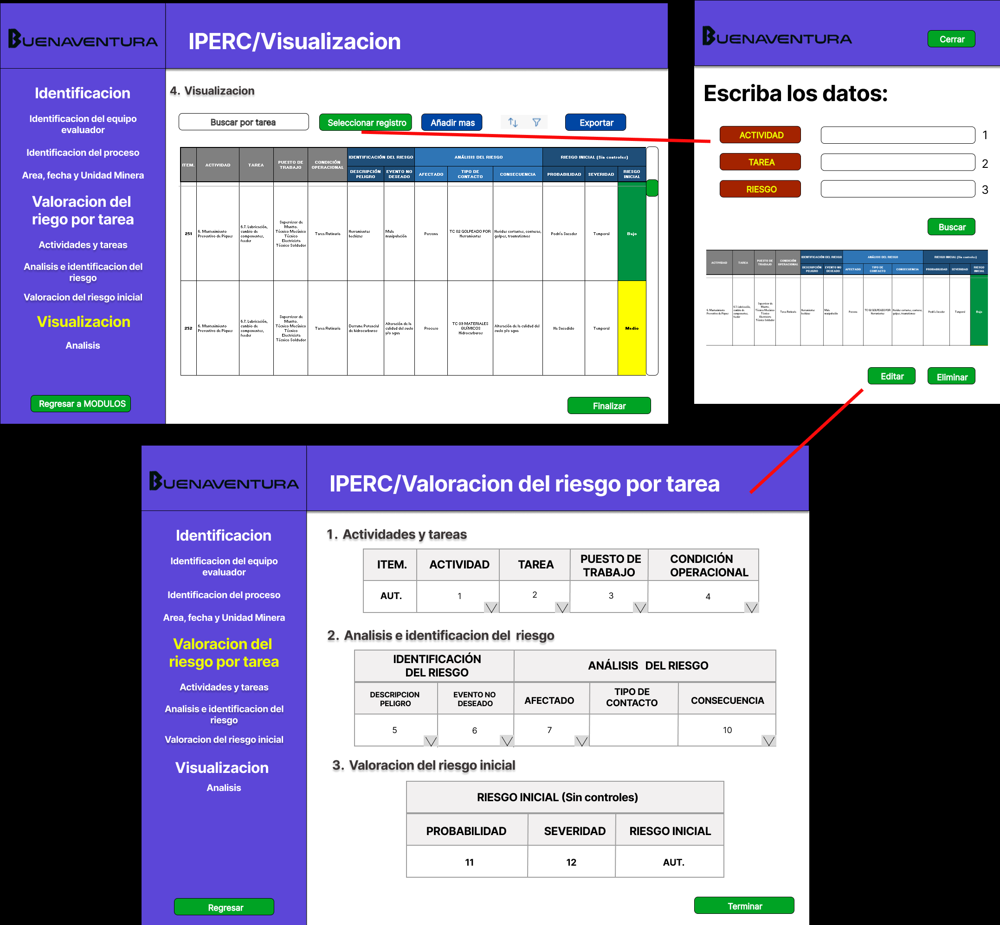

# 8.1. Sentencias SQL por módulo / prototipo

# Modulo 1(Planificación del mantenimiento)

**Código Requerimiento:** R-101

**Código Interfaz:** I-101

**Imagen Interfaz**


**Sentencias SQL**

**Eventos:**

1. Botón Crear Nuevo Plan de mantenimiento:
	Redirecciona a la interfaz I-102.

2. Botón Listado de Planes de mantenimiento:
   	Redirecciona a la interfaz I-103.

3. Botón Crear Nueva Orden de Trabajo:
	Redirecciona a la interfaz I-104.

4. Botón Listado de Órdenes de Trabajo:
	Redirecciona a la interfaz I-105.

5. Botón Editar Actividades de Mantenimiento:
	Redirecciona a la interfaz I-106.


**Código Requerimiento:** R-102

**Código Interfaz:** I-102

**Imagen Interfaz**


**Sentencias SQL**

**Eventos:**

1. Boton Añadir recurso:

	Añade una fila temporal para especificar un nuevo recurso en el plan de mantenimiento que se está creando. (implementación en el frontend)

2. Boton Añadir equipo:

	Añade una fila temporal para especificar un nuevo equipo de soporte en el plan de mantenimiento que se está creando. (implementación en el frontend)

3. Boton Guardar y Programar:

	```sql
	--- Guarda todos los datos llenados en el formulario y los sube a la base de datos ---
	--- Actualización en la tabla plan de mantenimiento ---
	INSERT INTO Plan_de_mantenimiento (id_plan,descripcion,fecha_plan,empleado_asigna,id_criticidad)
	VALUES (<1>,<2>,<3>,<4>,<5>)

	--- Actualización en la tabla Mantenimiento ---
	INSERT INTO Mantenimiento (id_act_mantto,fecha_inicio_programado,fecha_fin_programado,id_orden,id_plan,id_tipo_mant,id_maquina,id_estado)
	VALUES (<6>,<7>,<8>,null,<1>,<9>,<10>,<11>)
	```

 	Donde:

	|  | Descripción                                           |
	|-------------|-------------------------------------------------------|
	| `<1>`       | Id del plan creado automáticamente |
	| `<2>`       | Descripción obtenida del formulario |
	| `<3>`       | Fecha de creación del plan, se obtiene automáticamente |
	| `<4>`       | Id del empleado que creó el plan  |
	| `<5>`       | Id de criticidad obtenida del formulario (se envía el id en vez del nivel) |
	| `<6>`       | Id del mantenimiento creado automáticamente |
	| `<7>`       | Fecha inicial del mantenimiento obtenida del formulario |
	| `<8>`       | Fecha final del mantenimiento obtenida del formulario |
	| `<9>`       | Fecha inicial del mantenimiento obtenida del formulario |
	| `<10>`      | Id de la máquina obtenido del formulario |
	| `<11>`      | Id del estado luego de crear el plan. En este evento, será igual a 2 (En mantenimiento) |


**Código Requerimiento:** R-103

**Código Interfaz:** I-103

**Imagen Interfaz**


**Sentencias SQL**

**Eventos:**

1. Boton Añadir recurso:

	Añade una fila temporal para especificar un nuevo recurso en el plan de mantenimiento que se está creando. (implementación en el frontend)

2. Boton Añadir equipo:

	Añade una fila temporal para especificar un nuevo equipo de soporte en el plan de mantenimiento que se está creando. (implementación en el frontend)

3. Boton Guardar y Programar:

	```sql
	--- Guarda todos los datos llenados en el formulario y los sube a la base de datos ---
	--- Actualización en la tabla plan de mantenimiento ---
	INSERT INTO Plan_de_mantenimiento (id_plan,descripcion,fecha_plan,empleado_asigna,id_criticidad)
	VALUES (<1>,<2>,<3>,<4>,<5>)

	--- Actualización en la tabla Mantenimiento ---
	INSERT INTO Mantenimiento (id_act_mantto,fecha_inicio_programado,fecha_fin_programado,id_orden,id_plan,id_tipo_mant,id_maquina,id_estado)
	VALUES (<6>,<7>,<8>,null,<1>,<9>,<10>,<11>)
	```

 	Donde:

	|  | Descripción                                           |
	|-------------|-------------------------------------------------------|
	| `<1>`       | Id del plan creado automáticamente |
	| `<2>`       | Descripción obtenida del formulario |
	| `<3>`       | Fecha de creación del plan, se obtiene automáticamente |
	| `<4>`       | Id del empleado que creó el plan  |
	| `<5>`       | Id de criticidad obtenida del formulario (se envía el id en vez del nivel) |
	| `<6>`       | Id del mantenimiento creado automáticamente |
	| `<7>`       | Fecha inicial del mantenimiento obtenida del formulario |
	| `<8>`       | Fecha final del mantenimiento obtenida del formulario |
	| `<9>`       | Fecha inicial del mantenimiento obtenida del formulario |
	| `<10>`      | Id de la máquina obtenido del formulario |
	| `<11>`      | Id del estado luego de crear el plan. En este evento, será igual a 2 (En mantenimiento) |


**Código Requerimiento:** R-104

**Código Interfaz:** I-104

**Imagen Interfaz**


**Sentencias SQL**

**Eventos:**

1. Botón Asignar responsable:

	Establece al empleado como responsable con la actividad de responsabilidad para ese mantenimiento en particular.

2. Botón Guardar y Programar:

	```sql
	--- Crea la orden de trabajo y la primera actividad(responsable) para la orden ---
	--- Creación de la orden de trabajo y actualización de la tabla ---
	INSERT INTO Orden_de_trabajo (id_orden,descripcion,fecha_orden)
	VALUES (<1>,<2>,<3>);

	---------------------------------------------------------------------------

	--- Esta sección solo se implementa si se rellena un plan de mantenimiento asociado (backend) ---
	--- Actualizar la tabla Mantenimiento para relacionar el plan y la orden de trabajo ---
	UPDATE Mantenimiento
	SET id_orden = <1>
	WHERE id_plan = <4>

	---------------------------------------------------------------------------

	--- Añade la actividad responsable para esta orden de trabajo ---
	INSERT INTO Actividad_empleado (id_actv_empleado, nombre_actv, descripcion_actv, fecha_inicio, fecha_fin, id_equipo_soporte, id_empleado, id_estado, id_orden)
	VALUES (<5>,'Responsable','Es responsable de la ejecución completa del mantenimiento y su supervisión', <6>,<7>,<8>,<9>,<10>,<1>)

	```

	Donde:

	|  | Descripción                                           |
	|-------------|-------------------------------------------------------|
	| `<1>`       | Id de la orden de trabajo creado automáticamente |
	| `<2>`       | Descripción obtenida del formulario |
	| `<3>`       | Fecha de creación de la orden, se obtiene automáticamente |
	| `<4>`       | Id del plan a relacionar (de no llenarse en el formulario, es null) |
	| `<5>`       |  |
	| `<6>`       | Id del mantenimiento creado automáticamente |
	| `<7>`       | Fecha inicial del mantenimiento obtenida del formulario |
	| `<8>`       | Fecha final del mantenimiento obtenida del formulario |
	| `<9>`       | Fecha inicial del mantenimiento obtenida del formulario |
	| `<10>`      | Id de la máquina obtenido del formulario |
	| `<11>`      | Id del estado luego de crear el plan. En este evento, será igual a 2 (En mantenimiento) |


---

# Modulo 4 (IPERC)

**Código Requerimiento:** R-001

**Código Interfaz:** I-001

**Imagen Interfaz**


**Sentencias SQL**

**Eventos:**

1. Boton siguiente:

	```sql
	-- Insertar un nuevo equipo evaluador con un ID generado automáticamente
	INSERT INTO equipo_evaluador (cant_empleados)
	VALUES (?, 0);
	
	-- Insertar empleados asociados al equipo evaluador usando nombres que serán reemplazados por el ID generado del equipo evaluador
	INSERT INTO equipoevaluadorxempleado (id_equipo_evaluador, id_empleado)
	SELECT ?, empleado.id_empleado
	FROM empleado
	WHERE empleado.nombre IN (<1>, <2>, <3>)
	ON CONFLICT DO NOTHING;
	
	-- Actualizar la cantidad de empleados en el equipo evaluador con ID generado
	UPDATE equipo_evaluador
	SET cant_empleados = (SELECT COUNT(*)
	                      FROM equipoevaluadorxempleado
	                      WHERE id_equipo_evaluador = ?)
	WHERE id_equipo_evaluador = ?;
	
	-- Insertar un nuevo proceso asociado al equipo evaluador
	INSERT INTO proceso (id_proceso, id_equipo_evaluador, descripcion_proceso)
	VALUES (?, ?, <4>);
	
	-- Insertar datos en la tabla Informe_IPERC usando el ID de proceso generado y otros valores proporcionados
	INSERT INTO Informe_IPERC (id_informe_iperc, fecha_registro, cant_riesgos_analizados, unidad_minera, area, id_proceso)
	VALUES (?, <6>, 0, <5>, <7>, ?);
	```

 	Donde:

	|  | Descripción                                           |
	|-------------|-------------------------------------------------------|
	| `<1>`       | Nombre del primer empleado asociado al equipo evaluador |
	| `<2>`       | Nombre del segundo empleado asociado al equipo evaluador |
	| `<3>`       | Nombre del tercer empleado asociado al equipo evaluador |
	| `<4>`       | Descripción del proceso asociado al equipo evaluador  |
	| `<5>`       | Nombre de la unidad minera en Informe_IPERC           |
	| `<6>`       | Fecha de registro en Informe_IPERC (formato: 'YYYY-MM-DD') |
	| `<7>`       | Área de trabajo en Informe_IPERC                      |


	
**Código Requerimiento:** R-001

**Código Interfaz:** I-001

**Imagen Interfaz**

 
 
 **Sentencias SQL**

 **Eventos:**

1. Boton añadir mas:
   
	Primero verificaremos si existe alguna actividad como la ingresada en la base de datos para eso declararemos algunos valores para retornarlos
	
	```sql
	DECLARE
	actividad_id INT := NULL;
	tarea_id INT := NULL;
	des_actividad CHAR(255) := <1>;
	des_tarea CHAR(255) := <2>;
	```
	
	```sql
	SELECT id_actividad INTO actividad_id
	FROM actividades
	WHERE id_proceso = ? AND descripcion_actividad = des_actividad;
	```
	
	Si actividad_id es NULL, entonces la actividad no existe, agregamos la nueva actividad y la nueva tarea. 
	
	```sql
	IF actividad_id IS NULL THEN
	    INSERT INTO actividades (id_proceso, id_actividad, descripcion_actividad)
	    VALUES (?, ?, des_actividad)
	    RETURNING id_actividad INTO actividad_id;
	END IF;
	
	INSERT INTO tareas (id_actividad, id_tarea, descripcion_tarea, puesto_trabajo, cond_operacional)
	VALUES (actividad_id, ?, des_tarea, <3>, <4>)
	RETURNING id_tarea INTO tarea_id;
	```
	
	En caso que la actividad exista, reutilizamos su id. Verificar si ya existe la tarea en la actividad especificada
	
	```sql
	ELSE
	    SELECT id_tarea INTO tarea_id
	    FROM tareas
	    WHERE id_actividad = actividad_id AND descripcion_tarea = des_tarea;
	```
	
	Si tarea_id es NULL, entonces la tarea no existe y debemos crearla.
	
	```sql
	IF tarea_id IS NULL THEN
	    INSERT INTO tareas (id_actividad, id_tarea, descripcion_tarea, puesto_trabajo, cond_operacional)
	    VALUES (actividad_id, ?, des_tarea, <3>, <4>)
	    RETURNING id_tarea INTO tarea_id;
	END IF;
	```
	
	Insertamos la identificación del riesgo, el analisis y la valoracion del riesgo inicial.
	
	```sql
	INSERT INTO identificacion_del_riesgo (id_riesgo, descripcion_peligro, evento_no_deseado, id_tarea)
	VALUES (?, <5>, <6>, tarea_id);
	
	INSERT INTO analisis_riesgo (id_riesgo, id_analisis, afectado, id_tipo_contacto, id_tipo_peligro, consecuencia)
	VALUES (?, ?, <7>, <8>, <9>, <10>);
	
	INSERT INTO valoracion_del_riesgo_inicial (id_valoracion_inicial, id_tipo_severidad, id_tipo_probabilidad, id_tipo_riesgo, id_analisis)
	VALUES (?, <11>, <12>, ?, ?);
	```
	
2. Boton culminar:

	Este boton tiene la misma forma de arriba, sin embargo se agrega un update para contar la cantidad de riesgo analizados.
	
	```sql
	UPDATE Informe_IPERC
	SET 
	    fecha_act = NOW(),
	    cant_riesgos_analizados = (SELECT COUNT(*) FROM TareasXIdentRiesgo WHERE id_proceso = ?)
	WHERE 
	    id_informe_iperc = ?;
	```
	Donde:
	
	| Marcador de posición | Descripción                                                                                   |
	|----------------------|-----------------------------------------------------------------------------------------------|
	| `<1>`                | Descripción de la actividad a ser ingresada o verificada en la base de datos.                 |
	| `<2>`                | Descripción de la tarea a ser ingresada o verificada en la actividad especificada.            |
	| `<3>`                | Puesto de trabajo asociado a la tarea ingresada.                                              |
	| `<4>`                | Condición operacional asociada a la tarea ingresada.                                          |
	| `<5>`                | Descripción del peligro asociado al riesgo identificado.                                      |
	| `<6>`                | Evento no deseado asociado al riesgo identificado.                                            |
	| `<7>`                | Descripción de a quién o qué afecta el riesgo identificado.                                   |
	| `<8>`                | Tipo de contacto asociado al riesgo (SELECCIONADO).                                        |
	| `<9>`                | Tipo de peligro asociado al riesgo (SELECCIONADO).                                         |
	| `<10>`               | Consecuencia asociada al riesgo identificado.                                                 |
	| `<11>`               | Tipo de severidad asociado a la valoración del riesgo (SELECCIONADO).                      |
	| `<12>`               | Tipo de probabilidad asociado a la valoración del riesgo (SELECCIONADO).                   |
	
**Código Requerimiento:** R-001

**Código Interfaz:** I-001

**Imagen Interfaz**



**Sentencias SQL**

**Eventos:**

1. Carga de datos de la pantalla principal:

	```sql
	-- Consulta para visualizar todos los datos completos de las actividades, tareas y riesgos
	SELECT 
	    a.descripcion_actividad AS Actividad,                   -- Descripción de la actividad
	    t.descripcion_tarea AS Tarea,                           -- Descripción de la tarea
	    t.puesto_trabajo AS "Puesto de Trabajo",                -- Puesto de trabajo
	    t.cond_operacional AS "Condición Operacional",          -- Condición operacional
	    ir.descripcion_peligro AS "Descripción Peligro",        -- Descripción del peligro asociado a la tarea
	    ir.evento_no_deseado AS "Evento No Deseado",            -- Evento no deseado del riesgo
	    ar.afectado AS Afectado,                                -- Persona o proceso afectado
	    CONCAT(tc.nombre_tipo_contacto, ' ', tp.nombre_tipo_peligro) AS "Contacto y Peligro", 
	                                                           -- Unión de tipo de contacto y tipo de peligro sin delimitador
	    ar.consecuencia AS Consecuencia,                        -- Consecuencia del riesgo
	    tp_prob.nombre_tipo_probabilidad AS Probabilidad,       -- Probabilidad de ocurrencia del riesgo
	    ts.nombre_tipo_severidad AS Severidad,                  -- Severidad del riesgo
	    tr.nombre_tipo_riesgo AS "Riesgo Inicial"               -- Nivel de riesgo inicial (alto, medio, bajo)
	FROM 
	    actividades a
	    INNER JOIN tareas t ON a.id_actividad = t.id_actividad
	    INNER JOIN identificacion_del_riesgo ir ON t.id_tarea = ir.id_tarea -- Asocia directamente la tarea con el riesgo
	    INNER JOIN analisis_riesgo ar ON ar.id_riesgo = ir.id_riesgo       -- Relación del riesgo con el análisis
	    INNER JOIN tipos_contacto tc ON ar.id_tipo_contacto = tc.id_tipo_contacto
	    INNER JOIN tipos_peligro tp ON ar.id_tipo_peligro = tp.id_tipo_peligro
	    INNER JOIN valoracion_del_riesgo_inicial vi ON vi.id_analisis = ar.id_analisis
	    INNER JOIN tipo_probabilidad tp_prob ON vi.id_tipo_probabilidad = tp_prob.id_tipo_probabilidad
	    INNER JOIN tipo_severidad ts ON vi.id_tipo_severidad = ts.id_tipo_severidad
	    INNER JOIN tipo_riesgo tr ON vi.id_tipo_riesgo = tr.id_tipo_riesgo
	ORDER BY 
	    a.descripcion_actividad,  -- Ordenar primero por actividad
	    t.descripcion_tarea;      -- Luego ordenar por tarea dentro de cada actividad
	```

2. Buscar por tarea:

	En esta barra se buscara segun tarea ingresada, mostrando todos los datos relacionados.
	
	```sql
	SELECT 
	    a.descripcion_actividad AS "Actividad",              
	    t.descripcion_tarea AS "Tarea",                       
	    t.puesto_trabajo AS "Puesto de Trabajo",               
	    t.cond_operacional AS "Condición Operacional",          
	    ir.descripcion_peligro AS "Descripción del Peligro",    
	    ir.evento_no_deseado AS "Evento No Deseado",           
	    ar.afectado AS "Afectado",                            
	    tc.nombre_tipo_contacto AS "Tipo de Contacto",      
	    ar.consecuencia AS "Consecuencia",                   
	    tp.nombre_tipo_probabilidad AS "Probabilidad",         
	    vs.nombre_tipo_severidad AS "Severidad",                
	    tr.nombre_tipo_riesgo AS "Riesgo Inicial"               
	FROM 
	    tareas t
	INNER JOIN 
	    actividades a ON t.id_actividad = a.id_actividad
	INNER JOIN 
	    identificacion_del_riesgo ir ON t.id_tarea = ir.id_tarea           
	INNER JOIN 
	    analisis_riesgo ar ON ar.id_riesgo = ir.id_riesgo                  
	INNER JOIN 
	    tipos_contacto tc ON ar.id_tipo_contacto = tc.id_tipo_contacto
	INNER JOIN 
	    valoracion_del_riesgo_inicial vi ON vi.id_analisis = ar.id_analisis
	INNER JOIN 
	    tipo_probabilidad tp ON vi.id_tipo_probabilidad = tp.id_tipo_probabilidad
	INNER JOIN 
	    tipo_severidad vs ON vi.id_tipo_severidad = vs.id_tipo_severidad
	INNER JOIN 
	    tipo_riesgo tr ON vi.id_tipo_riesgo = tr.id_tipo_riesgo
	WHERE 
	    t.descripcion_tarea = <2>;           -
	```
	
3. Botón Seleccionar registro: 

	Con este boton nos mandara un apartado para ver el registro y saber que hacer con el.

4. Boton buscar:

   	El boton busca el registro segun actividad, tarea y riesgo.
	
	```sql
	SELECT 
	    a.descripcion_actividad AS "Actividad",              
	    t.descripcion_tarea AS "Tarea",                       
	    t.puesto_trabajo AS "Puesto de Trabajo",                  
	    t.cond_operacional AS "Condición Operacional",            
	    ir.descripcion_peligro AS "Descripción del Peligro",      
	    ir.evento_no_deseado AS "Evento No Deseado",              
	    ar.afectado AS "Afectado",                                
	    CONCAT(tc.nombre_tipo_contacto, ' ', tp.nombre_tipo_peligro) AS "Contacto y Peligro", 
	    ar.consecuencia AS "Consecuencia",                        
	    tp_prob.nombre_tipo_probabilidad AS "Probabilidad",       
	    ts.nombre_tipo_severidad AS "Severidad",                  
	    tr.nombre_tipo_riesgo AS "Riesgo Inicial"                
	FROM 
	    actividades a
	JOIN 
	    tareas t ON a.id_actividad = t.id_actividad
	JOIN 
	    identificacion_del_riesgo ir ON t.id_tarea = ir.id_tarea
	JOIN 
	    analisis_riesgo ar ON ar.id_riesgo = ir.id_riesgo
	JOIN 
	    tipos_contacto tc ON ar.id_tipo_contacto = tc.id_tipo_contacto
	JOIN 
	    tipos_peligro tp ON ar.id_tipo_peligro = tp.id_tipo_peligro
	JOIN 
	    valoracion_del_riesgo_inicial vi ON vi.id_analisis = ar.id_analisis
	JOIN 
	    tipo_probabilidad tp_prob ON vi.id_tipo_probabilidad = tp_prob.id_tipo_probabilidad
	JOIN 
	    tipo_severidad ts ON vi.id_tipo_severidad = ts.id_tipo_severidad
	JOIN 
	    tipo_riesgo tr ON vi.id_tipo_riesgo = tr.id_tipo_riesgo
	WHERE 
	    a.descripcion_actividad = <1>      
	    AND t.descripcion_tarea = <2>    
	    AND ir.descripcion_peligro = <3>; 
	```
	
5. Boton eliminar:

   	Elimina el registro seleccionado.

	```sql
	DO $$
	DECLARE
	    v_id_tarea INT;
	    v_id_riesgo INT;
	    v_id_actividad INT;
	BEGIN
	    -- Paso 1: Buscar el id_riesgo, id_tarea y id_actividad en identificacion_del_riesgo usando descripcion_peligro, descripcion_tarea y descripcion_actividad
	    SELECT ir.id_riesgo, ir.id_tarea, t.id_actividad
	    INTO v_id_riesgo, v_id_tarea, v_id_actividad
	    FROM identificacion_del_riesgo ir
	    JOIN tareas t ON ir.id_tarea = t.id_tarea
	    JOIN actividades a ON t.id_actividad = a.id_actividad
	    WHERE ir.descripcion_peligro = <3>  -- Descripción del riesgo (peligro)
	      AND t.descripcion_tarea = <2>     -- Descripción de la tarea
	      AND a.descripcion_actividad = <1>;-- Descripción de la actividad
	
	    -- Validar que los IDs fueron encontrados antes de proceder con la eliminación
	    IF v_id_tarea IS NOT NULL AND v_id_riesgo IS NOT NULL THEN
	        
	        -- Paso 2: Proceder con la eliminación en cascada
	
	        -- Eliminar en valoracion_del_riesgo_inicial usando id_riesgo
	        DELETE FROM valoracion_del_riesgo_inicial
	        USING analisis_riesgo ar
	        WHERE ar.id_analisis = valoracion_del_riesgo_inicial.id_analisis
	          AND ar.id_riesgo = v_id_riesgo;
	
	        -- Eliminar en analisis_riesgo usando id_riesgo
	        DELETE FROM analisis_riesgo
	        WHERE id_riesgo = v_id_riesgo;
	
	        -- Eliminar en identificacion_del_riesgo usando id_riesgo y id_tarea
	        DELETE FROM identificacion_del_riesgo
	        WHERE id_riesgo = v_id_riesgo 
	          AND id_tarea = v_id_tarea;
	
	        -- Finalmente, eliminar la tarea específica si es necesario (opcional)
	        DELETE FROM tareas
	        WHERE id_tarea = v_id_tarea;
	
	        RAISE NOTICE 'El registro ha sido eliminado exitosamente.';
	
	    ELSE
	        RAISE NOTICE 'No se encontraron registros con las descripciones especificadas.';
	    END IF;
	END $$;
	```
 	Donde:

 	| Placeholder | Descripción |
	|-------------|-------------|
	| `<1>`       | Descripción de la actividad ingresada (nombre de la actividad específica). |
	| `<2>`       | Descripción de la tarea ingresada (nombre de la tarea específica). |
	| `<3>`       | Descripción del peligro ingresada (nombre del riesgo o peligro específico). |

7. Boton editar:

   	Este boton nos lleva a otra pantalla unica solo para cambiar los datos.

8. Boton terminar:

   	Este boton si contiene la funcionalidad de actualizar los cambios.

	Actualizar la actividad, si se ha cambiado
	
	```sql
	UPDATE actividades
	SET descripcion_actividad = <1>
	WHERE id_actividad = ?;
	```
	
	Actualizar la tarea, si se han modificado sus datos
	
	```sql
	UPDATE tareas
	SET descripcion_tarea = <2>,
	    puesto_trabajo = <3>,
	    cond_operacional = <4>
	WHERE id_tarea = ?;
	```
	
	Actualizar la identificación del riesgo, si se ha cambiado el peligro o el evento no deseado
	
	```sql
	UPDATE identificacion_del_riesgo
	SET descripcion_peligro = <5>,
	    evento_no_deseado = <6>
	WHERE id_riesgo = ?;
	```
	
	Actualizar el análisis del riesgo, si se ha cambiado el afectado, tipo de contacto, o consecuencia
	
	```sql
	UPDATE analisis_riesgo
	SET afectado = <7>,
	    id_tipo_contacto = <8>,
	    id_tipo_peligro = <9>,
	    consecuencia = <10>
	WHERE id_riesgo = ?;
	```
	
	Actualizar la valoración inicial del riesgo, si se han cambiado la severidad, probabilidad o tipo de riesgo
	
	```sql
	UPDATE valoracion_del_riesgo_inicial
	SET id_tipo_severidad = <11>,
	    id_tipo_probabilidad = <12>,
	    id_tipo_riesgo = ?
	WHERE id_analisis = ?;
	```
 
	Donde:

	| Placeholder | Descripción |
	|-------------|-------------|
	| `<1>`       | Nueva descripción de la actividad.                    |
	| `<2>`       | Nueva descripción de la tarea.                        |
	| `<3>`       | Nuevo puesto de trabajo para la tarea.                |
	| `<4>`       | Nueva condición operacional para la tarea.            |
	| `<5>`       | Nueva descripción del peligro en la identificación.   |
	| `<6>`       | Nuevo evento no deseado en la identificación.         |
	| `<7>`       | Nuevo afectado en el análisis del riesgo.             |
	| `<8>`       | Nuevo ID de tipo de contacto en el análisis del riesgo. |
	| `<9>`       | Nuevo ID de tipo de peligro en el análisis del riesgo. |
	| `<10>`      | Nueva consecuencia en el análisis del riesgo.         |
	| `<11>`      | Nuevo ID de severidad en la valoración inicial.       |
	| `<12>`      | Nuevo ID de probabilidad en la valoración inicial.    |


